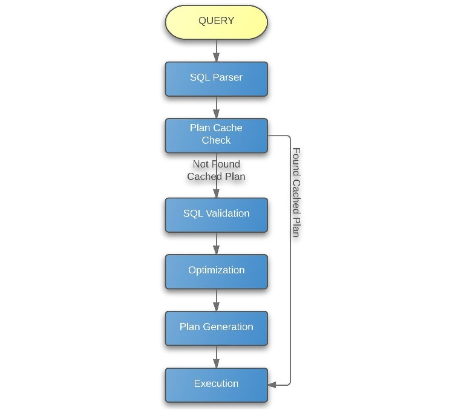

<a id="a9c67a2f26126e13"></a>

# 15. SQL Tuning

> 원본: [GOLDILOCKS 3.2 User Manual (ko)](https://manual.sunjesoft.co.kr/goldilocks/3_2_x/manual/ko/a9c67a2f26126e13)  
> 태그: `GOLDILOCKS_Venus_3_2_14_retagged`

[← 14. Cluster Objects](14-cluster-objects.md) · [전체 목차](../README.md) · [16. SQL References →](16-sql-references.md)

<a id="48894d8cf41e0d37"></a>
## SQL Tuning 개요

SQL tuning은 SQL 구문의 질의 성능을 향상시키기 위한 방법을 기술한다. GOLDILOCKS는 SQL tuning을 위한 hint, plan cache, SQL 실행 계획 출력 등을 제공한다.

SQL tuning은 질의에 대한 응답시간을 최소화하고, 질의 처리량을 개선하는 것을 목표로 하며 이를 위해 문제를 찾아내고 해결하는 방법을 기술한다.

SQL tuning을 이해하기 위해서는 database, database 구조, SQL 구문, optimizer에 대한 지식이 필요하며, 본 장에서 다루는 내용은 이런 지식을 가지고 있다는 전제하에 설명한다.

<a id="9bbe007530c16776"></a>
## SQL 처리 과정

GOLDILOCKS에서 SQL을 처리할 때 다음 그림과 같이 SQL parser, plan cache check, SQL validation, optimization, plan generation, execution 과정을 거친다.

Plan cache check 단계에서 plan cache에 동일한 질의 실행 계획이 저장되어 있으면 해당 실행 계획을 이용하여 execution을 수행한다.

<a id="597ac50680f3d3f4"></a>


<a id="2dbd392e6eb85edd"></a>
### SQL Parser

SQL parser는 SQL 처리 과정의 첫 번째 단계로써 사용자가 입력한 SQL 구문이 문법적으로 올바른지 판단한다. 만약 SQL 구문이 문법적으로 올바르지 않다면 이 단계에서 에러로 처리된다.

다음은 문법적으로 올바르지 않은 SQL 구문의 예이다.

```
gSQL> SELECT * FORM t1;

ERR-42000(40000): syntax error 
SELECT * FORM t1
.........^  ^
Error at line 1
```

SQL parser 단계에서는 parsing에 필요한 정보들을 수집하고 저장하며 이 단계가 완료되면 그 결과 SQL 구조가 parsing된다. 이 때 parsing 된 SQL 구조와 기타 정보들은 각각의 세션 영역에 저장되어 관리된다.

<a id="03402f3c64f8fcc9"></a>
### Plan Cache Check

SQL parser 단계가 끝나면 해당 질의와 동일한 질의가 plan cache에 저장되어 있는지 확인하는데 이 단계가 plan cache check이다.

Plan cache check에서는 SQL parser 단계가 끝난 질의 구문의 plan cache로부터 [Plan cache parameters](#ac785d875c290f67)가 일치하는 plan을 찾는다.

해당 plan이 plan cache에 저장되어 있는 경우 이 plan을 가지고 와서 plan에서 접근하는 테이블이나 column과 같은 객체들의 유효성을 검사한다. 만약 모든 객체가 유효하면 해당 plan을 이용하여 execution 단계로 진행하며, 그렇지 않고 유효하지 않은 객체가 하나라도 존재한다면 SQL validation 단계로 진행한다.

Plan cache에서는 서로 다른 세션에 의해 발생한 plan들이 모두 공유되며, 다른 세션에 의해 저장된 plan도 참조할 수 있다.

Plan cache check 단계는 plan cache에 저장된 plan을 이용하여 SQL validation 단계부터 plan generation 단계까지의 과정을 생략함으로써 성능을 향상시킨다.

<a id="30acdf621ed9b003"></a>
### SQL Validation

SQL validation은 질의가 구문상 올바른지 판단하는 단계이다. 이 단계에서는 질의에 기술된 테이블이나 column 등과 같은 객체들이 존재하는지 여부와 참조 가능한 column인지와 같은 구문상 오류에 대하여 검사한다.

다음은 구문상 올바르지 않은 SQL 구문의 예이다.

```
gSQL> SELECT * FROM t1;

ERR-42000(16040): table or view does not exist : 
SELECT * FROM t1
              *
ERROR at line 1:
```

<a id="0b5a5723bf7fa5a9"></a>
### Optimization

Optimization은 SQL 구문에 대하여 다양한 실행 계획을 세우고 그 중 가장 좋은 plan을 선택하는 단계이다. Optimization 단계에서는 테이블에 대한 access 방법, join 순서, join 방법 등의 최적화 기법들에 대한 cost를 계산하며, 이를 기준으로 다양한 plan을 만든 후 각 plan의 cost를 비교하여 최적의 plan을 선택한다.

자세한 내용은 [Query Optimizer](#7db5b3de5ad06031)을 참조한다.

<a id="47c179057cfbd2c7"></a>
### Plan Generation

Plan generation은 optimization이 최종적으로 선택한 plan을 execution 단계에서 수행할 수 있는 실행 계획 형태로 생성하는 단계이다. 실행 계획은 여러 단계 노드들의 조합으로 구성되며, 각 단계의 노드들은 수행한 결과 집합을 상위 노드로 반환한다. 최종 단계의 노드는 SQL 구문의 최종 결과를 사용자에게 보낸다.

실행 계획은 tree 구조의 노드들로 구성되는데 tree 구조에는 다음과 같은 정보들이 포함된다.

- 각 테이블들의 access 방법
- 참조하는 테이블들의 순서
- 테이블들의 조인 연산에 대한 조인 방법
- 데이터 filter에 대한 정보
- 데이터 grouping 및 aggregation 정보
- 데이터 정렬에 대한 정보

다음은 plan generation으로 SQL 실행 계획을 생성하는 예이다.

```
gSQL> 
\EXPLAIN PLAN 
SELECT t1.i1, t1.i2, t2.i1, t2.i2
  FROM t1, t2
 WHERE t1.i1 = t2.i1
   AND t1.i2 = 1
 ORDER BY t1.i1;

no rows selected.

>>>  start print plan

< Execution Plan >
==========================================================================
|  IDX  |  NODE DESCRIPTION                                 |       ROWS |
--------------------------------------------------------------------------
|    0  |  SELECT STATEMENT                                 |            |
|    1  |    SORT INSTANT ACCESS                            |          0 |
|    2  |      HASH JOIN (INNER JOIN)                       |          0 |
|    3  |        TABLE ACCESS ("T2")                        |          0 |
|    4  |        HASH JOIN INSTANT ACCESS                   |          0 |
|    5  |          TABLE ACCESS ("T1")                      |          0 |
==========================================================================

     1  -  SORT KEY : "T1.I1 ASC NULLS LAST"
           RECORD COLUMNS : I2, I1, I2
           READ COLUMNS : I1, I2, I1, I2
     2  -  JOINED COLUMNS : T1.I1, T1.I2, T2.I1, T2.I2
     3  -  READ COLUMNS : I1, I2
     4  -  INDEX COLUMNS : I1
           TABLE COLUMNS : I2
           READ COLUMNS : I1, I2
             HASH FILTER : I1 = {I1}
     5  -  READ COLUMNS : I1, I2
             PHYSICAL FILTER : I2 = 1

<<<  end print plan
```

<a id="e41f2bf86ac191eb"></a>
### Plan Cache Registration

Plan cache를 사용하는 경우 [Plan Generation](#47c179057cfbd2c7)에서 생성된 plan을 plan cache에 등록한다. [Plan cache parameters](#ac785d875c290f67) 값들의 일치 여부를 기준으로 cache 내의 plan들을 구분한다.

**Plan cache parameters**

<a id="ac785d875c290f67"></a>
| Parameter | 설명 |
| --- | --- |
| Query text | 대소문자를 구분하는 query text |
| User information | User id |
| Cursor property | Fetch가 필요한 query의 cursor 속성 |
| Bind parameter | Bind parameter 개수와 각 bind parameter의 IN/OUT 속성 |
| Enable atomic | Atomic insertion 사용 여부 |
| Enable hint error | Hint에 validation error 발생 여부 |

다음은 서로 다른 query text 값을 가지는 query들의 예이다.

```
"select i1 from t1"
"Select i1 from t1"
"select i1 from  t1"
"SELECT I1 FROM T1"
```

> Plan에서 참조하고 있는 스키마 객체 (테이블, 인덱스, view, 시퀀스)가 commit 되지 않은 경우에는 plan이 등록되지 않는다.

<a id="1c4c7acd8c07c1e1"></a>
### Execution

Execution은 plan generation에 의해 생성되거나 plan cache check에서 선택된 실행 계획을 실제로 수행하여 결과를 반환하는 단계이다. Tree 구조의 실행 계획을 실제로 수행할 때는 왼쪽 최하위의 노드를 먼저 수행한 후에 상위 노드를 수행한다.

```
gSQL> 
\EXPLAIN PLAN
SELECT t1.i1, t1.i2, t2.c1, t2.c2
  FROM t1, t2
 WHERE t1.i1 = t2.c1
   AND t1.i2 = 1
 ORDER BY t1.i1;

no rows selected.

>>>  start print plan

< Execution Plan >
=============================================================================================
|  IDX  |  NODE DESCRIPTION                                       |                    ROWS |
---------------------------------------------------------------------------------------------
|    0  |  SELECT STATEMENT                                       |                         |
|    1  |    SORT INSTANT ACCESS                                  |                       0 |
|    2  |      HASH JOIN (INNER JOIN)                             |                       0 |
|    3  |        TABLE ACCESS ("T2")                              |                       0 |
|    4  |        HASH JOIN INSTANT ACCESS                         |                       0 |
|    5  |          TABLE ACCESS ("T1")                            |                       0 |
=============================================================================================

     1  -  SORT KEY : "T1.I1 ASC NULLS LAST"
           RECORD COLUMNS : I2, C1, C2
           READ COLUMNS : I1, I2, C1, C2
     2  -  JOINED COLUMNS : T1.I1, T1.I2, T2.C1, T2.C2
     3  -  READ COLUMNS : C1, C2
     4  -  INDEX COLUMNS : I1
           TABLE COLUMNS : I2
           READ COLUMNS : I1, I2
             HASH FILTER : I1 = {C1}
     5  -  READ COLUMNS : I1, I2
             PHYSICAL FILTER : I2 = 1

<<<  end print plan
```

위의 예제를 이용하여 실제 실행하는 과정은 다음과 같다.

1. IDX3에서 테이블 T2에 대한 table access를 이용하여 결과를 가져온다. 이 때 반환되는 결과 row에는 C1과 C2 column이 포함된다.
2. IDX5에서 테이블 T1에 대한 table access를 이용하여 결과를 가져온다. 이 때 "I2 = 1"이 physical filter로 처리된 결과를 반환하며, 반환되는 결과 row에는 I1과 I2 column이 포함된다.
3. IDX4에서 IDX5로부터 반환된 결과에 대해 hash join instant access를 생성하고 hash filter로 "I1 = {C1}"을 수행한다. 반환되는 결과 row에는 I1과 I2 column이 포함된다.
4. IDX4에서 hash filter를 이용하여 IDX2에서 IDX3의 수행 결과에 대해 hash join을 수행하고 결과로 반환되는 결과 row에는 T1 테이블의 I1과 I2 column 및 T2 테이블의 C1과 C2 column이 포함된다.
5. IDX1에서 IDX2의 수행 결과에 대하여 sort instant access를 생성하고 T1 테이블의 I1 column을 이용하여 정렬한다. 결과에는 T1 테이블의 I1과 I2 column 및 T2 테이블의 C1과 C2 column이 포함된다.
6. IDX0에서 IDX1의 수행 결과를 최종적으로 사용자에게 반환한다.

SQL 실행 계획에 대한 자세한 내용은 [SQL 실행 계획](#343c5ce46c97bbbd)을 참조한다.

<a id="7db5b3de5ad06031"></a>
## Query Optimizer

<a id="6f4cdcd3f3e75c7e"></a>
### 개요

Query optimizer는 사용자의 SQL 구문을 가장 효율적으로 처리할 수 있는 실행 계획을 찾아내는 모듈이다. 이를 위해 query optimizer는 SQL 구문에 대하여 다양한 형태의 candidate plan을 생성하고 각 plan의 cost를 계산한다. 이렇게 계산한 cost들 중에 가장 cost가 작은 candidate plan를 최종 실행 계획으로 선택한다.

Cost를 계산하여 효율적인 plan을 찾는 과정을 cost-based optimization이라 하며, 이 과정에서 query optimizer는 각 노드가 반환하는 row의 개수, access paths, join methods와 같은 정보를 사용한다.

Query optimizer는 query transformations, 통계 정보를 이용해 parsing과 validation을 거친 SQL 구문의 cost를 계산하여 candidate plan들을 만들고, candidate plan들 중에서 가장 효율적인 (가장 cost가 작은) plan을 선택하여 최종 실행 계획을 작성한다.

Query transformations는 조건 구문을 view로 push하거나 subquery를 join 형태로 변환하는 것으로써 heuristic query transformation과 cost-based query transformation이 있다. Heuristic query transformation은 query를 변형하는 것이 그렇지 않은 것보다 항상 효율적인 경우에 transformation을 수행한다. Cost-based query transformation은 query를 변형하는 것이 항상 효율적인 것만은 아닐 경우에 변형하기 전과 후의 cost를 계산하여 효율적인 형태를 찾아 결정한다.

Cost를 계산할 때는 기본적으로 selectivity와 cardinality를 사용한다. Selectivity는 조건에 따라 결과 집합으로 반환될 row의 비율이고 cardinality는 각 노드에서 결과로 반환하는 row의 개수이다.

Query optimizer가 cost를 계산할 때는 selectivity와 cardinality를 기본으로 하여 table access, index access와 같은 access path에 대한 방법과 nested loops join, hash join과 같은 join method에 대한 방법, join ordering과 같은 방법들을 사용한다.

Query optimizer가 최종적으로 선택한 실행 계획은 explain plan 구문을 통해 확인할 수 있다. Explain plan 구문을 통해 출력된 실행 계획을 해석하기 위한 정보는 [SQL 실행 계획](#343c5ce46c97bbbd)을 참조한다.

<a id="9f02e55e48b03de8"></a>
### Query Transformation

Query transformation은 SQL 구문을 보다 효율적으로 수행하기 위하여 filter를 push하거나 subquery를 unnest하는 식으로 SQL 구문을 변형한다. 이러한 query transformation에 대하여 GOLDILOCKS는 다음과 같은 기법들을 사용한다.

- Simple view merging
- Filter push down
- Subquery unnesting
- Single table min/ max aggregation conversion
- Rewrite target on exists

<a id="38f5b2aec1c40d7c"></a>
#### Simple View Merging

Simple view를 상위 query block에 merge 한다.

Simple view merging을 하면 join ordering, join operation, access path를 결정할 때 더 많은 경우의 수를 적용할 수 있어 보다 최적화된 plan을 생성할 수 있다.

다음은 예제 질의이다.

```
gSQL> \explain plan 
      select * 
      from   ( select t1.col1 col1, t2.col1 col2 
               from   t1, t2 
               where  t1.col1 = t2.col1 )v1, t3
      where  v1.col1 = t3.col1;
```

t1, t2 테이블은 크고, t3 테이블은 작다고 가정한다.

Simple view merging이 되지 않으면 위 질의는 view 안의 join을 먼저 수행한 후 t3를 수행하게 되므로 중간 결과가 클 뿐만 아니라 많이 걸러지지도 않는다.

```
< Execution Plan >
=============================================================================================
|  IDX  |  NODE DESCRIPTION                                       |                    ROWS |
---------------------------------------------------------------------------------------------
|    0  |  SELECT STATEMENT                                       |                         |
|    1  |    NESTED LOOP JOIN (INNER JOIN)                        |                       1 |
|    2  |      VIEW (INLINE_VIEW AS V1)                           |                       5 |
|    3  |        NESTED LOOP JOIN (INNER JOIN)                    |                       5 |
|    4  |          INDEX ACCESS ("T2", "T2_COL1")                 | (         5)          5 |
|    5  |          INDEX ACCESS ("T1", "T1_COL1")                 | (         5)          5 |
|    6  |      INDEX ACCESS ("T3", "T3_COL3")                     | (         1)          1 |
=============================================================================================
```

그러나 simple view merging이 되면 t1, t3를 먼저 수행하고, t2를 수행하기 때문에 중간 결과가 많이 걸려지므로 성능이 향상된다.

```
< Execution Plan >
=============================================================================================
|  IDX  |  NODE DESCRIPTION                                       |                    ROWS |
---------------------------------------------------------------------------------------------
|    0  |  SELECT STATEMENT                                       |                         |
|    1  |    NESTED LOOP JOIN (INNER JOIN)                        |                       1 |
|    2  |      NESTED LOOP JOIN (INNER JOIN)                      |                       1 |
|    3  |        TABLE ACCESS ("T3")                              |                       1 |
|    4  |        INDEX ACCESS ("T1", "T1_COL1")                   | (         1)          1 |
|    5  |      INDEX ACCESS ("T2", "T2_COL1")                     | (         1)          1 |
=============================================================================================
```

Simple view merging이 가능한 view 조건은 다음과 같다.

- View 내부에 set 연산자가 존재하지 않아야 한다.
- View 내부에 DISTINCT가 없어야 한다.
- View 내부에 GROUP BY, HAVING, aggregate function이 존재하지 않아야 한다.
- View 내부에 full outer join이 없어야 한다.
- View 내부에 natural join이 없어야 한다.
- View 내부 SELECT list에 subquery를 포함하지 않아야 한다.
- View 내부에 LIMIT, OFFSET 구문이 존재하지 않아야 한다.
- View가 full outer join에 참여하지 않아야 한다.
- View가 left outer join의 오른쪽에 참여하고 있는 경우, view 내부의 from 절에 하나의 table만 존재해야 한다.
- View가 semi join의 오른쪽에 오면 안된다.

<a id="10b6d84c61726d6d"></a>
#### Filter Push Down

Filter push down은 &lt;where clause&gt;에 존재하는 filter들 중에서 FROM 절에 기술한 subquery (view)에 push 가능한 filter들을 push하는 기능이다. Filter push down이 subquery (view)에 push한 filter는 subquery (view)에서 index access 하는데 사용되거나 subquery (view)를 수행할 때 먼저 처리되는 filter로 작동하여 질의 처리 성능을 향상시킨다.

다음은 예제 질의이다.

```
SELECT l_linenumber, l_quantity
  FROM ( SELECT *
           FROM lineitem
          WHERE l_shipdate >= date '1996-01-01'
            AND l_shipdate <= date '1996-12-31' )
 WHERE l_shipmode = 'AIR';
```

위 질의에서 최상위 노드 WHERE 절에 있는 filter (l_shipmode = 'AIR')는 FROM 절에 기술된 subquery로 push 되며 이는 다음 질의와 동일하다.

```
SELECT l_linenumber, l_quantity
  FROM ( SELECT *
           FROM lineitem
          WHERE l_shipdate >= date '1996-01-01'
            AND l_shipdate <= date '1996-12-31'
            AND l_shipmode = 'AIR' );
```

위와 같이 변형된 질의는 lineitem 테이블에 l_shipmode에 대한 index가 있을 경우 index access를 사용하여 성능을 향상시킬 수 있다.

<a id="598a683429f9d3fa"></a>
#### Subquery Unnesting

Subquery unnesting은 조건절에 있는 subquery를 join 형태로 풀어내는 기능이다. Subquery unnesting을 사용하여 IN, NOT IN, EXISTS, NOT EXISTS 연산자와 ANY, ALL의 quantify 연산자들을 semi join 또는 anti-semi join으로 변형할 수 있고 이렇게 변형된 질의는 join을 효율적으로 처리하여 질의 처리 성능을 향상시킨다.

다음은 예제 질의이다.

```
SELECT ps_availqty
  FROM partsupp
 WHERE ps_partkey IN ( SELECT p_partkey
                         FROM part
                        WHERE p_type = 'STEEL' );
```

위 질의에서 IN 연산자는 ps_partkey = p_partkey 조건을 갖는 semi join으로 변형될 수 있고 이렇게 변형된 질의는 다음과 같이 실행 계획을 출력하여 확인할 수 있다.

```
gSQL> 
\EXPLAIN PLAN
SELECT ps_availqty
  FROM partsupp
 WHERE ps_partkey IN ( SELECT p_partkey
                         FROM part
                        WHERE p_type = 'STEEL' );

PS_AVAILQTY
-----------
       8895
       4969
       4651
       4093

4 rows selected.

>>>  start print plan

< Execution Plan >
=====================================================================================
|  IDX  |  NODE DESCRIPTION                                            |       ROWS |
-------------------------------------------------------------------------------------
|    0  |  SELECT STATEMENT                                            |            |
|    1  |    NESTED LOOP JOIN (INVERTED LEFT SEMI)                     |          4 |
|    2  |      SORT INSTANT ACCESS (UNIQUE)                            |          2 |
|    3  |        TABLE ACCESS ("PART")                                 |          2 |
|    4  |      INDEX ACCESS ("PARTSUPP, PARTSUPP_PK_INDEX")            |          4 |
=====================================================================================

     1  -  JOINED COLUMNS : PARTSUPP.PS_AVAILQTY
     2  -  SORT KEY : "PART.P_PARTKEY ASC NULLS LAST"
           READ COLUMNS : P_PARTKEY
     3  -  READ COLUMNS : P_PARTKEY, P_TYPE
             PHYSICAL FILTER : P_TYPE = 'STEEL'
     4  -  READ INDEX COLUMNS : PS_PARTKEY
           READ TABLE COLUMNS : PS_AVAILQTY
             MIN RANGE : PS_PARTKEY = {P_PARTKEY}
             MAX RANGE : PS_PARTKEY = {P_PARTKEY}

<<<  end print plan
```

위에 출력된 실행 계획에서 IN 연산이 nested loop join을 이용한 inverted left semi join으로 변형되었다.

<a id="36d605990b0b26fa"></a>
#### Single Table Min/ Max Aggregation Conversion

질의가 선택 목록에 min/ max aggregation을 가지고 있고 from 절에 single table이 있을 때, aggregation의 argument가 column이고 그 column을 첫 번째 key column으로 가지는 index가 존재하면 optimizer가 이 인덱스를 사용하여 결과를 반환한다.

이 기능을 이용하기 위해서는 다음의 조건을 만족해야 한다.

- 단일 테이블에 대한 질의이어야 하며, target에 MIN 또는 MAX 중 하나만 존재해야 한다.
- 질의에 OFFSET/ LIMIT 구문이 없어야 한다.
- Aggregation의 인자는 반드시 테이블의 column 하나만 존재해야 한다.
- Aggregation 대상 column이 index의 첫 번째 key인 index가 존재해야 한다.
- 사용자가 table access 또는 rowid access와 같은 힌트를 주지 않아야 한다.

Single table min/ max aggregation conversion은 모든 row를 읽지 않고 index의 처음 또는 끝의 데이터 하나만 읽어오는 방식으로 질의 처리 성능을 향상시킨다.

다음은 예제 질의이다.

```
SELECT p_name, p_brand, p_type
  FROM part
 WHERE p_size = ( SELECT MAX( p_size )
                    FROM part );
```

위 질의는 part 테이블에서 p_size가 가장 큰 값의 p_name, p_brand, p_type을 가져오는 질의로써 조건절에 있는 subquery에 MAX aggregation이 존재한다. 이는 p_size의 index access를 사용하여 ascending으로 정렬되어 있는 p_size 데이터 중에 마지막 한건만 가져오는 질의로 변형할 수 있으며, 이렇게 변형된 질의는 다음과 같이 실행 계획을 출력하여 확인할 수 있다.

```
gSQL> 
\EXPLAIN PLAN
SELECT p_name, p_brand, p_type
  FROM part
 WHERE p_size = ( SELECT MAX( p_size )
                    FROM part );

P_NAME P_BRAND    P_TYPE
------ ---------- ------
Part#3 Brand#2    STEEL 

1 row selected.

>>>  start print plan

< Execution Plan >
=====================================================================================
|  IDX  |  NODE DESCRIPTION                                            |       ROWS |
-------------------------------------------------------------------------------------
|    0  |  SELECT STATEMENT                                            |            |
|    1  |    TABLE ACCESS ("PART")                                     |          1 |
|    2  |    SUB QUERY LIST                                            |          1 |
|    3  |      INDEX ACCESS ("PART, PART_SIZE")                        |          1 |
=====================================================================================

     1  -  READ COLUMNS : P_NAME, P_BRAND, P_TYPE, P_SIZE
             PHYSICAL FILTER : P_SIZE = P_SIZE
     2  -  READ COLUMNS : P_SIZE
     3  -  READ INDEX COLUMNS : P_SIZE
             MAX RANGE : P_SIZE IS NOT NULL

<<<  end print plan
```

위에 출력된 실행 계획에서 조건절의 subquery에 index access를 이용하여 max range의 값을 읽어온다는 것을 알 수 있다.

<a id="e10815b3cd7ce429"></a>
#### Rewrite Target on Exists

Rewrite target on exists는 exists 또는 not exists 연산에 존재하는 subquery에서 target절을 constant value로 변형하는 기능이다. Exists 또는 not exists 연산은 subquery의 결과 row가 존재하는지 여부를 판단하는 연산자로써 target의 개수나 target의 expression 처리 결과가 연산 결과에 영향을 미치지 않기 때문에 target절을 constant value로 변형하더라도 결과는 동일하다.

Rewrite target on exists는 target절의 불필요한 expression 처리를 줄여 질의 처리 성능을 향상시킨다.

다음은 예제 질의이다.

```
SELECT p_name, p_brand, p_type
  FROM part
 WHERE EXISTS( SELECT /*+ NO_QUERY_TRANSFORMATION */ 
                      l_quantity, l_extendedprice * (1 - l_discount) 
                 FROM lineitem
                WHERE l_partkey = p_partkey
                  AND l_quantity > 30 );
```

위 질의는 lineitem 테이블에서 l_partkey와 p_partkey가 동일한 row 중에 l_quantity가 30보다 큰 row가 존재하면 해당 p_partkey에 대한 part 테이블의 row를 결과로 반환한다. 조건절의 exists 연산자에는 l_quantity와 l_extendedprice * (1 - l_discount)라는 두 target이 존재하는데 이는 TRUE라는 constant value로 변형할 수 있고 이렇게 변형된 질의는 다음과 같이 실행 계획을 출력하여 확인할 수 있다. (참고로 [NO_QUERY_TRANSFORMATION](16-sql-references.md#be6b057845f1b976) 힌트는 질의를 변형하지 않도록 하는 것이다.)

```
gSQL> 
\EXPLAIN PLAN
SELECT p_name, p_brand, p_type
  FROM part
 WHERE EXISTS( SELECT /*+ NO_QUERY_TRANSFORMATION */ 
                      l_quantity, l_extendedprice * (1 - l_discount) 
                 FROM lineitem
                WHERE l_partkey = p_partkey
                  AND l_quantity > 30 );

P_NAME P_BRAND    P_TYPE
------ ---------- ------
Part#1 Brand#1    COPPER
Part#3 Brand#2    STEEL 
Part#4 Brand#3    NICKEL
Part#5 Brand#3    STEEL 

4 rows selected.

>>>  start print plan

< Execution Plan >
=====================================================================================
|  IDX  |  NODE DESCRIPTION                                            |       ROWS |
-------------------------------------------------------------------------------------
|    0  |  SELECT STATEMENT                                            |            |
|    1  |    SUB QUERY FILTER                                          |          4 |
|    2  |      TABLE ACCESS ("PART")                                   |          5 |
|    3  |      SUB QUERY LIST                                          |          5 |
|    4  |        SUB QUERY FUNCTION                                    |          5 |
|    5  |          TABLE ACCESS ("LINEITEM")                           |          4 |
=====================================================================================

     1  -  FILTER : EXISTS( ( TRUE ) )
     2  -  READ COLUMNS : P_PARTKEY, P_NAME, P_BRAND, P_TYPE
     4  -  FUNCTION : EXISTS( ( TRUE ) )
     5  -  READ COLUMNS : L_PARTKEY, L_QUANTITY
             PHYSICAL FILTER : L_PARTKEY = {P_PARTKEY} AND L_QUANTITY > 30

<<<  end print plan
```

위에 출력된 실행 계획에서 exists의 subquery target이 TRUE로 변형되었다는 것을 알 수 있다.

<a id="55ee645595076f95"></a>
### Access Paths

Access path는 단일 테이블에 access 하는 방법이다. 이러한 access 방법에는 table access, index access, rowid access, index concat 등이 있고 query optimizer는 각 access 방법별로 cost를 계산하여 그 중 가장 cost가 작은 access를 실행 계획으로 선택한다.

<a id="f40a4ba012ed7a09"></a>
#### Table Access

Table access는 테이블을 검색할 때 index나 rowid를 사용하지 않고 저장된 테이블 그대로 scan하는 방식이다. 일반적으로 table access는 다른 access 방식보다 비용이 크기 때문에 다른 access 방식을 사용할 수 없는 경우나 사용자가 힌트로 table access를 요구한 경우에만 query optimizer가 이 방식을 선택한다.

다음과 같은 경우에 table access를 사용한다.

- Index가 존재하지 않는 경우
- Index에 존재하는 column에 대한 filter에서 column이 존재하는 쪽에 function이 존재하는 경우 (예: i1 + 1 = 10)
- Index의 첫 번째 column에 대한 조건이 없어서 테이블 접근 비용이 작은 경우 (예: index key가 i1, i2인 index에 i2 = 3 조건이 주어진 경우)
- 테이블이 작아 index access보다 table access의 비용이 더 작은 경우
- 사용자가 테이블 접근 힌트를 준 경우 (예: FULL(t1) 힌트)
- Index에 대한 조건이 존재하지만 테이블에 접근할 필요가 있어서 cost를 계산한 결과 table access 비용이 더 작은 경우

다음은 filter의 column을 포함하는 index가 없는 경우에 table access를 사용하는 예이다.

```
gSQL> 
\EXPLAIN PLAN
SELECT p_name, p_brand, p_type
  FROM part
 WHERE p_size > 20;

P_NAME P_BRAND    P_TYPE
------ ---------- ------
Part#3 Brand#2    STEEL 

1 row selected.

>>>  start print plan

< Execution Plan >
=====================================================================================
|  IDX  |  NODE DESCRIPTION                                            |       ROWS |
-------------------------------------------------------------------------------------
|    0  |  SELECT STATEMENT                                            |            |
|    1  |    TABLE ACCESS ("PART")                                     |          1 |
=====================================================================================

     1  -  READ COLUMNS : P_NAME, P_BRAND, P_TYPE, P_SIZE
             PHYSICAL FILTER : P_SIZE > 20

<<<  end print plan
```

다음은 filter의 column을 포함하는 index가 있지만 사용자가 힌트로 table access를 명시했을 때의 예이다.

```
gSQL> 
\EXPLAIN PLAN
SELECT /*+ FULL(part) */
       p_name, p_brand, p_type
  FROM part
 WHERE p_partkey > 1;

P_NAME P_BRAND    P_TYPE
------ ---------- ------
Part#2 Brand#1    NICKEL
Part#3 Brand#2    STEEL 
Part#4 Brand#3    NICKEL
Part#5 Brand#3    STEEL 

4 rows selected.

>>>  start print plan

< Execution Plan >
=====================================================================================
|  IDX  |  NODE DESCRIPTION                                            |       ROWS |
-------------------------------------------------------------------------------------
|    0  |  SELECT STATEMENT                                            |            |
|    1  |    TABLE ACCESS ("PART")                                     |          4 |
=====================================================================================

     1  -  READ COLUMNS : P_PARTKEY, P_NAME, P_BRAND, P_TYPE
             PHYSICAL FILTER : P_PARTKEY > 1

<<<  end print plan
```

<a id="b698eb288cbf31cf"></a>
#### Index Access

Index access는 테이블을 검색할 때 index를 사용하여 scan하는 방식이다. Index를 이용할 수 있는 filter가 있을 경우 일반적으로 다른 access보다 index access가 더 효율적이다. Index access를 사용할 수 있는 경우, query optimizer가 cost를 계산하여 가장 비용이 작은 index access를 선택하며, 사용자가 index access를 힌트로 명시하는 경우, 사용자가 명시한 index들의 cost를 계산하여 가장 비용이 작은 index access를 선택한다.

다만 다음과 같은 경우에는 index access를 선택하지 않는다.

- Index에 해당하는 filter가 있지만 cost를 계산한 결과 table access와 같은 다른 access 비용보다 더 비쌀 경우
- 사용자가 index access 이외의 다른 access 힌트를 명시하고 해당 access가 가능한 경우 (예: FULL(t1) 힌트)
- 다른 access를 선택하게 되는 조건인 경우 ([Table Access](#f40a4ba012ed7a09)를 사용하는 경우를 참조한다.)

다음은 query optimizer가 선택한 index access를 사용하는 예이다.

```
gSQL> 
\EXPLAIN PLAN
SELECT p_name, p_brand, p_type
  FROM part
 WHERE p_partkey = 1;

P_NAME P_BRAND    P_TYPE
------ ---------- ------
Part#1 Brand#1    COPPER

1 row selected.

>>>  start print plan

< Execution Plan >
=====================================================================================
|  IDX  |  NODE DESCRIPTION                                            |       ROWS |
-------------------------------------------------------------------------------------
|    0  |  SELECT STATEMENT                                            |            |
|    1  |    INDEX ACCESS ("PART, PART_PK_INDEX")                      |          1 |
=====================================================================================

     1  -  READ INDEX COLUMNS : P_PARTKEY
           READ TABLE COLUMNS : P_NAME, P_BRAND, P_TYPE
             MIN RANGE : P_PARTKEY = 1
             MAX RANGE : P_PARTKEY = 1

<<<  end print plan
```

다음은 index access를 힌트로 명시했을 때의 예이다.

```
gSQL> 
\EXPLAIN PLAN
SELECT /*+ INDEX(part, part_size) */
       p_name, p_brand, p_type
  FROM part
 WHERE p_size > 10;

P_NAME P_BRAND    P_TYPE
------ ---------- ------
Part#4 Brand#3    NICKEL
Part#5 Brand#3    STEEL 
Part#3 Brand#2    STEEL 

3 rows selected.

>>>  start print plan

< Execution Plan >
=====================================================================================
|  IDX  |  NODE DESCRIPTION                                            |       ROWS |
-------------------------------------------------------------------------------------
|    0  |  SELECT STATEMENT                                            |            |
|    1  |    INDEX ACCESS ("PART, PART_SIZE")                          |          3 |
=====================================================================================

     1  -  READ INDEX COLUMNS : P_SIZE
           READ TABLE COLUMNS : P_NAME, P_BRAND, P_TYPE
             MIN RANGE : P_SIZE > 10
             MAX RANGE : P_SIZE IS NOT NULL

<<<  end print plan
```

<a id="1878684c447fb9ae"></a>
#### Rowid Access

Rowid access는 테이블을 검색할 때 rowid를 사용하여 해당 페이지에 직접 접근하는 방식이다. Rowid access를 사용하기 위해서는 반드시 rowid에 대한 filter가 존재해야 한다. 일반적으로 rowid에 대한 조건이 존재하는 경우 query optimizer가 다른 access보다 우선적으로 rowid access를 선택한다.

다음은 rowid access를 사용하는 예이다.

```
gSQL> 
\EXPLAIN PLAN
SELECT p_name, p_brand, p_type
  FROM part
 WHERE ROWID = 'AAAAAAAAADiAACAAACCjAAA';

P_NAME P_BRAND    P_TYPE
------ ---------- ------
Part#1 Brand#1    COPPER

1 row selected.

>>>  start print plan

< Execution Plan >
=====================================================================================
|  IDX  |  NODE DESCRIPTION                                            |       ROWS |
-------------------------------------------------------------------------------------
|    0  |  SELECT STATEMENT                                            |            |
|    1  |    USER ROWID ACCESS ("PART")                                |          1 |
=====================================================================================

     1  -  READ COLUMNS : P_NAME, P_BRAND, P_TYPE
             ROWID ACCESS EXPR : ROWID = 'AAAAAAAAADiAACAAACCjAAA'

<<<  end print plan
```

<a id="f61af64423fd959e"></a>
#### Index Concat

Index concat은 filter에 or 구문이 존재하고 or에 의해 나뉘어진 filter들이 각각 index access할 수 있을 경우 각각의 index access 결과를 통합하여 하나의 결과로 만든다. 즉, index concat은 하위 노드에 다수의 index access를 갖는 concat 노드이다. Filter에 or 구문이 존재하는 경우 query optimizer가 index concat cost를 계산하고 다른 access보다 index concat의 비용이 작을 경우 이를 선택한다.

Index concat의 cost는 다음의 단계로 계산된다.

1. Or을 기준으로 재조정한 filter를 생성한다.
2. Or을 기준으로 분류한 각각의 filter들에 적용 가능한 index 중 최적의 index를 선택한다.
3. 선택한 index들의 결과를 취합할 때 중복을 제거하기 위한 concat의 cost를 계산한다.
4. 앞서 선택한 concat의 cost를 합산하여 index concat의 최종 cost를 결정한다.

Index concat node는 다음 단계로 수행된다.

1. Index concat node의 하위 노드들 중 첫 번째 노드를 수행한다.
2. 수행 결과 중 중복되는 것을 제거하기 위한 데이터를 concat 노드에 저장하고, 결과를 상위 노드로 보낸다.
3. 두 번째 노드부터는 concat 노드에서 중복여부를 판단하여 중복되지 않는 row들에서 중복을 제거하기 위한 데이터를 concat 노드에 저장하고, 결과를 상위 노드로 보낸다.

다음은 index concat을 사용하는 예이다.

```
gSQL> 
\EXPLAIN PLAN
SELECT /*+ INDEX_COMBINE(part, part_size) */
       p_name, p_brand, p_type
  FROM part
 WHERE p_size = 1
    OR p_size = 21;

P_NAME P_BRAND    P_TYPE
------ ---------- ------
Part#2 Brand#1    NICKEL
Part#3 Brand#2    STEEL 

2 rows selected.

>>>  start print plan

< Execution Plan >
=====================================================================================
|  IDX  |  NODE DESCRIPTION                                            |       ROWS |
-------------------------------------------------------------------------------------
|    0  |  SELECT STATEMENT                                            |            |
|    1  |    CONCAT                                                    |          2 |
|    2  |      INDEX ACCESS ("PART, PART_SIZE")                        |          1 |
|    3  |      INDEX ACCESS ("PART, PART_SIZE")                        |          1 |
=====================================================================================

     2  -  READ INDEX COLUMNS : P_SIZE
           READ TABLE COLUMNS : P_NAME, P_BRAND, P_TYPE
             MIN RANGE : P_SIZE = 1
             MAX RANGE : P_SIZE = 1
     3  -  READ INDEX COLUMNS : P_SIZE
           READ TABLE COLUMNS : P_NAME, P_BRAND, P_TYPE
             MIN RANGE : P_SIZE = 21
             MAX RANGE : P_SIZE = 21

<<<  end print plan
```

<a id="a61c153dba928326"></a>
### Join

Join은 두 테이블 (또는 view)의 결과 row들을 하나의 결과 row로 결합하는 과정이다. Join을 하는 과정에서 두 테이블 (또는 view)의 row들을 결합하는 조건이 있을 수 있는데 이를 join 조건이라고 한다. Join을 수행할 때 join 조건이 존재하지 않는 경우에는 한 쪽 테이블의 각 row를 다른쪽 테이블의 모든 row들과결합한 결과 row들을 반환한다.

Join 처리과정은 일반적으로 tree 형태로 표현된다. Join의 tree에서 왼쪽에 놓여진 테이블을 outer node라고 하고 오른쪽에 놓여진 테이블을 inner node라고 하는데 일반적으로 join을 수행할 때 outer node의 row 하나를 읽어온 후 inner node에서 join 조건과 일치하는 row들을 읽어와서 결합한다.

FROM 절에 셋 이상의 테이블 (또는 view)들이 기술된 경우 두 테이블을 먼저 join한 후에 그 join 결과와 남아있는 다른 테이블을 join한다. 이 때 join tree의 outer node에만 join node가 존재하는 경우 left deep join tree라고 하고 inner node에만 존재하는 경우 right deep join tree라고 한다. 만약 join node가 join tree의 outer node와 inner node 모두에 존재하는 경우 hybrid join tree라고 한다. 다음 그림은 join tree의 종류를 나타낸다.

<a id="e2134c567bdfeded"></a>


위 그림에서 세 종류의 join tree 모두 table 1, table 2, table 3, table 4의 순서로 join 되며 각 테이블의 데이터와 join 조건이 모두 같다면 세 종류의 join tree 모두 동일한 결과를 반환하지만 결과 row들의 순서는 서로 다를 수 있다.

Query optimizer는 다음 네 가지 사항을 고려하여 join cost를 계산한다.

- Join에 참여하는 각 테이블들의 access paths에 대한 cost
- Join 종류 (inner, outer 등)에 따른 cost
- 가능한 join methods들의 cost
- Join에 참여하는 두 테이블의 순서에 따른 cost

위에서 언급한 네 가지 사항에 따라 cost가 달라지며 query optimizer는 이 중 가장 비용이 작은 plan을 선택한다.

<a id="cffd34ba209f613d"></a>
#### Join 종류

<a id="1249fb932c6568e5"></a>
##### Cross Join

Cross join에는 join 조건이 없기 때문에 outer node의 각 row에 inner node의 모든 row를 결합하여 join 결과로 반환된다.

다음은 cross join의 예이다.

```
gSQL> 
\EXPLAIN PLAN
SELECT s_name, c_name FROM supplier, customer;

S_NAME                    C_NAME    
------------------------- ----------
Supplier#1                Customer#1
Supplier#1                Customer#2
Supplier#1                Customer#3
Supplier#1                Customer#4
Supplier#1                Customer#5
Supplier#2                Customer#1
Supplier#2                Customer#2
Supplier#2                Customer#3
Supplier#2                Customer#4
Supplier#2                Customer#5
Supplier#3                Customer#1
Supplier#3                Customer#2
Supplier#3                Customer#3
Supplier#3                Customer#4
Supplier#3                Customer#5
Supplier#4                Customer#1
Supplier#4                Customer#2
Supplier#4                Customer#3
Supplier#4                Customer#4
Supplier#4                Customer#5

S_NAME                    C_NAME    
------------------------- ----------
Supplier#5                Customer#1
Supplier#5                Customer#2
Supplier#5                Customer#3
Supplier#5                Customer#4
Supplier#5                Customer#5

25 rows selected.

>>>  start print plan

< Execution Plan >
=====================================================================================
|  IDX  |  NODE DESCRIPTION                                            |       ROWS |
-------------------------------------------------------------------------------------
|    0  |  SELECT STATEMENT                                            |            |
|    1  |    NESTED LOOP JOIN (INNER JOIN)                             |         25 |
|    2  |      TABLE ACCESS ("SUPPLIER")                               |          5 |
|    3  |      TABLE ACCESS ("CUSTOMER")                               |          5 |
=====================================================================================

     1  -  JOINED COLUMNS : SUPPLIER.S_NAME, CUSTOMER.C_NAME
     2  -  READ COLUMNS : S_NAME
     3  -  READ COLUMNS : C_NAME

<<<  end print plan
```

<a id="2be27ca96e4fddd5"></a>
##### Inner Join

Inner join에는 join 조건이 있다. Inner join은 outer node의 각 row에 join 조건을 만족하는 inner node row들만 결합하여 join 결과로 반환한다.

Join 조건은 두 테이블 (또는 view)의 column들 간의 연산자로 구성되어 있는데, Join 조건의 연산자가 =(equal)인 경우 equi- join이라 하고 그렇지 않은 경우 non-equi-join이라고 한다.

다음은 inner join 중 equi-join의 예이다.

```
gSQL> 
\EXPLAIN PLAN
SELECT p_name, ps_availqty
  FROM part, partsupp
 WHERE p_partkey = ps_partkey;

P_NAME PS_AVAILQTY
------ -----------
Part#1        3325
Part#1        8076
Part#2        3956
Part#2        4069
Part#3        8895
Part#3        4969
Part#4        8539
Part#4        3025
Part#5        4651
Part#5        4093

10 rows selected.

>>>  start print plan

< Execution Plan >
=====================================================================================
|  IDX  |  NODE DESCRIPTION                                            |       ROWS |
-------------------------------------------------------------------------------------
|    0  |  SELECT STATEMENT                                            |            |
|    1  |    HASH JOIN (INNER JOIN)                                    |         10 |
|    2  |      TABLE ACCESS ("PARTSUPP")                               |         10 |
|    3  |      HASH JOIN INSTANT ACCESS                                |         10 |
|    4  |        TABLE ACCESS ("PART")                                 |          5 |
=====================================================================================

     1  -  JOINED COLUMNS : PART.P_NAME, PARTSUPP.PS_AVAILQTY
     2  -  READ COLUMNS : PS_PARTKEY, PS_AVAILQTY
     3  -  INDEX COLUMNS : P_PARTKEY
           TABLE COLUMNS : P_NAME
           READ COLUMNS : P_PARTKEY, P_NAME
             HASH FILTER : P_PARTKEY = {PS_PARTKEY}
     4  -  READ COLUMNS : P_PARTKEY, P_NAME

<<<  end print plan
```

다음은 inner join 중 non-equi-join의 예이다.

```
gSQL> 
\EXPLAIN PLAN
SELECT o_totalprice, l_extendedprice, l_discount
  FROM orders, lineitem
 WHERE o_orderkey = 1
   AND l_shipdate > o_orderdate;

O_TOTALPRICE L_EXTENDEDPRICE L_DISCOUNT
------------ --------------- ----------
   173665.47        21168.23        .04
   173665.47        45983.16        .09
   173665.47         13309.6         .1
   173665.47        28955.64        .09
   173665.47        22824.48         .1

5 rows selected.

>>>  start print plan

< Execution Plan >
=====================================================================================
|  IDX  |  NODE DESCRIPTION                                            |       ROWS |
-------------------------------------------------------------------------------------
|    0  |  SELECT STATEMENT                                            |            |
|    1  |    NESTED LOOP JOIN (INNER JOIN)                             |          5 |
|    2  |      INDEX ACCESS ("ORDERS, ORDERS_PK_INDEX")                |          1 |
|    3  |      TABLE ACCESS ("LINEITEM")                               |          5 |
=====================================================================================

     1  -  JOINED COLUMNS : ORDERS.O_TOTALPRICE, LINEITEM.L_EXTENDEDPRICE, LINEITEM.L_DISCOUNT
     2  -  READ INDEX COLUMNS : O_ORDERKEY
           READ TABLE COLUMNS : O_TOTALPRICE, O_ORDERDATE
             MIN RANGE : O_ORDERKEY = 1
             MAX RANGE : O_ORDERKEY = 1
     3  -  READ COLUMNS : L_EXTENDEDPRICE, L_DISCOUNT, L_SHIPDATE
             PHYSICAL FILTER : L_SHIPDATE > {O_ORDERDATE}

<<<  end print plan
```

<a id="69729dd35ce18669"></a>
##### Outer Join

Outer join에는 join 조건이 있어서 outer node의 각 row에 join 조건을 만족하는 inner node row들만 결합하여 결과로 반환한다. 만일 join 조건을 만족하는 row가 없으면 NULL 데이터만을 갖는 row와 결합한 row를 join 결과로 반환한다.

Outer join은 left, right, full과 같은 방향성을 갖는다. Left outer join의 경우 구문의 왼쪽에 존재하는 테이블이 outer node가 되고 right outer join의 경우 구문의 우측에 존재하는 테이블이 outer node가 된다. Full outer join은 left outer join 결과와 right outer join 결과들의 합집합 개념으로써 join 조건을 만족하는 row들을 결합한 row와 함께 join 조건을 만족하지 못하는 left node의 row들과 right node의 row들을 NULL 데이터만 갖는 row와 결합한 row들을 join 결과로 반환한다.

Right outer join은 구문의 양쪽에 있는 테이블의 위치를 바꾸어 left outer join으로 수행한 결과와 같다. 즉, "A LEFT OUTER JOIN B"와 "B RIGHT OUTER JOIN A"의 결과는 서로 같다. Query optimizer에서는 이를 기반으로 모든 right outer join을 left outer join으로 치환한 plan을 생성한다.

다음은 left outer join의 예이다.

```
gSQL> 
\EXPLAIN PLAN
SELECT p_name, p_brand, ps_availqty
  FROM part LEFT OUTER JOIN partsupp
    ON p_partkey = ps_partkey
   AND ps_availqty > 5000;

P_NAME P_BRAND    PS_AVAILQTY
------ ---------- -----------
Part#1 Brand#1           8076
Part#2 Brand#1           null
Part#3 Brand#2           8895
Part#4 Brand#3           8539
Part#5 Brand#3           null

5 rows selected.

>>>  start print plan

< Execution Plan >
=====================================================================================
|  IDX  |  NODE DESCRIPTION                                            |       ROWS |
-------------------------------------------------------------------------------------
|    0  |  SELECT STATEMENT                                            |            |
|    1  |    HASH JOIN (LEFT OUTER JOIN)                               |          5 |
|    2  |      TABLE ACCESS ("PART")                                   |          5 |
|    3  |      HASH JOIN INSTANT ACCESS                                |          5 |
|    4  |        TABLE ACCESS ("PARTSUPP")                             |          3 |
=====================================================================================

     1  -  JOINED COLUMNS : PART.P_NAME, PART.P_BRAND, PARTSUPP.PS_AVAILQTY
     2  -  READ COLUMNS : P_PARTKEY, P_NAME, P_BRAND
     3  -  INDEX COLUMNS : PS_PARTKEY
           TABLE COLUMNS : PS_AVAILQTY
           READ COLUMNS : PS_PARTKEY, PS_AVAILQTY
             HASH FILTER : {P_PARTKEY} = PS_PARTKEY
     4  -  READ COLUMNS : PS_PARTKEY, PS_AVAILQTY
             PHYSICAL FILTER : PS_AVAILQTY > 5000

<<<  end print plan
```

다음은 full outer join의 예이다.

```
gSQL> 
\EXPLAIN PLAN
SELECT p_name, p_brand, ps_availqty
  FROM part FULL OUTER JOIN partsupp
    ON p_partkey = ps_partkey
   AND ps_availqty > 3000
   AND p_size < 20;

P_NAME P_BRAND    PS_AVAILQTY
------ ---------- -----------
Part#1 Brand#1           8076
Part#1 Brand#1           3325
Part#2 Brand#1           4069
Part#2 Brand#1           3956
Part#3 Brand#2           null
Part#4 Brand#3           3025
Part#4 Brand#3           8539
Part#5 Brand#3           4093
Part#5 Brand#3           4651
null   null              4969
null   null              8895

11 rows selected.

>>>  start print plan

< Execution Plan >
=====================================================================================
|  IDX  |  NODE DESCRIPTION                                            |       ROWS |
-------------------------------------------------------------------------------------
|    0  |  SELECT STATEMENT                                            |            |
|    1  |    HASH JOIN (FULL OUTER JOIN)                               |         11 |
|    2  |      TABLE ACCESS ("PART")                                   |          5 |
|    3  |      HASH JOIN INSTANT ACCESS                                |         11 |
|    4  |        TABLE ACCESS ("PARTSUPP")                             |         10 |
=====================================================================================

     1  -  JOINED COLUMNS : PART.P_NAME, PART.P_BRAND, PARTSUPP.PS_AVAILQTY
             JOIN FILTER : {PS_AVAILQTY} > 3000 AND {P_SIZE} < 20
     2  -  READ COLUMNS : P_PARTKEY, P_NAME, P_BRAND, P_SIZE
     3  -  INDEX COLUMNS : PS_PARTKEY
           TABLE COLUMNS : PS_AVAILQTY
           READ COLUMNS : PS_PARTKEY, PS_AVAILQTY
             HASH FILTER : {P_PARTKEY} = PS_PARTKEY
     4  -  READ COLUMNS : PS_PARTKEY, PS_AVAILQTY

<<<  end print plan
```

<a id="4b17319cd166a2ba"></a>
##### Semi Join

Semi join은 join 조건을 만족하는 outer node의 row만을 결과로 반환하므로 join 조건이 반드시 있어야 한다. Semi join은 outer node의 각 row들에 대해 join 조건을 만족하는 inner node row들이 있을 경우 outer node의 row만을 join 결과로 반환한다.

Semi join은 SQL 구문으로 직접 기술할 수 없으며, query optimizer가 IN, EXISTS 연산자와 = ANY와 같은 ANY형 quantify 연산자들을 semi join 형태로 변환한다.

Semi join에는 inverted 형태가 있는데 이것은 nested loops join과 hash join에서 지원한다.

Nested loops join에서의 inverted semi join은 outer node에 join 조건에 대한 index가 존재한다. 따라서 inner node의 row들을 unique가 보장되는 형태로 읽어와서 outer node에서 join 조건을 만족하는 결과를 찾아 반환한다. 이 방법은 outer node의 row가 많고 join 조건에 대한 index가 존재하며, inner node의 row가 적은 경우에 사용할 수 있다. Inner node의 row들은 unique가 보장되어야 하는데 이를 위해 sort instant를 사용한다. Nested loops join을 이용한 inverted semi join은 적은 수의 inner node row를 이용하여 많은 수의 row가 존재하는 outer node에 index access한 join 결과를 반환한다. 따라서 일반적인 nested loops join을 이용한 semi join보다 성능이 향상된다.

Hash join에서의 inverted semi join은 outer node를 hash instant로 생성하고 inner node의 row들을 읽어서 hash instant에서 join 조건을 만족하는 row들 중에 아직 결과로 반환하지 않은 row들을 결과로써 반환한다. 이 방법은 outer node의 row가 적고 inner node의 row가 많은 경우에 사용할 수 있다. 이는 적은 개수를 갖는 outer node의 row들을 hash instant로 만들고 inner node에서 많은 수의 row를 읽어 hash instant를 탐색한 후 join 결과를 반환한다. 따라서 inner node에 hash instant를 만드는 hash join을 이용한 semi join보다 hash instant 생성비용이 감소하는 등 성능이 향상된다.

다음은 semi join의 예이다.

```
gSQL> 
\EXPLAIN PLAN
SELECT p_name, p_brand
  FROM part
 WHERE p_partkey IN ( SELECT ps_partkey
                        FROM partsupp
                       WHERE ps_availqty > 5000 );

P_NAME P_BRAND   
------ ----------
Part#1 Brand#1   
Part#3 Brand#2   
Part#4 Brand#3   

3 rows selected.

>>>  start print plan

< Execution Plan >
=====================================================================================
|  IDX  |  NODE DESCRIPTION                                            |       ROWS |
-------------------------------------------------------------------------------------
|    0  |  SELECT STATEMENT                                            |            |
|    1  |    HASH JOIN (INVERTED LEFT SEMI)                            |          3 |
|    2  |      TABLE ACCESS ("PARTSUPP")                               |          3 |
|    3  |      HASH JOIN INSTANT ACCESS                                |          3 |
|    4  |        TABLE ACCESS ("PART")                                 |          5 |
=====================================================================================

     1  -  JOINED COLUMNS : PART.P_NAME, PART.P_BRAND
     2  -  READ COLUMNS : PS_PARTKEY, PS_AVAILQTY
             PHYSICAL FILTER : PS_AVAILQTY > 5000
     3  -  INDEX COLUMNS : P_PARTKEY
           TABLE COLUMNS : P_NAME, P_BRAND
           READ COLUMNS : P_PARTKEY, P_NAME, P_BRAND
             HASH FILTER : P_PARTKEY = {PS_PARTKEY}
     4  -  READ COLUMNS : P_PARTKEY, P_NAME, P_BRAND

<<<  end print plan
```

<a id="bce172ba80c4fa1d"></a>
##### Anti-semi Join

Anti-semi join은 outer node의 각 row들에 대하여 inner node에 join 조건을 만족하는 row가 하나도 없을 때 outer node의 row만을 join 결과로 반환한다. 따라서 join 조건이 반드시 존재해야 한다.

Anti-semi join은 SQL 구문으로 직접 기술할 수 없으며, query optimizer가 NOT IN, NOT EXISTS 연산자와 = ALL과 같은 ALL형 quantify 연산자들을 anti-semi join 형태로 변환한다.

Semi-join과 달리 anti-semi join은 NULL 데이터가 존재하는 경우 NULL 데이터를 별도로 처리해야 한다. 이는 NULL 데이터의 비교연산 결과 TRUE나 FALSE가 아닌 UKNOWN이 발생하기 때문인데 anti-semi join의 join 조건에 대해 NULL 데이터가 없는 것이 보장되는 경우 query optimizer는 anti-semi join을 수행하며, 그렇지 않은 경우 NULL 데이터를 고려하여 null-aware anti-semi join을 수행한다.

다음은 join 조건에 대해 NULL 데이터가 없음을 보장하는 anti-semi join의 예이다.

```
gSQL> 
\EXPLAIN PLAN
SELECT p_name, p_brand
  FROM part
 WHERE p_partkey NOT IN ( SELECT ps_partkey
                            FROM partsupp
                           WHERE ps_availqty > 5000 );

P_NAME P_BRAND   
------ ----------
Part#2 Brand#1   
Part#5 Brand#3   

2 rows selected.

>>>  start print plan

< Execution Plan >
=====================================================================================
|  IDX  |  NODE DESCRIPTION                                            |       ROWS |
-------------------------------------------------------------------------------------
|    0  |  SELECT STATEMENT                                            |            |
|    1  |    HASH JOIN (LEFT ANTI SEMI)                                |          2 |
|    2  |      TABLE ACCESS ("PART")                                   |          5 |
|    3  |      HASH JOIN INSTANT ACCESS (UNIQUE)                       |          2 |
|    4  |        TABLE ACCESS ("PARTSUPP")                             |          3 |
=====================================================================================

     1  -  JOINED COLUMNS : PART.P_NAME, PART.P_BRAND
     2  -  READ COLUMNS : P_PARTKEY, P_NAME, P_BRAND
     3  -  INDEX COLUMNS : PS_PARTKEY
             HASH FILTER : {P_PARTKEY} = PS_PARTKEY
     4  -  READ COLUMNS : PS_PARTKEY, PS_AVAILQTY
             PHYSICAL FILTER : PS_AVAILQTY > 5000

<<<  end print plan
```

다음은 join 조건에 NULL 데이터가 없음을 보장하지 않는 anti-semi join의 예이다.

```
gSQL> 
\EXPLAIN PLAN
SELECT p_name, p_brand
  FROM part
 WHERE p_partkey NOT IN ( SELECT l_partkey
                            FROM lineitem
                           WHERE l_quantity > 30 );

P_NAME P_BRAND   
------ ----------
Part#2 Brand#1   

1 row selected.

>>>  start print plan

< Execution Plan >
=====================================================================================
|  IDX  |  NODE DESCRIPTION                                            |       ROWS |
-------------------------------------------------------------------------------------
|    0  |  SELECT STATEMENT                                            |            |
|    1  |    HASH JOIN (LEFT ANTI SEMI NA)                             |          1 |
|    2  |      TABLE ACCESS ("PART")                                   |          5 |
|    3  |      HASH JOIN INSTANT ACCESS (UNIQUE)                       |          1 |
|    4  |        TABLE ACCESS ("LINEITEM")                             |          5 |
=====================================================================================

     1  -  JOINED COLUMNS : PART.P_NAME, PART.P_BRAND
     2  -  READ COLUMNS : P_PARTKEY, P_NAME, P_BRAND
     3  -  INDEX COLUMNS : L_PARTKEY
             HASH FILTER : {P_PARTKEY} = L_PARTKEY
     4  -  READ COLUMNS : L_PARTKEY, L_QUANTITY
             PHYSICAL FILTER : L_QUANTITY > 30

<<<  end print plan
```

<a id="a5bbf76a36538fce"></a>
#### Join Method

Join method는 두 테이블 (또는 view)의 join 연산 방법으로써 nested loops join과 sort merge join, hash join이 있다. Query optimizer는 join 연산을 할 때 이 세 가지 join methods에 대한 cost를 계산하여 가장 적은 비용의 join 연산을 선택한다.

<a id="5acb15e295ac4ea7"></a>
##### Nested Loops Join

Nested loops join은 가장 기본적인 join으로써 outer node와 inner node에 별도로 instant 등을 생성하지 않고 join을 수행한다. Query optimizer는 다음과 같은 경우에 nested loops join을 사용한다.

- Join 조건이 없는 경우
- Join 조건에 equi-join 조건이 없는 경우
- Inner node 쪽에 index와 같은 효율적인 access 방법이 존재하는 경우
- USE_NL 힌트를 명시한 경우

Nested loops join은 대개 join 조건에 따라 inner node가 index access를 사용하는 경우 성능이 향상되며, query optimizer가 cost를 계산한 결과 nested loops join이 좋은 경우 이를 선택한다.

Nested loops join에는 기본적인 형태 외에 instant를 사용하는 확장된 형태의 nested loops join이 있다. 이는 inner node 쪽에 sort instant를 생성하여 join 조건에 index access가 있는 것과 비슷한 효과를 주는데 inner node에 대해 sort instant를 생성하는 비용이 추가되긴 하지만 join 조건을 만족하는 inner node의 row를 검색하는 비용이 더 많이 감소되어 전체적인 join 비용이 감소하는 경우에 사용된다.

다음은 nested loops join의 예이다.

```
gSQL> 
\EXPLAIN PLAN
SELECT /*+ USE_NL(part, partsupp) */
       p_name, p_brand, p_type
  FROM part, partsupp
 WHERE p_partkey = ps_partkey
   AND ps_availqty > 5000;

P_NAME P_BRAND    P_TYPE
------ ---------- ------
Part#1 Brand#1    COPPER
Part#3 Brand#2    STEEL 
Part#4 Brand#3    NICKEL

3 rows selected.

>>>  start print plan

< Execution Plan >
=====================================================================================
|  IDX  |  NODE DESCRIPTION                                            |       ROWS |
-------------------------------------------------------------------------------------
|    0  |  SELECT STATEMENT                                            |            |
|    1  |    NESTED LOOP JOIN (INNER JOIN)                             |          3 |
|    2  |      TABLE ACCESS ("PART")                                   |          5 |
|    3  |      INDEX ACCESS ("PARTSUPP, PARTSUPP_PK_INDEX")            |          3 |
=====================================================================================

     1  -  JOINED COLUMNS : PART.P_NAME, PART.P_BRAND, PART.P_TYPE
     2  -  READ COLUMNS : P_PARTKEY, P_NAME, P_BRAND, P_TYPE
     3  -  READ INDEX COLUMNS : PS_PARTKEY
           READ TABLE COLUMNS : PS_AVAILQTY
             MIN RANGE : PS_PARTKEY = {P_PARTKEY}
             MAX RANGE : PS_PARTKEY = {P_PARTKEY}
             PHYSICAL TABLE FILTER : PS_AVAILQTY > 5000

<<<  end print plan
```

다음은 inner node에 sort instant를 이용한 확장된 형태의 nested loops join의 예이다.

```
gSQL> 
\EXPLAIN PLAN
SELECT /*+ USE_INL(part, lineitem) */
       p_name, p_brand, p_type
  FROM part, lineitem
 WHERE p_partkey = l_partkey
   AND l_quantity > 30;

P_NAME P_BRAND    P_TYPE
------ ---------- ------
Part#4 Brand#3    NICKEL
Part#5 Brand#3    STEEL 
Part#1 Brand#1    COPPER
Part#4 Brand#3    NICKEL
Part#3 Brand#2    STEEL 

5 rows selected.

>>>  start print plan

< Execution Plan >
=====================================================================================
|  IDX  |  NODE DESCRIPTION                                            |       ROWS |
-------------------------------------------------------------------------------------
|    0  |  SELECT STATEMENT                                            |            |
|    1  |    NESTED LOOP JOIN (INNER JOIN)                             |          5 |
|    2  |      TABLE ACCESS ("LINEITEM")                               |          5 |
|    3  |      SORT INSTANT ACCESS                                     |          5 |
|    4  |        TABLE ACCESS ("PART")                                 |          5 |
=====================================================================================

     1  -  JOINED COLUMNS : PART.P_NAME, PART.P_BRAND, PART.P_TYPE
     2  -  READ COLUMNS : L_PARTKEY, L_QUANTITY
             PHYSICAL FILTER : L_QUANTITY > 30
     3  -  SORT KEY : "PART.P_PARTKEY ASC NULLS LAST"
           RECORD COLUMNS : P_NAME, P_BRAND, P_TYPE
           READ COLUMNS : P_PARTKEY, P_NAME, P_BRAND, P_TYPE
             MIN RANGE : P_PARTKEY = {L_PARTKEY}
             MAX RANGE : P_PARTKEY = {L_PARTKEY}
     4  -  READ COLUMNS : P_PARTKEY, P_NAME, P_BRAND, P_TYPE

<<<  end print plan
```

<a id="a240a542d361673a"></a>
##### Sort Merge Join

Sort merge join은 join 조건을 만족하는 column으로 outer node와 inner node의 row들을 정렬한 다음 순차적으로 비교하며 join 결과를 반환한다. Outer node와 inner node에 join 조건을 만족하는 column에 대한 index가 존재하고 이를 이용할 수 있다면 해당 index를 그대로 사용하고 그렇지 않은 경우 sort instant를 사용하여 row들을 정렬한다.

Sort merge join은 정렬된 데이터의 outer node와 inner node를 순차적으로 읽어가며 join 조건을 비교하여 결과를 내기 때문에 outer node의 row 각각에 대해 inner node의 전체 row 중 join 조건과 일치하는 row를 찾아야 하는 nested loops join보다 일반적으로 성능이 더 좋다. 그러나 outer node와 inner node에 sort instant를 생성하고 row들을 정렬하는 비용이 큰 경우 오히려 성능이 저하될 수 있어 query optimizer가 각각의 cost를 계산하여 sort merge join의 비용이 더 작은 경우에 선택한다.

Sort merge join을 위해서는 join 조건에 하나 이상의 equi-join 조건을 반드시 포함해야 하고 equi-join 조건에 존재하는 column들을 기준으로 정렬한다. Equi-join 조건의 column들이 모두 존재하는 index가 있는 경우 index key의 각 column들 정렬순서 (ascending, descending)를 sort merge join에 사용 가능한 경우에만 사용한다. 예를 들어 I1, I2 column이 sort merge join에 사용되고 I1은 ascending, I2는 descending으로 서로 다른 정렬순서를 갖는 index가 있을 경우, 이 index는 사용할 수 없다.

다음은 sort merge join의 예이다.

```
gSQL> 
\EXPLAIN PLAN
SELECT /*+ USE_MERGE(part, partsupp) */
       p_name, p_brand, p_type
  FROM part, partsupp
 WHERE p_partkey = ps_partkey
   AND ps_availqty > 5000;

P_NAME P_BRAND    P_TYPE
------ ---------- ------
Part#1 Brand#1    COPPER
Part#3 Brand#2    STEEL 
Part#4 Brand#3    NICKEL

3 rows selected.

>>>  start print plan

< Execution Plan >
=====================================================================================
|  IDX  |  NODE DESCRIPTION                                            |       ROWS |
-------------------------------------------------------------------------------------
|    0  |  SELECT STATEMENT                                            |            |
|    1  |    SORT MERGE JOIN (INNER JOIN) : EQUAL                      |          3 |
|    2  |      INDEX ACCESS ("PART, PART_PK_INDEX")                    |          5 |
|    3  |      SORT JOIN INSTANT ACCESS                                |          3 |
|    4  |        TABLE ACCESS ("PARTSUPP")                             |          3 |
=====================================================================================

     1  -  JOINED COLUMNS : PART.P_NAME, PART.P_BRAND, PART.P_TYPE
             MERGE FILTER : PART.P_PARTKEY = PARTSUPP.PS_PARTKEY
     2  -  READ INDEX COLUMNS : P_PARTKEY
           READ TABLE COLUMNS : P_NAME, P_BRAND, P_TYPE
     3  -  SORT KEY : "PARTSUPP.PS_PARTKEY ASC NULLS LAST"
           READ COLUMNS : PS_PARTKEY
     4  -  READ COLUMNS : PS_PARTKEY, PS_AVAILQTY
             PHYSICAL FILTER : PS_AVAILQTY > 5000

<<<  end print plan
```

<a id="ee0bdae1a00eb25c"></a>
##### Hash Join

Hash join은 inner node에 hash instant를 생성하여 join 연산을 수행한다. Inner node에만 hash instant를 생성하면 되고, hash를 사용하여 join 조건을 비교하기 때문에 성능이 향상된다.

Hash join은 join 조건에 반드시 하나 이상의 equi-join 조건을 포함해야 한다. Equi-join 조건에 존재하는 column들을 hash key로 하는 hash instant를 생성하는 비용이 발생하지만 outer node의 각 row에 대하여 join 조건을 수행할 때 hash key를 이용하여 빠르게 탐색할 수 있기 때문에 inner node 쪽에 join 조건에 대한 index가 없는 경우, 다른 join 방법을 쓸 때에 비해 성능이 향상된다.

다음은 hash join의 예이다.

```
gSQL> 
\EXPLAIN PLAN
SELECT /*+ USE_HASH(part, partsupp) */
       p_name, p_brand, p_type
  FROM part, partsupp
 WHERE p_partkey = ps_partkey
   AND ps_availqty > 5000;

P_NAME P_BRAND    P_TYPE
------ ---------- ------
Part#1 Brand#1    COPPER
Part#3 Brand#2    STEEL 
Part#4 Brand#3    NICKEL

3 rows selected.

>>>  start print plan

< Execution Plan >
=====================================================================================
|  IDX  |  NODE DESCRIPTION                                            |       ROWS |
-------------------------------------------------------------------------------------
|    0  |  SELECT STATEMENT                                            |            |
|    1  |    HASH JOIN (INNER JOIN)                                    |          3 |
|    2  |      TABLE ACCESS ("PARTSUPP")                               |          3 |
|    3  |      HASH JOIN INSTANT ACCESS                                |          3 |
|    4  |        TABLE ACCESS ("PART")                                 |          5 |
=====================================================================================

     1  -  JOINED COLUMNS : PART.P_NAME, PART.P_BRAND, PART.P_TYPE
     2  -  READ COLUMNS : PS_PARTKEY, PS_AVAILQTY
             PHYSICAL FILTER : PS_AVAILQTY > 5000
     3  -  INDEX COLUMNS : P_PARTKEY
           TABLE COLUMNS : P_NAME, P_BRAND, P_TYPE
           READ COLUMNS : P_PARTKEY, P_NAME, P_BRAND, P_TYPE
             HASH FILTER : P_PARTKEY = {PS_PARTKEY}
     4  -  READ COLUMNS : P_PARTKEY, P_NAME, P_BRAND, P_TYPE

<<<  end print plan
```

<a id="9041a9129a42dd2c"></a>
##### Join Concat

Join concat의 join 조건에는 or 구문이 존재하고 or에 의해 나뉘어진 join 조건들을 각각 별도의 join으로 처리한 결과를 하나로 통합한다. Join concat은 or에 의해 나뉘어진 join 조건들 각각에 대해 가장 좋은 plan을 선택하고 join concat에서 중복을 제거한 후 하나의 결과로 반환한다.

Join concat은 하위 노드로 join node를 갖는다는 점을 제외하면 index concat과 동일하다.

다음은 join concat의 예이다.

```
gSQL> 
\EXPLAIN PLAN
SELECT p_name, p_brand, p_type
  FROM part, partsupp
 WHERE ( p_partkey = ps_partkey AND ps_availqty > 5000 )
    OR ( p_partkey = ps_partkey AND ps_supplycost > 900 );

P_NAME P_BRAND    P_TYPE
------ ---------- ------
Part#1 Brand#1    COPPER
Part#3 Brand#2    STEEL
Part#4 Brand#3    NICKEL
Part#3 Brand#2    STEEL
Part#5 Brand#3    STEEL

5 rows selected.

>>>  start print plan

< Execution Plan >
=====================================================================================
|  IDX  |  NODE DESCRIPTION                                            |       ROWS |
-------------------------------------------------------------------------------------
|    0  |  SELECT STATEMENT                                            |            |
|    1  |    CONCAT                                                    |          5 |
|    2  |      HASH JOIN (INNER JOIN)                                  |          3 |
|    3  |        TABLE ACCESS ("PARTSUPP")                             |          3 |
|    4  |        HASH JOIN INSTANT ACCESS                              |          3 |
|    5  |          TABLE ACCESS ("PART")                               |          5 |
|    6  |      HASH JOIN (INNER JOIN)                                  |          3 |
|    7  |        TABLE ACCESS ("PARTSUPP")                             |          3 |
|    8  |        HASH JOIN INSTANT ACCESS                              |          3 |
|    9  |          TABLE ACCESS ("PART")                               |          5 |
=====================================================================================

     2  -  JOINED COLUMNS : PART.P_NAME, PART.P_BRAND, PART.P_TYPE
     3  -  READ COLUMNS : PS_PARTKEY, PS_AVAILQTY
             PHYSICAL FILTER : PS_AVAILQTY > 5000
     4  -  INDEX COLUMNS : P_PARTKEY
           TABLE COLUMNS : P_NAME, P_BRAND, P_TYPE
           READ COLUMNS : P_PARTKEY, P_NAME, P_BRAND, P_TYPE
             HASH FILTER : P_PARTKEY = {PS_PARTKEY}
     5  -  READ COLUMNS : P_PARTKEY, P_NAME, P_BRAND, P_TYPE
     6  -  JOINED COLUMNS : PART.P_NAME, PART.P_BRAND, PART.P_TYPE
     7  -  READ COLUMNS : PS_PARTKEY, PS_SUPPLYCOST
             PHYSICAL FILTER : PS_SUPPLYCOST > 900
     8  -  INDEX COLUMNS : P_PARTKEY
           TABLE COLUMNS : P_NAME, P_BRAND, P_TYPE
           READ COLUMNS : P_PARTKEY, P_NAME, P_BRAND, P_TYPE
             HASH FILTER : P_PARTKEY = {PS_PARTKEY}
     9  -  READ COLUMNS : P_PARTKEY, P_NAME, P_BRAND, P_TYPE

<<<  end print plan
```

<a id="c013c4b562de5b75"></a>
### Cluster

Cluster는 local server와 remote server에 존재하는 데이터들을 수집하여 하나의 결과 집합으로 취합한다. Cluster에는 single table에 대한 데이터들을 취합하는 cluster access와 두 개 이상의 table들을 join한 결과 데이터들을 취합하는 cluster join이 있다.

<a id="4f8c5ed3e4ae7208"></a>
#### Cluster Access

Cluster access는 cluster 환경에서 local server와 remote server에 존재하는 테이블 데이터들을 가져온다. Cluster access는 single table 데이터를 취합하고 그 하위에는 위 [Access Paths](#55ee645595076f95)에 해당하는 access들 중 하나가 올 수 있다.

Cluster access는 remote server로부터 데이터를 가져와야 할 때만 필요하다. 따라서 cluster access는 standalone에는 나타나지 않고 cluster 환경에서 local server에서만 데이터를 가져오면 되는 경우에도 나타나지 않는다.

다음은 cluster access를 사용하는 예이다.

```
gSQL>
\EXPLAIN PLAN
SELECT p_name, p_brand, p_type
  FROM part
 WHERE p_size > 20;

P_NAME P_BRAND    P_TYPE
------ ---------- ------
Part#3 Brand#2    STEEL 

1 row selected.

>>>  start print plan

< Execution Plan >
==================================================================================================
|  IDX  |  NODE DESCRIPTION                                            |                    ROWS |
--------------------------------------------------------------------------------------------------
|    0  |  SELECT STATEMENT                                            |                         |
|    1  |    CLUSTER ACCESS ("PART") [HASH SHARDING]                   |                       1 |
|    2  |      TABLE ACCESS ("PART") [HASH SHARDING]                   |                       1 |
==================================================================================================

     1  -  SQL : SELECT /*+ FULL("_A1") */ "_A1"."P_NAME","_A1"."P_BRAND","_A1"."P_TYPE","_A1"."P_SIZE" FROM "PUBLIC"."PART"@LOCAL "_A1" WHERE "_A1"."P_SIZE" > ?
             BIND PARAMS : {0} IN 
     2  -  READ COLUMNS : P_NAME, P_BRAND, P_TYPE, P_SIZE
             PHYSICAL FILTER : P_SIZE > 20

<<<  end print plan
```

<a id="f2340f6615d82078"></a>
#### Cluster Join

Cluster join은 cluster 환경에서 local server와 remote server에 존재하는 join 결과 데이터들을 가져온다. Cluster join은 두 개 이상의 table들을 join한 결과 데이터를 취합하며 하위에는 위 [Join Method](#a5bbf76a36538fce)에 해당하는 method들 중 하나가 올 수 있다.

Cluster join은 remote server로부터 데이터를 가져와야 하는 경우에만 필요하다. 따라서 cluster join은 stand alone에는 나타나지 않고 cluster 환경에서 local server에서만 데이터를 가져오면 되는 경우에도 나타나지 않는다.

다음은 cluster join을 사용하는 예이다.

```
gSQL>
\EXPLAIN PLAN
SELECT c_name, o_totalprice
  FROM orders, customer
 WHERE o_custkey = c_custkey
   AND c_nation = 'KOREA';

C_NAME     O_TOTALPRICE
---------- ------------
Customer#1    173665.47
Customer#3     32151.78

2 rows selected.

>>>  start print plan

< Execution Plan >
===================================================================================================
|  IDX  |  NODE DESCRIPTION                                                     |            ROWS |
---------------------------------------------------------------------------------------------------
|    0  |  SELECT STATEMENT                                                     |                 |
|    1  |    CLUSTER JOIN                                                       |               2 |
|    2  |      NESTED LOOP JOIN (INNER JOIN)                                    |               2 |
|    3  |        TABLE ACCESS ("CUSTOMER") [CLONED]                             |               2 |
|    4  |        INDEX ACCESS ("ORDERS", "ORDERS_CUSTKEY_FK") [HASH SHARDING]   | (     2)      2 |
===================================================================================================

     1  -  SQL : SELECT /*+ KEEP_JOINED_TABLE FULL("_A1") USE_NL("_A1") INDEX_ASC("_A2", "ORDERS_CUSTKEY_FK") USE_NL("_A2") */ "_A1"."C_NAME","_A2"."O_TOTALPRICE" FROM "PUBLIC"."CUSTOMER"@LOCAL "_A1" INNER JOIN "PUBLIC"."ORDERS"@LOCAL "_A2" ON "_A1"."C_NATION" = ? AND "_A2"."O_CUSTKEY" = "_A1"."C_CUSTKEY"
             BIND PARAMS : {0} IN 
     2  -  JOINED COLUMNS : CUSTOMER.C_NAME, ORDERS.O_TOTALPRICE
     3  -  READ COLUMNS : C_CUSTKEY, C_NAME, C_NATION
             PHYSICAL FILTER : C_NATION = 'KOREA'
     4  -  READ INDEX COLUMNS : O_CUSTKEY
           READ TABLE COLUMNS : O_TOTALPRICE
             MIN RANGE : O_CUSTKEY = {C_CUSTKEY}
             MAX RANGE : O_CUSTKEY = {C_CUSTKEY}

<<<  end print plan
```

<a id="7da2c1de47a4c5d0"></a>
### 통계 정보

Query optimizer는 통계 정보를 사용하여 cost를 계산한다. Query optimizer가 사용하는 통계 정보에는 테이블 통계 정보와 column 통계 정보, 인덱스 통계 정보 등이 있다.

- 테이블 통계 정보
    - Row 개수
- Column 통계 정보
    - 서로 다른 값의 개수
    - NULL 값의 개수
    - 값의 평균 길이
    - 최소값
    - 최대값
- 인덱스 통계 정보
    - 서로 다른 key의 개수

통계 정보를 구축하기 위해 [ANALYZE TABLE](16-sql-references.md#313298c58633e794) 구문을 수행한다. 구축된 통계 정보는 데이터베이스에 저장되며 통계 정보를 재구축하기 전까지 동일한 통계 정보가 사용된다.

통계 정보가 구축되지 않은 테이블에 대해서는 카탈로그 정보와 질의 수행 시점의 페이지 정보를 이용하여 간단한 통계정보를 구축한 후 이용한다.

<a id="28f8a38e5e436591"></a>
### Optimizer 조정

일반적으로 query optimizer는 주어진 통계 정보를 이용하여 가장 효율적인 plan을 선택한다. 그러나 query optimizer가 선택한 plan보다 더 좋은 plan이 존재할 수 있으며, query optimizer가 이를 선택하지 못하는 경우 사용자가 해당 plan을 사용하도록 지정할 수 있다.

현재 GOLDILOCKS의 query optimizer는 힌트를 제공하고 있으며, 적용 가능한 힌트가 기술된 경우 계산된 cost와 관계없이 사용자가 기술한 힌트를 우선 적용한다. 따라서 더 좋은 plan이 존재하는 경우 사용자가 힌트를 사용하여 plan을 강제로 변경할 수 있다.

힌트에 대한 자세한 내용은 [hint clause](16-sql-references.md#a12a3515f3dbcd31)를 참조한다.

<a id="343c5ce46c97bbbd"></a>
## SQL 실행 계획

<a id="3fd034914ddaa04b"></a>
### 개요

SQL 실행 계획은 query optimizer가 여러 candidate plan 중에 가장 좋은 plan으로 선택한 plan을 실제로 수행하기 위한 형태로 구성한 것이다. SQL 실행 계획은 실행을 위한 node 단위로 구분되며, 각 node는 자신이 수행해야 하는 filter를 갖는다.

SQL 실행 계획의 최상위 노드는 INSERT, DELETE, UPDATE, SELECT statement로 분류된다. 최상위 노드를 기준으로 각각의 노드가 tree 형태로 구성되어 있으며, 실제로는 왼쪽 최하위 노드부터 수행된다.

SQL 실행 계획의 tree에서는 다음 정보들을 확인할 수 있다.

- Statement에서 참조하는 테이블들의 순서
- 각각의 테이블에 대한 access path
- Join을 처리하는 node에서의 join method
- 정렬 또는 grouping, aggregation, filter 등의 정보

일반적으로 동일한 SQL 구문은 동일한 형태의 SQL 실행 계획을 갖지만 다음과 같은 경우에는 다른 형태의 SQL 실행 계획을 가질 수 있다.

- 서로 다른 schema에 동일한 이름의 테이블이 있는 상태에서 각각 다른 schema에 대한 질의를 수행한 경우
- 이전 질의를 수행한 후에 index 추가/ 삭제와 같은 schema 변경이 발생한 경우
- 이전 질의를 수행한 후에 데이터 추가/ 삭제 등으로 인해 통계 정보가 변경되었고 이를 이용해 query optimizer가 다른 plan을 더 좋은 plan으로 선택하여 그것이 수행된 경우

<a id="2e6e0c23f43ec5b7"></a>
### 출력

<a id="ed9bc5b611d085f6"></a>
#### 구문

```
<explain plan> ::= 
      \explain plan [ on | only ] <sql statement>

<sql statement> ::= 
        <query expression>
      | <select for update statement>
      | <select statement: single row>
      | <insert statement>
      | <update statement: searched>
      | <delete statement: searched>
```

<a id="80a267d3ede0cb47"></a>
#### 사용 범위 및 접근 권한

&lt;explain plan&gt; 구문을 수행하려면 &lt;sql statement&gt; 구문에 대한 접근 권한을 가져야 한다.

<a id="3deb890cbc9584f3"></a>
#### 구문 규칙 및 파라미터

<a id="0283a852b35fe739"></a>
##### &lt;explain plan&gt;

- `\explain plan on `
    - &lt;sql statement&gt;에 대한 execution을 수행하여 질의 결과도 함께 출력한다.
- `\explain plan only`
    - &lt;sql statement&gt;에 대한 execution을 수행하지 않는다.
- `\explain plan`
    - `\explain plan on`과 같다.

<a id="8cc4e26220c73426"></a>
##### &lt;sql statement&gt;

&lt;sql statement&gt;는 실행 계획을 출력할 대상 질의이다.

<a id="6713936112cbeb62"></a>
#### 설명

&lt;sql statement&gt;에 기술된 SELECT 및 DML 구문의 실행 계획을 출력한다.

<a id="1ef072aed01201f9"></a>
#### 사용 예

다음과 같이 ON과 함께 사용할 경우 SQL 구문을 수행하고 질의 결과를 실행 계획과 함께 출력한다.

```
gSQL> \explain plan on SELECT id, name FROM t1 ORDER BY 1;

ID NAME      
-- ----------
 1 leekmo    
 2 jhkim     
 3 bsyou     

3 rows selected.

>>>  start print plan

< Execution Plan >
==========================================================================
|  IDX  |  NODE DESCRIPTION                                 |       ROWS |
--------------------------------------------------------------------------
|    0  |  SELECT STATEMENT                                 |            |
|    1  |    SORT INSTANT ACCESS                            |          3 |
|    2  |      TABLE ACCESS ("T1")                          |          3 |
==========================================================================

     1  -  SORT KEY : "T1.ID ASC NULLS LAST"
           RECORD COLUMNS : NAME
           READ COLUMNS : ID, NAME
     2  -  READ COLUMNS : ID, NAME

<<<  end print plan
```

다음과 같이 ON이나 ONLY를 생략하였을 경우 SQL 구문을 수행하고 질의 결과를 실행 계획과 함께 출력한다.

```
gSQL> \explain plan SELECT id, name FROM t1 ORDER BY 1;

ID NAME      
-- ----------
 1 leekmo    
 2 jhkim     
 3 bsyou     

3 rows selected.

>>>  start print plan

< Execution Plan >
==========================================================================
|  IDX  |  NODE DESCRIPTION                                 |       ROWS |
--------------------------------------------------------------------------
|    0  |  SELECT STATEMENT                                 |            |
|    1  |    SORT INSTANT ACCESS                            |          3 |
|    2  |      TABLE ACCESS ("T1")                          |          3 |
==========================================================================

     1  -  SORT KEY : "T1.ID ASC NULLS LAST"
           RECORD COLUMNS : NAME
           READ COLUMNS : ID, NAME
     2  -  READ COLUMNS : ID, NAME

<<<  end print plan
```

다음과 같이 ONLY를 사용할 경우 SQL 구문을 수행하지 않고, 질의 결과 없이 실행 계획만 출력한다.

```
gSQL> \explain plan only SELECT id, name FROM t1 ORDER BY 1;


>>>  start print plan

< Execution Plan >
==========================================================================
|  IDX  |  NODE DESCRIPTION                                 |       ROWS |
--------------------------------------------------------------------------
|    0  |  SELECT STATEMENT                                 |            |
|    1  |    SORT INSTANT ACCESS                            |          0 |
|    2  |      TABLE ACCESS ("T1")                          |          0 |
==========================================================================

     1  -  SORT KEY : "T1.ID ASC NULLS LAST"
           RECORD COLUMNS : NAME
           READ COLUMNS : ID, NAME
     2  -  READ COLUMNS : ID, NAME

<<<  end print plan
```

<a id="7e22cf5359b700a1"></a>
### 읽기

<a id="defb7ce01860b009"></a>
#### SQL 실행 계획 구성

SQL 실행 계획은 query optimizer에 의해 결정되며 실제 질의 처리를 위한 노드로 구성되어 있다. 이러한 SQL 실행 계획은 EXPLAIN PLAN 명령을 사용하여 다음과 같이 출력할 수 있다.

```
gSQL> \explain plan SELECT id, name FROM t1;

ID NAME      
-- ----------
 1 leekmo    
 2 jhkim     
 3 bsyou     

3 rows selected.

>>>  start print plan

< Execution Plan >
==========================================================================
|  IDX  |  NODE DESCRIPTION                                 |       ROWS |
--------------------------------------------------------------------------
|    0  |  SELECT STATEMENT                                 |            |
|    1  |    TABLE ACCESS ("T1")                            |          3 |
==========================================================================

     1  -  READ COLUMNS : ID, NAME

<<<  end print plan
```

위 예에서 SQL 실행 계획을 출력하기 위하여 SQL 구문 앞에 `\`explain plan 명령을 명시하였다. 해당 명령의 수행 결과가 >>> start print plan으로 시작되어 <<< end print plan으로 종료되는 사이에 실행 계획이 출력되었다.

SQL 실행 계획의 출력은 노드 이름과 수행된 row 수를 테이블 형태로 출력하는 execution plan node table과 각 execution plan node의 상세 정보를 출력하는 node information으로 나누어진다.

<a id="80bb4bce8b9984ac"></a>
##### Execution Plan Node Table

테이블 t1의 id와 name을 검색하는 질의에 대한 [SQL 실행 계획 구성](#defb7ce01860b009) 중 execution plan node table에 대한 부분은 다음과 같다.

```
< Execution Plan >
==========================================================================
|  IDX  |  NODE DESCRIPTION                                 |       ROWS |
--------------------------------------------------------------------------
|    0  |  SELECT STATEMENT                                 |            |
|    1  |    TABLE ACCESS ("T1")                            |          3 |
==========================================================================
```

위 예에서 execution plan node table은 IDX와 NODE DESCRIPTION, ROWS의 column들로 구성되어 있고 각 노드는 0부터 시작되는 고유한 식별번호를 갖는다. 또한 각 노드들의 tree 형태 구성을 노드 이름 앞의 공백으로 구분할 수 있도록 되어 있다. 즉, 위 예에서 SELECT STATEMENT는 TABLE ACCESS를 child node로 갖는다.

Execution plan node table의 각 column에 대한 정보는 다음과 같다.

- IDX
    - 각 plan node에 부여된 식별자이다.
- NODE DESCRIPTION
    - Plan node의 이름이다.
    - 괄호 안의 내용은 plan node를 구분하는 부가적인 정보이다.
    - 들여쓰기로 표시된 plan node는 하위 plan node를 의미한다.
        - 하위 plan node부터 수행하여 상위 노드에 그 결과를 전달한다.
- ROWS
    - Plan node 수행에 따른 결과 레코드의 개수이다.

위 execution plan node table을 분석한 결과는 다음과 같다.

- T1 테이블에 TABLE ACCESS를 수행하여 세 개의 결과 record를 얻었고, SELECT STATEMENT를 입력하여 이를 전달한다.

<a id="cfe1e56efca40aa6"></a>
##### Node Information

테이블 t1의 id와 name을 검색하는 질의에 대한 [SQL 실행 계획 구성](#defb7ce01860b009) 중 node information에 대한 부분은 다음과 같다.

```
1  -  READ COLUMNS : ID, NAME
```

Node information은 각 노드에 출력할 정보가 있을 때 출력되고 노드를 구분하기 위해 앞부분에 execution plan node table의 IDX를 출력한다. 뒷부분에는 출력 정보에 대한 분류명과 해당 분류에 대한 정보들이 나타나며, 여러 분류의 출력 정보가 필요한 경우 각 정보별로 하나의 줄에 출력한다.

위 node information을 분석한 결과는 다음과 같다.

- T1 테이블에 TABLE ACCESS를 수행할 때 ID와 NAME을 read column 대상으로 한다.

<a id="33d91ca61746d6b9"></a>
#### Execution Plan Node 분류

Execution plan node는 크게 &lt;statement node&gt;, &lt;access node&gt;, &lt;join node&gt;, &lt;instant node&gt;, &lt;aggregation node&gt;, &lt;SET operator node&gt;, &lt;subquery node&gt;, &lt;filter node&gt;, &lt;cluster node&gt;, &lt;other node&gt;로 분류되며, 각각의 노드는 다음 표와 같다.

<a id="63bc9bfc4e3afe9c"></a>
<table class="table column_count_2"><caption>Execution plan node의 분류</caption><thead><tr><th class="to_center"><div>Node</div></th><th class="to_center"><div>참조</div></th></tr></thead><tbody><tr><td class="to_middle" rowspan="4"><div>Statement node</div></td><td class="to_middle"><div><a class="reference" href="#45e0c82b62ab8f8f">DELETE STATEMENT</a></div></td></tr><tr><td class="to_middle"><div><a class="reference" href="#1d8cfe21c33e1e2c">INSERT STATEMENT</a></div></td></tr><tr><td class="to_middle"><div><a class="reference" href="#d4ad0956224c23e6">SELECT STATEMENT</a></div></td></tr><tr><td class="to_middle"><div><a class="reference" href="#36bf3c8efb9504e3">UPDATE STATEMENT</a></div></td></tr><tr><td class="to_middle" rowspan="3"><div>Access node</div></td><td class="to_middle"><div><a class="reference" href="#9f02d055e6f73733">INDEX ACCESS (table_name [ AS alias ], index_name)</a></div></td></tr><tr><td class="to_middle"><div><a class="reference" href="#cb6dccbd34637130">TABLE ACCESS (table_name [ AS alias ])</a></div></td></tr><tr><td class="to_middle"><div><a class="reference" href="#d12246b1a69f425e">USER ROWID ACCESS (table_name [ AS alias ])</a></div></td></tr><tr><td class="to_middle" rowspan="3"><div>Join node</div></td><td class="to_middle"><div><a class="reference" href="#458d9d70137d51a5">HASH JOIN (join_method)</a></div></td></tr><tr><td class="to_middle"><div><a class="reference" href="#cc1fd89c4d8d4833">NESTED LOOP JOIN (join_method)</a></div></td></tr><tr><td class="to_middle"><div><a class="reference" href="#350f9092ad855c94">SORT MERGE JOIN (join_method) : EQUAL</a></div></td></tr><tr><td class="to_middle" rowspan="7"><div>Instant node</div></td><td class="to_middle"><div><a class="reference" href="#1f8d97d0f76d9201">GROUP HASH INSTANT ACCESS</a></div></td></tr><tr><td class="to_middle"><div><a class="reference" href="#0d197c861080536f">HASH JOIN INSTANT ACCESS</a></div></td></tr><tr><td class="to_middle"><div><a class="reference" href="#f7711785f82fe7ca">HASH JOIN INSTANT ACCESS (UNIQUE)</a></div></td></tr><tr><td class="to_middle"><div><a class="reference" href="#401530615e81ef97">SORT INSTANT ACCESS</a></div></td></tr><tr><td class="to_middle"><div><a class="reference" href="#86bca27a37e23fdb">SORT INSTANT ACCESS (UNIQUE)</a></div></td></tr><tr><td class="to_middle"><div><a class="reference" href="#9daedc61a95311e4">SORT JOIN INSTANT ACCESS</a></div></td></tr><tr><td class="to_middle"><div><a class="reference" href="#764587df49ec8dc5">SORT JOIN INSTANT ACCESS (UNIQUE)</a></div></td></tr><tr><td class="to_middle"><div>Aggregation node</div></td><td class="to_middle"><div><a class="reference" href="#932d8d2fee10424b">HASH AGGREGATION</a></div></td></tr><tr><td class="to_middle" rowspan="6"><div>SET operator node</div></td><td class="to_middle"><div><a class="reference" href="#0ae090a189a6e1c4">EXCEPT ALL</a></div></td></tr><tr><td class="to_middle"><div><a class="reference" href="#132869e0fe78feb7">EXCEPT DISTINCT</a></div></td></tr><tr><td class="to_middle"><div><a class="reference" href="#35de13c471e27dc8">INTERSECT ALL</a></div></td></tr><tr><td class="to_middle"><div><a class="reference" href="#1711d7bce41fd172">INTERSECT DISTINCT</a></div></td></tr><tr><td class="to_middle"><div><a class="reference" href="#be790f2ea4c210b8">UNION ALL</a></div></td></tr><tr><td class="to_middle"><div><a class="reference" href="#2324a9bfb0754f4b">UNION DISTINCT</a></div></td></tr><tr><td class="to_middle" rowspan="3"><div>Subquery node</div></td><td class="to_middle"><div><a class="reference" href="#663dfed9ca35ecda">SUB QUERY FUNCTION</a></div></td></tr><tr><td class="to_middle"><div><a class="reference" href="#477f6859799db227">SUB QUERY FUNCTION (MATERIALIZED)</a></div></td></tr><tr><td class="to_middle"><div><a class="reference" href="#e54f4222de075d7d">SUB QUERY LIST</a></div></td></tr><tr><td class="to_middle"><div>Filter node</div></td><td class="to_middle"><div><a class="reference" href="#668087a9986704e8">FILTER</a></div></td></tr><tr><td class="to_middle" rowspan="2"><div>Cluster node</div></td><td class="to_middle"><div><a class="reference" href="#6afb546a90e8b4f8">CLUSTER ACCESS (table_name) [sharding_strategy]</a></div></td></tr><tr><td class="to_middle"><div><a class="reference" href="#3d6bab8f2b4ad850">CLUSTER JOIN</a></div></td></tr><tr><td class="to_middle" rowspan="7"><div>Other node</div></td><td class="to_middle"><div><a class="reference" href="#aabab38a867c9c95">CONCAT</a></div></td></tr><tr><td class="to_middle"><div><a class="reference" href="#9376af4a8f6db632">DELETE (table_name)</a></div></td></tr><tr><td class="to_middle"><div><a class="reference" href="#fb8ffe07f100c63a">INSERT (table_name)</a></div></td></tr><tr><td class="to_middle"><div><a class="reference" href="#0d6c403b07e38f0a">UPDATE (table_name)</a></div></td></tr><tr><td class="to_middle"><div><a class="reference" href="#0eb9d4712c2fa721">VIEW</a></div></td></tr><tr><td class="to_middle"><div><a class="reference" href="#9240d4ac20dc6ede">VIEW (view_name)</a></div></td></tr><tr><td class="to_middle"><div><a class="reference" href="#5693afd666fc78ea">GROUP</a></div></td></tr></tbody></table>

<a id="b0cf9b9ab9e79ab4"></a>
#### Node Information 분류

Node information은 크게 &lt;column information&gt;, &lt;filter information&gt;, &lt;aggregation information&gt;으로 분류되며, 각각의 node information은 다음 표와 같다.

<a id="affbc9db8f25a37f"></a>
<table class="table column_count_3"><caption>Node information 분류</caption><thead><tr><th class="to_center to_middle"><div>Node
information</div></th><th class="to_center to_middle"><div>이름</div></th><th class="to_center to_middle"><div>설명</div></th></tr></thead><tbody><tr><td class="to_middle" rowspan="7"><div>Column 
information</div></td><td class="to_middle"><div>READ COLUMNS
COLUMNS</div></td><td class="to_middle"><div>현재 노드에서 결과로 보낼 column list</div></td></tr><tr><td class="to_middle"><div>INDEX COLUMNS
READ INDEX COLUMNS</div></td><td class="to_middle"><div>Index에서 참조할 column list</div></td></tr><tr><td class="to_middle"><div>TABLE COLUMNS
READ TABLE COLUMNS</div></td><td class="to_middle"><div>Table에서 참조할 column list</div></td></tr><tr><td class="to_middle"><div>JOINED COLUMNS</div></td><td class="to_middle"><div>Join 결과로 보낼 column list</div></td></tr><tr><td class="to_middle"><div>SORT KEY</div></td><td class="to_middle"><div>Sort instant에서 sort key로 사용할 column list</div></td></tr><tr><td class="to_middle"><div>RECORD COLUMNS</div></td><td class="to_middle"><div>Sort instant에서 sort key를 제외한 나머지 column list</div></td></tr><tr><td class="to_middle"><div>GROUPING COLUMNS</div></td><td class="to_middle"><div>Grouping key로 사용할 column list</div></td></tr><tr><td class="to_middle" rowspan="17"><div>Filter 
information</div></td><td class="to_middle"><div>PHYSICAL FILTER</div></td><td class="to_middle"><div>Type casting이 필요 없는 비교 연산에 대한 AND-filter</div></td></tr><tr><td class="to_middle"><div>LOGICAL FILTER</div></td><td class="to_middle"><div>Physical filter를 제외한 AND-filter</div></td></tr><tr><td class="to_middle"><div>JOIN FILTER</div></td><td class="to_middle"><div>Join 조건에 대한 filter</div></td></tr><tr><td class="to_middle"><div>WHERE FILTER</div></td><td class="to_middle"><div>Join 연산으로 구성된 row에 적용할 filter</div></td></tr><tr><td class="to_middle"><div>HASH FILTER</div></td><td class="to_middle"><div>Hash key를 이용하여 처리하는 filter</div></td></tr><tr><td class="to_middle"><div>PHYSICAL TABLE FILTER</div></td><td class="to_middle"><div>Table filter 중 type casting이 필요 없는 비교 연산에 대한 AND-filter</div></td></tr><tr><td class="to_middle"><div>LOGICAL TABLE FILTER</div></td><td class="to_middle"><div>Table filter 중 physical filter를 제외한 AND-filter</div></td></tr><tr><td class="to_middle"><div>MIN RANGE</div></td><td class="to_middle"><div>Index의 min key range</div></td></tr><tr><td class="to_middle"><div>MAX RANGE</div></td><td class="to_middle"><div>Index의 max key range</div></td></tr><tr><td class="to_middle"><div>PHYSICAL KEY FILTER</div></td><td class="to_middle"><div>Index filter 중 type casting이 필요 없는 비교 연산에 대한 AND-filter</div></td></tr><tr><td class="to_middle"><div>LOGICAL KEY FILTER</div></td><td class="to_middle"><div>Index filter 중 physical filter를 제외한 AND-filter</div></td></tr><tr><td class="to_middle"><div>MERGE FILTER</div></td><td class="to_middle"><div>Sort merge join에서 merge join에 사용하는 filter</div></td></tr><tr><td class="to_middle"><div>SUBQUERY FILTER</div></td><td class="to_middle"><div>Subquery를 처리하기 위한 subquery AND-filter</div></td></tr><tr><td class="to_middle"><div>FUNCTION</div></td><td class="to_middle"><div>Subquery를 처리하기 위한 function expression</div></td></tr><tr><td class="to_middle"><div>ROWID ACCESS EXPR</div></td><td class="to_middle"><div>Rowid와 관련된 filter</div></td></tr><tr><td class="to_middle"><div>NODE FILTER</div></td><td class="to_middle"><div>처음 실행할 때 한 번만 평가하는 filter</div></td></tr><tr><td class="to_middle"><div>FILTER</div></td><td class="to_middle"><div>매 row마다 평가하는 filter</div></td></tr><tr><td class="to_middle" rowspan="2"><div>Aggregation 
information</div></td><td class="to_middle"><div>AGGREGATIONS</div></td><td class="to_middle"><div>일반 aggregation list</div></td></tr><tr><td class="to_middle"><div>NESTED AGGREGATIONS</div></td><td class="to_middle"><div>중첩 aggregation list</div></td></tr><tr><td class="to_middle" rowspan="4"><div>Other 
information</div></td><td class="to_middle"><div>NODE EXPR</div></td><td class="to_middle"><div>처음 한 번만 수행하는 expression</div></td></tr><tr><td class="to_middle"><div>SQL</div></td><td class="to_middle"><div>Remote server에 보낼 SQL 질의 구문</div></td></tr><tr><td class="to_middle"><div>BIND PARAMS</div></td><td class="to_middle"><div>위 SQL 질의 구문에서 사용된 bind parameter</div></td></tr><tr><td class="to_middle"><div>REFERENCE SHARD KEY VALUE</div></td><td class="to_middle"><div>Table의 shard key로 지정된 column에 대한 '=' filter의 value 값</div></td></tr></tbody></table>

<a id="1f309b232174d989"></a>
#### Execution Plan Node Reference

<a id="6afb546a90e8b4f8"></a>
##### CLUSTER ACCESS (table_name) [sharding_strategy]

- Cluster 환경에서 local server와 remote server의 access node 결과를 취합한다.
- Remote server에서 결과를 받아야 하는 경우에만 생성된다.
- Node information
    - SQL: Remote server에 보낼 SQL 질의 구문
    - BIND PARAMS: 위 SQL 질의 구문에서 사용된 bind parameter
    - REFERENCE SHARD KEY VALUE: Table의 shard key로 지정된 column의 '=' filter value 값

다음 예제를 참조한다.

```
gSQL> \explain plan only
      SELECT l_orderkey
      FROM lineitem
      WHERE l_orderkey = 1
        AND l_linenumber = 2;

>>>  start print plan

< Execution Plan >
===================================================================================================
|  IDX  |  NODE DESCRIPTION                                                     |            ROWS |
---------------------------------------------------------------------------------------------------
|    0  |  SELECT STATEMENT                                                     |                 |
|    1  |    CLUSTER ACCESS ("LINEITEM") [HASH SHARDING]                        |               0 |
|    2  |      INDEX ACCESS ("LINEITEM", "LINEITEM_PK_INDEX") [HASH SHARDING]   |               0 |
===================================================================================================

     1  -  SQL : SELECT /*+ INDEX_ASC("_A1", "LINEITEM_PK_INDEX") */ "_A1"."L_ORDERKEY","_A1"."L_LINENUMBER" FROM "PUBLIC"."LINEITEM"@LOCAL "_A1" WHERE "_A1"."L_ORDERKEY" = ? AND "_A1"."L_LINENUMBER" = ?
             BIND PARAMS : {0} IN  {1} IN
             REFERENCE SHARD KEY VALUE : (1, 2)
     2  -  READ INDEX COLUMNS : L_ORDERKEY, L_LINENUMBER
             MIN RANGE : L_ORDERKEY = 1 AND L_LINENUMBER = 2
             MAX RANGE : L_ORDERKEY = 1 AND L_LINENUMBER = 2

<<<  end print plan
```

<a id="3d6bab8f2b4ad850"></a>
##### CLUSTER JOIN

- Cluster 환경에서 local server와 remote server의 join node 결과를 취합한다.
- Remote server로부터 결과를 받아야 하는 경우에만 생성된다.
- Node information
    - SQL: Remote server에 보낼 SQL 질의 구문
    - BIND PARAMS: 위 SQL 질의 구문에서 사용된 bind parameter
    - REFERENCE SHARD KEY VALUE: Table의 shard key로 지정된 column의 '=' filter value 값

다음 예제를 참조한다.

```
gSQL> \explain plan only
      SELECT c_name, o_totalprice
      FROM orders, customer
      WHERE o_custkey = c_custkey
        AND o_orderkey = 1;
    2     3     4     5 

>>>  start print plan

< Execution Plan >
====================================================================================================
|  IDX  |  NODE DESCRIPTION                                                   |               ROWS |
----------------------------------------------------------------------------------------------------
|    0  |  SELECT STATEMENT                                                   |                    |
|    1  |    CLUSTER JOIN                                                     |                  0 |
|    2  |      NESTED LOOP JOIN (INNER JOIN)                                  |                  0 |
|    3  |        INDEX ACCESS ("ORDERS", "ORDERS_PK_INDEX") [HASH SHARDING]   |                  0 |
|    4  |        INDEX ACCESS ("CUSTOMER", "CUSTOMER_PK_INDEX") [CLONED]      |                  0 |
====================================================================================================

     1  -  SQL : SELECT /*+ KEEP_JOINED_TABLE INDEX_ASC("_A1", "ORDERS_PK_INDEX") USE_NL("_A1") INDEX_ASC("_A2", "CUSTOMER_PK_INDEX") USE_NL("_A2") */ "_A2"."C_NAME","_A1"."O_TOTALPRICE" FROM "PUBLIC"."ORDERS"@LOCAL "_A1" INNER JOIN "PUBLIC"."CUSTOMER"@LOCAL "_A2" ON "_A1"."O_ORDERKEY" = ? AND "_A2"."C_CUSTKEY" = "_A1"."O_CUSTKEY"
             BIND PARAMS : {0} IN
             REFERENCE SHARD KEY VALUE (ORDERS) : (1)
     2  -  JOINED COLUMNS : CUSTOMER.C_NAME, ORDERS.O_TOTALPRICE
     3  -  READ INDEX COLUMNS : O_ORDERKEY
           READ TABLE COLUMNS : O_CUSTKEY, O_TOTALPRICE
             MIN RANGE : O_ORDERKEY = 1
             MAX RANGE : O_ORDERKEY = 1
     4  -  READ INDEX COLUMNS : C_CUSTKEY
           READ TABLE COLUMNS : C_NAME
             MIN RANGE : C_CUSTKEY = {O_CUSTKEY}
             MAX RANGE : C_CUSTKEY = {O_CUSTKEY}

<<<  end print plan
```

<a id="aabab38a867c9c95"></a>
##### CONCAT

- 하위 노드들의 결과를 병합한다.
- Index access 또는 join에 대한 where 절에 or 연산이 있는 경우 생성된다.

다음 예제를 참조한다.

```
gSQL> \explain plan only 
      SELECT s_suppkey FROM supplier WHERE s_suppkey = 1 or s_suppkey = 2;


>>>  start print plan

< Execution Plan >
==========================================================================
|  IDX  |  NODE DESCRIPTION                                 |       ROWS |
--------------------------------------------------------------------------
|    0  |  SELECT STATEMENT                                 |            |
|    1  |    CONCAT                                         |          0 |
|    2  |      INDEX ACCESS ("SUPPLIER, SUPPLIER_PK_INDEX") |          0 |
|    3  |      INDEX ACCESS ("SUPPLIER, SUPPLIER_PK_INDEX") |          0 |
==========================================================================

     2  -  READ INDEX COLUMNS : S_SUPPKEY
             MIN RANGE : S_SUPPKEY = 1
             MAX RANGE : S_SUPPKEY = 1
     3  -  READ INDEX COLUMNS : S_SUPPKEY
             MIN RANGE : S_SUPPKEY = 2
             MAX RANGE : S_SUPPKEY = 2

<<<  end print plan
```

<a id="45e0c82b62ab8f8f"></a>
##### DELETE STATEMENT

- DELETE 구문을 수행한다.
- [DELETE (table_name)](#9376af4a8f6db632) node를 하위 노드로 갖는다.

다음 예제를 참조한다.

```
gSQL> \explain plan only DELETE FROM supplier;


>>>  start print plan

< Execution Plan >
==========================================================================
|  IDX  |  NODE DESCRIPTION                                 |       ROWS |
--------------------------------------------------------------------------
|    0  |  DELETE STATEMENT                                 |            |
|    1  |    DELETE ("SUPPLIER")                            |          0 |
|    2  |      INDEX ACCESS ("SUPPLIER, SUPPLIER_PK_INDEX") |          0 |
==========================================================================

     2  -  READ INDEX COLUMNS : S_SUPPKEY

<<<  end print plan
```

<a id="9376af4a8f6db632"></a>
##### DELETE (table_name)

해당 table에 DELETE 연산을 수행한다.

다음 예제를 참조한다.

```
gSQL> \explain plan only DELETE FROM supplier;


>>>  start print plan

< Execution Plan >
==========================================================================
|  IDX  |  NODE DESCRIPTION                                 |       ROWS |
--------------------------------------------------------------------------
|    0  |  DELETE STATEMENT                                 |            |
|    1  |    DELETE ("SUPPLIER")                            |          0 |
|    2  |      INDEX ACCESS ("SUPPLIER, SUPPLIER_PK_INDEX") |          0 |
==========================================================================

     2  -  READ INDEX COLUMNS : S_SUPPKEY

<<<  end print plan
```

<a id="0ae090a189a6e1c4"></a>
##### EXCEPT ALL

IDX 순서를 기준으로 하위 노드의 EXCEPT ALL 연산을 수행한다.

다음 예제를 참조한다.

```
gSQL> \explain plan only 
      SELECT s_suppkey FROM supplier 
      EXCEPT ALL 
      SELECT /*+ FULL( lineitem) */ l_suppkey FROM lineitem 
      EXCEPT ALL 
      SELECT ps_suppkey FROM partsupp;


>>>  start print plan

< Execution Plan >
==========================================================================
|  IDX  |  NODE DESCRIPTION                                 |       ROWS |
--------------------------------------------------------------------------
|    0  |  SELECT STATEMENT                                 |            |
|    1  |    EXCEPT-ALL                                     |          0 |
|    2  |      INDEX ACCESS ("SUPPLIER, SUPPLIER_PK_INDEX") |          0 |
|    3  |      TABLE ACCESS ("LINEITEM")                    |          0 |
|    4  |      INDEX ACCESS ("PARTSUPP, PARTSUPP_PK_INDEX") |          0 |
==========================================================================

     2  -  READ INDEX COLUMNS : S_SUPPKEY
     3  -  READ COLUMNS : L_SUPPKEY
     4  -  READ INDEX COLUMNS : PS_SUPPKEY

<<<  end print plan
```

<a id="132869e0fe78feb7"></a>
##### EXCEPT DISTINCT

IDX 순서를 기준으로 하위 노드의 EXCEPT DISTINCT 연산을 수행한다.

다음 예제를 참조한다.

```
gSQL> \explain plan only 
      SELECT s_suppkey FROM supplier 
      EXCEPT DISTINCT 
      SELECT /*+ FULL( lineitem) */ l_suppkey FROM lineitem 
      EXCEPT DISTINCT 
      SELECT ps_suppkey FROM partsupp;


>>>  start print plan

< Execution Plan >
==========================================================================
|  IDX  |  NODE DESCRIPTION                                 |       ROWS |
--------------------------------------------------------------------------
|    0  |  SELECT STATEMENT                                 |            |
|    1  |    EXCEPT-DISTINCT                                |          0 |
|    2  |      INDEX ACCESS ("SUPPLIER, SUPPLIER_PK_INDEX") |          0 |
|    3  |      TABLE ACCESS ("LINEITEM")                    |          0 |
|    4  |      INDEX ACCESS ("PARTSUPP, PARTSUPP_PK_INDEX") |          0 |
==========================================================================

     2  -  READ INDEX COLUMNS : S_SUPPKEY
     3  -  READ COLUMNS : L_SUPPKEY
     4  -  READ INDEX COLUMNS : PS_SUPPKEY

<<<  end print plan
```

<a id="668087a9986704e8"></a>
##### FILTER

- 하위 subquery 결과에 대한 filter를 처리하거나 node expression, node filter를 처리한다.
- Node information
    - READ COLUMNS: Filter로부터 읽어들일 column list 이다.
    - NODE EXPR: 처음 한 번만 수행하는 expression 이다.
    - NODE FILTER: 처음 한 번만 평가하는 filter 이다.
    - FILTER: 매 row마다 평가하는 filter 이다.
    - SUBQUERY FILTER: Subquery AND-filter 이다.

다음 예제를 참조한다.

```
gSQL> \explain plan only 
      SELECT l_orderkey 
      FROM lineitem
      WHERE 1 = 1
        AND l_linenumber = 1 + random(1,1)
        AND l_quantity * l_discount >= 10 + random(1,1)
        AND l_orderkey in 
           ( SELECT /*+ NO_QUERY_TRANSFORMATION */ o_orderkey 
             FROM orders );

>>>  start print plan

< Execution Plan >
===========================================================================================
|  IDX  |  NODE DESCRIPTION                                     |                    ROWS |
-------------------------------------------------------------------------------------------
|    0  |  SELECT STATEMENT                                     |                         |
|    1  |    FILTER                                             |                       0 |
|    2  |      TABLE ACCESS ("LINEITEM")                        |                       0 |
|    3  |      SUB QUERY LIST                                   |                       0 |
|    4  |        SUB QUERY FUNCTION (MATERIALIZED)              |                       0 |
|    5  |          INDEX ACCESS ("ORDERS", "ORDERS_PK_INDEX")   |                       0 |
===========================================================================================

     1  -  READ COLUMNS : LINEITEM.L_ORDERKEY
           NODE EXPR : 1 + RANDOM(1,1)
           NODE FILTER : 1 = 1
           FILTER : ( LINEITEM.L_QUANTITY * LINEITEM.L_DISCOUNT ) >= ( 10 + RANDOM(1,1) )
           SUBQUERY FILTER : ( LINEITEM.L_ORDERKEY ) IN ( ORDERS.O_ORDERKEY )
     2  -  READ COLUMNS : L_ORDERKEY, L_LINENUMBER
             PHYSICAL FILTER : L_LINENUMBER = ?
     4  -  FUNCTION : ( L_ORDERKEY ) IN ( O_ORDERKEY )
     5  -  READ INDEX COLUMNS : O_ORDERKEY

<<<  end print plan
```

<a id="5693afd666fc78ea"></a>
##### GROUP

- Materialization이 필요없는 grouping 연산을 수행한다.
- SELECT 구문에 GROUP BY 절이 오거나 DISTINCT 절이 오는 경우에 생성된다.
    - 단, grouping key에 대한 uniqueness 또는 sort order가 보장되는 경우에 한하여 지원된다.
    - 이 외의 경우에 대해서는 GROUP HASH INSTANT ACCESS를 통해 grouping을 지원한다.
- Node information
    - AGGREGATIONS
        - Grouping 중에 처리할 중첩되지 않은 aggregation list 이다.
        - Grouping을 수행한다.
    - GROUPING COLUMNS: Grouping key로 구성될 column list 이다.
    - RECORD COLUMNS: Grouping key는 아니지만 참조하기 위해 추가된 column list 이다.
    - READ COLUMNS: Grouping 결과로 읽어들일 column list 이다.
    - LOGICAL FILTER: 전체 AND-filter 이다.

다음 예제를 참조한다.

```
gSQL> \explain plan only SELECT /*+ INDEX( lineitem ) */ max( sum( l_quantity ) ) 
      FROM lineitem 
      GROUP BY l_orderkey 
      HAVING sum( l_quantity ) > 10 and mod( sum( l_quantity ), 10 ) = 1;2 3 4 


>>>  start print plan

< Execution Plan >
==========================================================================
|  IDX  |  NODE DESCRIPTION                                 |       ROWS |
--------------------------------------------------------------------------
|    0  |  SELECT STATEMENT                                 |            |
|    1  |    HASH AGGREGATION                               |          0 |
|    2  |      GROUP                                        |          0 |
|    3  |        INDEX ACCESS("LINEITEM, LINEITEM_PK_INDEX")|          0 |
==========================================================================

     1  -  AGGREGATIONS : MAX( SUM( L_QUANTITY ) )
     2  -  AGGREGATIONS : SUM( L_QUANTITY )
           GROUPING COLUMNS : L_ORDERKEY
           RECORD COLUMNS : SUM( L_QUANTITY )
           READ COLUMNS : SUM( L_QUANTITY )
             LOGICAL FILTER : MOD(SUM( L_QUANTITY ),10) = 1 AND SUM( L_QUANTITY ) > 10
     3  -  READ INDEX COLUMNS : L_ORDERKEY
           READ TABLE COLUMNS : L_QUANTITY

<<<  end print plan
```

<a id="1f8d97d0f76d9201"></a>
##### GROUP HASH INSTANT ACCESS

- Grouping 연산을 수행한다.
- SELECT 구문에 GROUP BY 절이 오거나 DISTINCT 절이 오는 경우에 생성된다.
- Node information
    - AGGREGATIONS: Grouping 중에 처리할 중첩되지 않은 aggregation list 이다.
    - NESTED AGGREGATIONS
        - Grouping 중에 처리할 중첩된 aggregation list 이다.
        - Grouping을 수행한다.
    - GROUPING COLUMNS: Grouping key로 구성될 instant의 column list 이다.
    - RECORD COLUMNS: Grouping key는 아니지만 참조하기 위해 추가된 instant의 column list 이다.
    - READ COLUMNS: Instant로부터 읽어들일 column list 이다.
    - PHYSICAL FILTER: Type casting이 필요 없는 비교 연산에 대한 AND-filter 이다.
    - LOGICAL FILTER: 전체 FILTER에서 PHYSICAL FILTER를 제외한 AND-filter 이다.

다음 예제를 참조한다.

```
gSQL> \explain plan only SELECT /*+ FULL( lineitem ) */ max( sum( l_quantity ) ) 
      FROM lineitem 
      GROUP BY l_orderkey 
      HAVING sum( l_quantity ) > 10 and mod( sum( l_quantity ), 10 ) = 1;


>>>  start print plan

< Execution Plan >
==========================================================================
|  IDX  |  NODE DESCRIPTION                                 |       ROWS |
--------------------------------------------------------------------------
|    0  |  SELECT STATEMENT                                 |            |
|    1  |    GROUP HASH INSTANT ACCESS                      |          0 |
|    2  |      TABLE ACCESS ("LINEITEM")                    |          0 |
==========================================================================

     1  -  AGGREGATIONS : SUM( L_QUANTITY )
           NESTED AGGREGATIONS : MAX( SUM( L_QUANTITY ) )
           GROUPING COLUMNS : L_ORDERKEY
           RECORD COLUMNS : SUM( L_QUANTITY )
           READ COLUMNS : SUM( L_QUANTITY )
             PHYSICAL FILTER : SUM( L_QUANTITY ) > 10
             LOGICAL FILTER : MOD(SUM( L_QUANTITY ),10) = 1
     2  -  READ COLUMNS : L_ORDERKEY, L_QUANTITY

<<<  end print plan
```

<a id="932d8d2fee10424b"></a>
##### HASH AGGREGATION

- 하위 노드 결과에 대해 aggregation을 수행한다.
- 하위 노드에서 aggregation을 처리할 수 없는 경우 별도의 HASH AGGREGATION node가 생성된다.
- Node information
    - AGGREGATIONS: Node 내에서 처리할 중첩되지 않은 aggregation list 이다.

다음 예제를 참조한다.

```
gSQL> \explain plan only SELECT sum( l_quantity ) FROM orders, lineitem;


>>>  start print plan

< Execution Plan >
==========================================================================
|  IDX  |  NODE DESCRIPTION                                 |       ROWS |
--------------------------------------------------------------------------
|    0  |  SELECT STATEMENT                                 |            |
|    1  |    HASH AGGREGATION                               |          0 |
|    2  |      NESTED LOOP JOIN (INNER JOIN)                |          0 |
|    3  |        TABLE ACCESS ("LINEITEM")                  |          0 |
|    4  |        INDEX ACCESS ("ORDERS, ORDERS_PK_INDEX")   |          0 |
==========================================================================

     1  -  AGGREGATIONS : SUM( L_QUANTITY )
     2  -  JOINED COLUMNS : LINEITEM.L_QUANTITY
     3  -  READ COLUMNS : L_QUANTITY
     4  -  READ INDEX COLUMNS : NOTHING

<<<  end print plan
```

<a id="458d9d70137d51a5"></a>
##### HASH JOIN (join_method)

- 하위 두 노드에 대해 hash join을 수행한다.
- 하위 노드 중 inner node는 hash instant로 구성되어 있다.
- Outer node의 IDX가 inner node의 IDX보다 작다. (Outer node가 상위에 표시됨)
- join_method
    - INNER JOIN
    - LEFT OUTER JOIN
    - FULL OUTER JOIN
    - LEFT SEMI JOIN
    - LEFT SEMI JOIN NA
    - INVERTED LEFT SEMI JOIN
    - LEFT ANTI SEMI JOIN
- Node information
    - JOINED COLUMNS: Join 결과가 될 column list 이다.
    - JOIN FILTER: Join condition으로 적용될 filter 이다.
    - WHERE FILTER: Join 수행 후 적용될 filter 이다.

다음 예제를 참조한다.

```
gSQL> \explain plan only 
      SELECT l_quantity 
      FROM orders FULL OUTER JOIN lineitem 
           ON o_orderkey = l_orderkey and o_orderdate <> l_shipdate 
      WHERE o_orderkey > 1;


>>>  start print plan

< Execution Plan >
==========================================================================
|  IDX  |  NODE DESCRIPTION                                 |       ROWS |
--------------------------------------------------------------------------
|    0  |  SELECT STATEMENT                                 |            |
|    1  |    HASH JOIN (FULL OUTER JOIN)                    |          0 |
|    2  |      TABLE ACCESS ("ORDERS")                      |          0 |
|    3  |      HASH JOIN INSTANT ACCESS                     |          0 |
|    4  |        TABLE ACCESS ("LINEITEM")                  |          0 |
==========================================================================

     1  -  JOINED COLUMNS : ORDERS.O_ORDERKEY, LINEITEM.L_QUANTITY
             JOIN FILTER : {O_ORDERDATE} <> {L_SHIPDATE}
             WHERE FILTER : ORDERS.O_ORDERKEY > 1
     2  -  READ COLUMNS : O_ORDERKEY, O_ORDERDATE
     3  -  INDEX COLUMNS : L_ORDERKEY
           TABLE COLUMNS : L_SHIPDATE, L_QUANTITY
           READ COLUMNS : L_ORDERKEY, L_SHIPDATE, L_QUANTITY
             HASH FILTER : {O_ORDERKEY} = L_ORDERKEY
     4  -  READ COLUMNS : L_ORDERKEY, L_QUANTITY, L_SHIPDATE

<<<  end print plan
```

<a id="0d197c861080536f"></a>
##### HASH JOIN INSTANT ACCESS

- Hash join의 inner node 이다.
- Hash join 조건 (equi-join)으로 사용되는 column expression을 기준으로 하위 노드 결과에 대한 hash instant를 구성한다.
- Node information
    - INDEX COLUMNS: Hash column이 되는 hash instant의 column list 이다.
    - TABLE COLUMNS: Hash column을 제외한 hash instant의 column list 이다.
    - READ COLUMNS: Hash instant로부터 읽어들일 column list 이다.
    - HASH FILTER: Hash join을 위한 equi-join condition 이다.
    - PHYSICAL TABLE FILTER: INDEX COLUMNS를 포함하지 않고 type casting이 필요 없는 비교 연산에 대한 AND-filter 이다.
    - LOGICAL TABLE FILTER: 전체 TABLE FILTER에서 PHYSICAL TABLE FILTER를 제외한 AND-filter 이다.

다음 예제를 참조한다.

```
gSQL> \explain plan only 
      SELECT /*+ USE_HASH( orders, lineitem ) 
                 ORDERING( orders, lineitem ) */ l_quantity 
      FROM orders INNER JOIN lineitem 
           ON o_orderkey = l_orderkey and l_suppkey > o_orderkey 
              and l_quantity * 20 > o_totalprice;


>>>  start print plan

< Execution Plan >
==========================================================================
|  IDX  |  NODE DESCRIPTION                                 |       ROWS |
--------------------------------------------------------------------------
|    0  |  SELECT STATEMENT                                 |            |
|    1  |    HASH JOIN (INNER JOIN)                         |          0 |
|    2  |      TABLE ACCESS ("ORDERS")                      |          0 |
|    3  |      HASH JOIN INSTANT ACCESS                     |          0 |
|    4  |        TABLE ACCESS ("LINEITEM")                  |          0 |
==========================================================================

     1  -  JOINED COLUMNS : LINEITEM.L_QUANTITY
     2  -  READ COLUMNS : O_ORDERKEY, O_TOTALPRICE
     3  -  INDEX COLUMNS : L_ORDERKEY
           TABLE COLUMNS : L_SUPPKEY, L_QUANTITY
           READ COLUMNS : L_ORDERKEY, L_SUPPKEY, L_QUANTITY
             HASH FILTER : {O_ORDERKEY} = L_ORDERKEY
             PHYSICAL TABLE FILTER : L_SUPPKEY > {O_ORDERKEY}
             LOGICAL TABLE FILTER : ( L_QUANTITY * 20 ) > {O_TOTALPRICE}
     4  -  READ COLUMNS : L_ORDERKEY, L_SUPPKEY, L_QUANTITY

<<<  end print plan
```

<a id="f7711785f82fe7ca"></a>
##### HASH JOIN INSTANT ACCESS (UNIQUE)

- Hash join 조건 (equi-join)으로 사용되는 column expression을 기준으로 하위 노드 결과에 대한 hash instant를 구성한다.
    - 단, 전체 hash column list를 기준으로 중복을 제거한 hash instant를 구성한다.
- Hash join method가 semi join 또는 anti semi join인 경우에 생성된다.
- Node information
    - INDEX COLUMNS: Hash column이 되는 hash instant의 column list 이다.
    - TABLE COLUMNS: Hash column을 제외한 hash instant의 column list 이다.
    - READ COLUMNS: Hash instant로부터 읽어들일 column list 이다.
    - HASH FILTER: Hash join을 위한 equi-join condition 이다.
    - PHYSICAL TABLE FILTER: INDEX COLUMNS이 아닌 column이 포함되어 있고 type casting이 필요 없는 비교 연산에 대한 AND-filter 이다.
    - LOGICAL TABLE FILTER: 전체 TABLE FILTER에서 PHYSICAL TABLE FILTER를 제외한 AND-filter 이다.

다음 예제를 참조한다.

```
gSQL> \explain plan only 
      SELECT o_custkey 
      FROM orders 
      WHERE o_orderkey in 
       ( SELECT l_orderkey 
         FROM lineitem );

>>>  start print plan

< Execution Plan >
==========================================================================
|  IDX  |  NODE DESCRIPTION                                 |       ROWS |
--------------------------------------------------------------------------
|    0  |  SELECT STATEMENT                                 |            |
|    1  |    HASH JOIN (LEFT SEMI)                          |          0 |
|    2  |      TABLE ACCESS ("ORDERS")                      |          0 |
|    3  |      HASH JOIN INSTANT ACCESS (UNIQUE)            |          0 |
|    4  |        TABLE ACCESS ("LINEITEM")                  |          0 |
==========================================================================

     1  -  JOINED COLUMNS : ORDERS.O_CUSTKEY
     2  -  READ COLUMNS : O_ORDERKEY, O_CUSTKEY
     3  -  INDEX COLUMNS : L_ORDERKEY
             HASH FILTER : {O_ORDERKEY} = L_ORDERKEY
     4  -  READ COLUMNS : L_ORDERKEY

<<<  end print plan
```

<a id="9f02d055e6f73733"></a>
##### INDEX ACCESS (table_name [ AS alias ], index_name)

- index_name의 index를 이용하여 table_name의 레코드를 탐색한다.
- Node information
    - READ INDEX COLUMNS: Index key column인 참조 column list 이다.
    - READ TABLE COLUMNS: Index key column을 제외한 참조 column list 이다.
    - AGGREGATIONS: Node 내에서 처리할 중첩되지 않은 aggregation list 이다.
    - MIN RANGE: Index의 min key range 이다.
    - MAX RANGE: Index의 max key range 이다.
    - PHYSICAL KEY FILTER: Key column 만을 대상으로 하고 type casting이 필요 없는 비교 연산에 대한 AND-filter 이다.
    - LOGICAL KEY FILTER: 전체 KEY FILTER 중에 PHYSICAL KEY FILTER를 제외한 AND-filter 이다.
    - PHYSICAL TABLE FILTER: Index key column이 아닌 column을 포함하며 type casting이 필요 없는 비교 연산에 대한 AND-filter 이다.
    - LOGICAL TABLE FILTER: 전체 TABLE FILTER에서 PHYSICAL TABLE FILTER를 제외한 AND-filter 이다.

다음 예제를 참조한다.

```
gSQL> \explain plan only 
      SELECT /*+ INDEX( lineitem ) */ count( l_orderkey ) 
      FROM lineitem 
      WHERE l_orderkey > 100 and l_linenumber > 0 
            and mod( l_orderkey, 2 ) = 0 and l_quantity > 0 
            and l_discount * l_tax > 100;


>>>  start print plan

< Execution Plan >
==========================================================================
|  IDX  |  NODE DESCRIPTION                                 |       ROWS |
--------------------------------------------------------------------------
|    0  |  SELECT STATEMENT                                 |            |
|    1  |    INDEX ACCESS ("LINEITEM, LINEITEM_PK_INDEX")   |          0 |
==========================================================================

     1  -  READ INDEX COLUMNS : L_ORDERKEY, L_LINENUMBER
           READ TABLE COLUMNS : L_QUANTITY, L_DISCOUNT, L_TAX
           AGGREGATIONS : COUNT( L_ORDERKEY )
             MIN RANGE : L_ORDERKEY > 100
             MAX RANGE : L_ORDERKEY IS NOT NULL
             PHYSICAL KEY FILTER : L_LINENUMBER > 0
             LOGICAL KEY FILTER : MOD(L_ORDERKEY,2) = 0
             PHYSICAL TABLE FILTER : L_QUANTITY > 0
             LOGICAL TABLE FILTER : ( L_DISCOUNT * L_TAX ) > 100

<<<  end print plan
```

<a id="1d8cfe21c33e1e2c"></a>
##### INSERT STATEMENT

- INSERT 구문을 수행한다.
- [INSERT (table_name)](#fb8ffe07f100c63a) node를 하위 노드로 갖는다.

다음 예제를 참조한다.

```
gSQL> \explain plan only 
      INSERT INTO supplier VALUES ( 123, 'jhkim', 'KOREA', '0123456789' );


>>>  start print plan

< Execution Plan >
==========================================================================
|  IDX  |  NODE DESCRIPTION                                 |       ROWS |
--------------------------------------------------------------------------
|    0  |  INSERT STATEMENT                                 |            |
|    1  |    INSERT ("SUPPLIER")                            |          0 |
==========================================================================


<<<  end print plan
```

<a id="fb8ffe07f100c63a"></a>
##### INSERT (table_name)

해당 table에 INSERT 연산을 수행한다.

다음 예제를 참조한다.

```
gSQL> \explain plan only 
      INSERT INTO supplier VALUES ( 123, 'jhkim', 'KOREA', '0123456789' );


>>>  start print plan

< Execution Plan >
==========================================================================
|  IDX  |  NODE DESCRIPTION                                 |       ROWS |
--------------------------------------------------------------------------
|    0  |  INSERT STATEMENT                                 |            |
|    1  |    INSERT ("SUPPLIER")                            |          0 |
==========================================================================


<<<  end print plan
```

<a id="35de13c471e27dc8"></a>
##### INTERSECT ALL

하위 노드들에 대해 INTERSECT ALL 연산을 수행한다.

다음 예제를 참조한다.

```
gSQL> \explain plan only 
      SELECT s_suppkey FROM supplier 
      INTERSECT ALL 
      SELECT /*+ FULL( lineitem) */ l_suppkey FROM lineitem 
      INTERSECT ALL 
      SELECT ps_suppkey FROM partsupp;


>>>  start print plan

< Execution Plan >
==========================================================================
|  IDX  |  NODE DESCRIPTION                                 |       ROWS |
--------------------------------------------------------------------------
|    0  |  SELECT STATEMENT                                 |            |
|    1  |    INTERSECT-ALL                                  |          0 |
|    2  |      INDEX ACCESS ("SUPPLIER, SUPPLIER_PK_INDEX") |          0 |
|    3  |      TABLE ACCESS ("LINEITEM")                    |          0 |
|    4  |      INDEX ACCESS ("PARTSUPP, PARTSUPP_PK_INDEX") |          0 |
==========================================================================

     2  -  READ INDEX COLUMNS : S_SUPPKEY
     3  -  READ COLUMNS : L_SUPPKEY
     4  -  READ INDEX COLUMNS : PS_SUPPKEY

<<<  end print plan
```

<a id="1711d7bce41fd172"></a>
##### INTERSECT DISTINCT

하위 노드들에 대해 INTERSECT DISTINCT 연산을 수행한다.

다음 예제를 참조한다.

```
gSQL> \explain plan only 
      SELECT s_suppkey FROM supplier 
      INTERSECT DISTINCT 
      SELECT /*+ FULL( lineitem) */ l_suppkey FROM lineitem 
      INTERSECT DISTINCT 
      SELECT ps_suppkey FROM partsupp;


>>>  start print plan

< Execution Plan >
==========================================================================
|  IDX  |  NODE DESCRIPTION                                 |       ROWS |
--------------------------------------------------------------------------
|    0  |  SELECT STATEMENT                                 |            |
|    1  |    INTERSECT-DISTINCT                             |          0 |
|    2  |      INDEX ACCESS ("SUPPLIER, SUPPLIER_PK_INDEX") |          0 |
|    3  |      TABLE ACCESS ("LINEITEM")                    |          0 |
|    4  |      INDEX ACCESS ("PARTSUPP, PARTSUPP_PK_INDEX") |          0 |
==========================================================================

     2  -  READ INDEX COLUMNS : S_SUPPKEY
     3  -  READ COLUMNS : L_SUPPKEY
     4  -  READ INDEX COLUMNS : PS_SUPPKEY

<<<  end print plan
```

<a id="cc1fd89c4d8d4833"></a>
##### NESTED LOOP JOIN (join_method)

- 하위 두 노드에 대해 nested loop join을 수행한다.
- Outer node의 IDX가 inner node의 IDX보다 작다. (Outer node가 상위에 표시됨)
- join_method
    - CROSS JOIN
    - INNER JOIN
    - LEFT OUTER JOIN
    - FULL OUTER JOIN
    - LEFT SEMI JOIN
    - INVERTED LEFT SEMI JOIN
    - LEFT ANTI SEMI JOIN
- Node information
    - JOINED COLUMNS: Join 결과가 될 column list 이다.
    - JOIN FILTER: Join condition으로 적용될 filter 이다.
    - WHERE FILTER: Join 수행 후 적용될 filter 이다.

다음 예제를 참조한다.

```
gSQL> \explain plan only 
      SELECT /*+ USE_NL( orders, lineitem ) 
                 ORDERING( orders, lineitem ) */ l_quantity 
      FROM orders FULL OUTER JOIN lineitem 
           ON o_orderkey = l_orderkey
      WHERE l_quantity > 10;


>>>  start print plan

< Execution Plan >
==========================================================================
|  IDX  |  NODE DESCRIPTION                                 |       ROWS |
--------------------------------------------------------------------------
|    0  |  SELECT STATEMENT                                 |            |
|    1  |    NESTED LOOP JOIN (FULL OUTER JOIN)             |          0 |
|    2  |      TABLE ACCESS ("ORDERS")                      |          0 |
|    3  |      TABLE ACCESS ("LINEITEM")                    |          0 |
==========================================================================

     1  -  JOINED COLUMNS : LINEITEM.L_QUANTITY
             JOIN FILTER : {O_ORDERKEY} = {L_ORDERKEY}
             WHERE FILTER : LINEITEM.L_QUANTITY > 10
     2  -  READ COLUMNS : O_ORDERKEY, O_TOTALPRICE
     3  -  READ COLUMNS : L_ORDERKEY, L_SUPPKEY, L_QUANTITY

<<<  end print plan
```

<a id="d4ad0956224c23e6"></a>
##### SELECT STATEMENT

SELECT 구문을 수행한다.

다음 예제를 참조한다.

```
gSQL> \explain plan only SELECT s_suppkey FROM supplier;


>>>  start print plan

< Execution Plan >
==========================================================================
|  IDX  |  NODE DESCRIPTION                                 |       ROWS |
--------------------------------------------------------------------------
|    0  |  SELECT STATEMENT                                 |            |
|    1  |    INDEX ACCESS ("SUPPLIER, SUPPLIER_PK_INDEX")   |          0 |
==========================================================================

     1  -  READ INDEX COLUMNS : S_SUPPKEY

<<<  end print plan
```

<a id="401530615e81ef97"></a>
##### SORT INSTANT ACCESS

- Sort key column을 기준으로 하는 하위 노드의 결과에 대한 sort instant를 구성한다.
- SELECT 구문에 ORDER BY 절을 사용할 때 또는 subquery를 실체화할 때 생성된다.
- Node information
    - SORT KEY: Sort key column이 되는 sort instant의 column list 이다.
    - RECORD COLUMNS: Sort key column을 제외한 sort instant의 column list 이다.
    - READ COLUMNS: Sort instant로부터 읽어들일 column list 이다.
    - MIN RANGE: Index의 min key range 이다.
    - MAX RANGE: Index의 max key range 이다.
    - PHYSICAL KEY FILTER: Key column만을 대상으로 하고 type casting이 필요 없는 비교 연산에 대한 AND-filter 이다.
    - LOGICAL KEY FILTER: 전체 KEY FILTER 중에 PHYSICAL KEY FILTER를 제외한 AND-filter 이다.
    - PHYSICAL TABLE FILTER: Index key column이 아니고 column을 포함하며 type casting이 필요 없는 비교 연산에 대한 AND-filter 이다.
    - LOGICAL TABLE FILTER: 전체 TABLE FILTER에서 PHYSICAL TABLE FILTER를 제외한 AND-filter 이다.

다음 예제를 참조한다.

```
gSQL> \explain plan only 
      SELECT /*+ USE_NL( lineitem, partsupp ) 
                 ORDERING( lineitem, partsupp ) */ l_orderkey 
      FROM lineitem INNER JOIN 
          ( SELECT /*+ NO_QUERY_TRANSFORMATION */ 
                  ps_partkey, ps_suppkey, ps_availqty 
            FROM partsupp OFFSET 1 )
        ON l_partkey = ps_partkey and l_suppkey = ps_suppkey 
           and ps_suppkey > l_suppkey and ps_partkey + 1 > l_partkey 
           and ps_availqty < l_quantity and ps_availqty * 10 > l_quantity;


>>>  start print plan

< Execution Plan >
==========================================================================
|  IDX  |  NODE DESCRIPTION                                 |       ROWS |
--------------------------------------------------------------------------
|    0  |  SELECT STATEMENT                                 |            |
|    1  |    NESTED LOOP JOIN (INNER JOIN)                  |          0 |
|    2  |      TABLE ACCESS ("LINEITEM")                    |          0 |
|    3  |      SORT INSTANT ACCESS                          |          0 |
|    4  |        VIEW                                       |          0 |
|    5  |          TABLE ACCESS ("PARTSUPP")                |          0 |
==========================================================================

     1  -  JOINED COLUMNS : LINEITEM.L_ORDERKEY
     2  -  READ COLUMNS : L_ORDERKEY, L_PARTKEY, L_SUPPKEY, L_QUANTITY
     3  -  SORT KEY : "PARTSUPP.PS_SUPPKEY ASC NULLS LAST",
                      "PARTSUPP.PS_PARTKEY ASC NULLS LAST"
           RECORD COLUMNS : PS_AVAILQTY
           READ COLUMNS : PS_SUPPKEY, PS_PARTKEY, PS_AVAILQTY
             MIN RANGE : PS_SUPPKEY = {L_SUPPKEY}
                         AND PS_SUPPKEY > {L_SUPPKEY}
             MAX RANGE : PS_SUPPKEY = {L_SUPPKEY}
             PHYSICAL KEY FILTER : PS_PARTKEY = {L_PARTKEY}
             LOGICAL KEY FILTER : ( PS_PARTKEY + 1 ) > {L_PARTKEY}
             PHYSICAL TABLE FILTER : PS_AVAILQTY < {L_QUANTITY}
             LOGICAL TABLE FILTER : ( PS_AVAILQTY * 10 ) > {L_QUANTITY}
     4  -  COLUMNS : PS_PARTKEY, PS_SUPPKEY, PS_AVAILQTY
     5  -  READ COLUMNS : PS_PARTKEY, PS_SUPPKEY, PS_AVAILQTY

<<<  end print plan
```

<a id="86bca27a37e23fdb"></a>
##### SORT INSTANT ACCESS (UNIQUE)

- Sort key column을 기준으로 하는 하위 노드 결과에 대한 sort instant를 구성한다.
    - 단, 전체 sort key column list를 기준으로 중복을 제거한 sort instant를 구성한다.
- Join의 outer node로 subquery 결과를 실체화하는 경우에 해당 노드가 생성된다.
- Node information
    - SORT KEY: Sort key column이 되는 sort instant의 column list 이다.
    - READ COLUMNS: Sort instant로부터 읽어들일 column list 이다.

다음 예제를 참조한다.

```
gSQL> \explain plan only 
      SELECT l_orderkey 
      FROM lineitem 
      WHERE EXISTS( SELECT /*+ NL_ISJ */ o_orderkey 
                    FROM orders WHERE o_orderkey = l_orderkey );


>>>  start print plan

< Execution Plan >
==========================================================================
|  IDX  |  NODE DESCRIPTION                                 |       ROWS |
--------------------------------------------------------------------------
|    0  |  SELECT STATEMENT                                 |            |
|    1  |    NESTED LOOP JOIN (INVERTED LEFT SEMI)          |          0 |
|    2  |      SORT INSTANT ACCESS (UNIQUE)                 |          0 |
|    3  |        INDEX ACCESS ("ORDERS, ORDERS_PK_INDEX")   |          0 |
|    4  |      INDEX ACCESS ("LINEITEM, LINEITEM_PK_INDEX") |          0 |
==========================================================================

     1  -  JOINED COLUMNS : LINEITEM.L_ORDERKEY
     2  -  SORT KEY : "ORDERS.O_ORDERKEY ASC NULLS LAST"
           READ COLUMNS : O_ORDERKEY
     3  -  READ INDEX COLUMNS : O_ORDERKEY
     4  -  READ INDEX COLUMNS : L_ORDERKEY
             MIN RANGE : L_ORDERKEY = {O_ORDERKEY}
             MAX RANGE : L_ORDERKEY = {O_ORDERKEY}

<<<  end print plan
```

<a id="9daedc61a95311e4"></a>
##### SORT JOIN INSTANT ACCESS

- Sort merge join의 inner node이다.
- Sort merge join 조건 (equi-join)으로 사용되는 column expression을 기준으로 하위 노드 결과에 대한 sort instant를 구성한다.
- Node information
    - SORT KEY: Sort key column이 되는 sort instant의 column list 이다.
    - RECORD COLUMNS: Sort key column을 제외한 sort instant의 column list 이다.
    - READ COLUMNS: Sort instant로부터 읽어들일 column list 이다.
    - MIN RANGE: Sort instant의 min key range 이다.
    - MAX RANGE: Sort instant의 max key range 이다.

다음 예제를 참조한다.

```
gSQL> \explain plan only 
      SELECT /*+ USE_MERGE( orders, lineitem ) 
                 ORDERING( orders, lineitem ) */ l_quantity 
      FROM orders INNER JOIN lineitem 
           ON o_orderkey = l_orderkey 
              and l_quantity * 20 > o_totalprice;


>>>  start print plan

< Execution Plan >
==========================================================================
|  IDX  |  NODE DESCRIPTION                                 |       ROWS |
--------------------------------------------------------------------------
|    0  |  SELECT STATEMENT                                 |            |
|    1  |    SORT MERGE JOIN (INNER JOIN) : EQUAL           |          0 |
|    2  |      INDEX ACCESS ("ORDERS, ORDERS_PK_INDEX")     |          0 |
|    3  |      SORT JOIN INSTANT ACCESS                     |          0 |
|    4  |        TABLE ACCESS ("LINEITEM")                  |          0 |
==========================================================================

     1  -  JOINED COLUMNS : LINEITEM.L_QUANTITY
             MERGE FILTER : ORDERS.O_ORDERKEY = LINEITEM.L_ORDERKEY
             JOIN FILTER : ( {L_QUANTITY} * 20 ) > {O_TOTALPRICE}
     2  -  READ INDEX COLUMNS : O_ORDERKEY
           READ TABLE COLUMNS : O_TOTALPRICE
     3  -  SORT KEY : "LINEITEM.L_ORDERKEY ASC NULLS LAST"
           RECORD COLUMNS : L_QUANTITY
           READ COLUMNS : L_ORDERKEY, L_QUANTITY
             MIN RANGE : L_ORDERKEY >= {O_ORDERKEY}
             MAX RANGE : L_ORDERKEY IS NOT NULL
     4  -  READ COLUMNS : L_ORDERKEY, L_QUANTITY

<<<  end print plan
```

<a id="764587df49ec8dc5"></a>
##### SORT JOIN INSTANT ACCESS (UNIQUE)

- Sort merge join 조건 (equi-join)으로 사용되는 column expression을 기준으로 하위 노드의 결과에 대한 sort instant를 구성한다.
    - 단, 전체 sort key column list를 기준으로 중복을 제거한 sort instant를 구성한다.
- Node information
    - SORT KEY: Sort key column이 되는 sort instant의 column list 이다.
    - READ COLUMNS: Sort instant로부터 읽어들일 column list 이다.
    - MIN RANGE: Sort instant의 min key range 이다.
    - MAX RANGE: Sort instant의 max key range 이다.

다음 예제를 참조한다.

```
gSQL> \explain plan only 
      SELECT o_custkey 
      FROM orders 
      WHERE o_orderkey in 
       ( SELECT /*+ MERGE_SJ FULL( lineitem ) */ l_orderkey FROM lineitem );


>>>  start print plan

< Execution Plan >
==========================================================================
|  IDX  |  NODE DESCRIPTION                                 |       ROWS |
--------------------------------------------------------------------------
|    0  |  SELECT STATEMENT                                 |            |
|    1  |    SORT MERGE JOIN (LEFT SEMI) : EQUAL            |          0 |
|    2  |      INDEX ACCESS ("ORDERS, ORDERS_PK_INDEX")     |          0 |
|    3  |      SORT JOIN INSTANT ACCESS (UNIQUE)            |          0 |
|    4  |        TABLE ACCESS ("LINEITEM")                  |          0 |
==========================================================================

     1  -  JOINED COLUMNS : ORDERS.O_CUSTKEY
             MERGE FILTER : ORDERS.O_ORDERKEY = LINEITEM.L_ORDERKEY
     2  -  READ INDEX COLUMNS : O_ORDERKEY
           READ TABLE COLUMNS : O_CUSTKEY
     3  -  SORT KEY : "LINEITEM.L_ORDERKEY ASC NULLS LAST"
           READ COLUMNS : L_ORDERKEY
             MIN RANGE : L_ORDERKEY >= {O_ORDERKEY}
             MAX RANGE : L_ORDERKEY IS NOT NULL
     4  -  READ COLUMNS : L_ORDERKEY

<<<  end print plan
```

<a id="350f9092ad855c94"></a>
##### SORT MERGE JOIN (join_method) : EQUAL

- 하위 두 노드에 대한 sort merge join을 수행한다.
- 하위 노드 중 inner node는 sort instant로 구성되어 있다.
- Outer node의 IDX가 inner node의 IDX보다 작다. (Outer node가 상위에 표시됨)
- join_method
    - INNER JOIN
    - LEFT OUTER JOIN
    - FULL OUTER JOIN
    - LEFT SEMI JOIN
    - LEFT ANTI SEMI JOIN
- Node information
    - JOINED COLUMNS: Join 결과가 될 column list 이다.
    - MERGE FILTER: Equi-join 조건으로 사용될 filter 이다.
    - JOIN FILTER: Join condition으로 적용될 filter 이다.
    - WHERE FILTER: Join 수행 후 적용될 filter 이다.

다음 예제를 참조한다.

```
gSQL> \explain plan only 
      SELECT /*+ USE_MERGE( orders, lineitem ) */ l_quantity 
      FROM orders FULL OUTER JOIN lineitem 
           ON o_orderkey = l_orderkey and o_orderdate <> l_shipdate 
      WHERE o_orderkey > 1;


>>>  start print plan

< Execution Plan >
==========================================================================
|  IDX  |  NODE DESCRIPTION                                 |       ROWS |
--------------------------------------------------------------------------
|    0  |  SELECT STATEMENT                                 |            |
|    1  |    SORT MERGE JOIN (FULL OUTER JOIN) : EQUAL      |          0 |
|    2  |      INDEX ACCESS ("ORDERS, ORDERS_PK_INDEX")     |          0 |
|    3  |      SORT JOIN INSTANT ACCESS                     |          0 |
|    4  |        TABLE ACCESS ("LINEITEM")                  |          0 |
==========================================================================

     1  -  JOINED COLUMNS : ORDERS.O_ORDERKEY, LINEITEM.L_QUANTITY
             MERGE FILTER : ORDERS.O_ORDERKEY = LINEITEM.L_ORDERKEY
             JOIN FILTER : {O_ORDERDATE} <> {L_SHIPDATE}
             WHERE FILTER : ORDERS.O_ORDERKEY > 1
     2  -  READ INDEX COLUMNS : O_ORDERKEY
           READ TABLE COLUMNS : O_ORDERDATE
     3  -  SORT KEY : "LINEITEM.L_ORDERKEY ASC NULLS LAST"
           RECORD COLUMNS : L_SHIPDATE, L_QUANTITY
           READ COLUMNS : L_ORDERKEY, L_SHIPDATE, L_QUANTITY
     4  -  READ COLUMNS : L_ORDERKEY, L_QUANTITY, L_SHIPDATE

<<<  end print plan
```

<a id="663dfed9ca35ecda"></a>
##### SUB QUERY FUNCTION

- Subquery를 포함하는 function을 처리한다.
- Node information
    - FUNCTION: Function expression 이다.

다음 예제를 참조한다.

```
gSQL> \explain plan only 
      SELECT exists ( SELECT /*+ FULL( lineitem ) */ l_orderkey 
      FROM lineitem 
      WHERE o_orderkey = l_orderkey ) FROM orders;


>>>  start print plan

< Execution Plan >
==========================================================================
|  IDX  |  NODE DESCRIPTION                                 |       ROWS |
--------------------------------------------------------------------------
|    0  |  SELECT STATEMENT                                 |            |
|    1  |    INDEX ACCESS ("ORDERS, ORDERS_PK_INDEX")       |          0 |
|    2  |    SUB QUERY LIST                                 |          0 |
|    3  |      SUB QUERY FUNCTION                           |          0 |
|    4  |        TABLE ACCESS ("LINEITEM")                  |          0 |
==========================================================================

     1  -  READ INDEX COLUMNS : O_ORDERKEY
     3  -  FUNCTION : EXISTS( ( L_ORDERKEY ) )
     4  -  READ COLUMNS : L_ORDERKEY
             PHYSICAL FILTER : {O_ORDERKEY} = L_ORDERKEY

<<<  end print plan
```

<a id="477f6859799db227"></a>
##### SUB QUERY FUNCTION (MATERIALIZED)

- Subquery 수행 결과를 실체화한 후에 function을 처리한다.
- Node information
    - FUNCTION: Function expression 이다.

다음 예제를 참조한다.

```
gSQL> \explain plan only 
      SELECT o_orderkey in 
             ( SELECT /*+ FULL( lineitem ) */ l_orderkey FROM lineitem ) 
      FROM orders;


>>>  start print plan

< Execution Plan >
==========================================================================
|  IDX  |  NODE DESCRIPTION                                 |       ROWS |
--------------------------------------------------------------------------
|    0  |  SELECT STATEMENT                                 |            |
|    1  |    INDEX ACCESS ("ORDERS, ORDERS_PK_INDEX")       |          0 |
|    2  |    SUB QUERY LIST                                 |          0 |
|    3  |      SUB QUERY FUNCTION (MATERIALIZED)            |          0 |
|    4  |        TABLE ACCESS ("LINEITEM")                  |          0 |
==========================================================================

     1  -  READ INDEX COLUMNS : O_ORDERKEY
     3  -  FUNCTION : ( O_ORDERKEY ) IN ( L_ORDERKEY )
     4  -  READ COLUMNS : L_ORDERKEY

<<<  end print plan
```

<a id="e54f4222de075d7d"></a>
##### SUB QUERY LIST

- Subquery들을 수행하여 상위 노드로 결과를 전달한다.
- Outer column이 존재하는 경우 상수화하여 상위 노드로 전달한다.
    - 상위 노드에서 참조하는 하위 노드의 column을 outer column이라고 한다.
- Node information
    - READ COLUMNS: Outer column으로 구성할 column list 이다.

다음 예제를 참조한다.

```
gSQL> \explain plan only 
      SELECT ( SELECT count(*) FROM lineitem ) = count(*) FROM orders;


>>>  start print plan

< Execution Plan >
==========================================================================
|  IDX  |  NODE DESCRIPTION                                 |       ROWS |
--------------------------------------------------------------------------
|    0  |  SELECT STATEMENT                                 |            |
|    1  |    INDEX ACCESS ("ORDERS, ORDERS_PK_INDEX")       |          0 |
|    2  |    SUB QUERY LIST                                 |          0 |
|    3  |      INDEX ACCESS ("LINEITEM, LINEITEM_PK_INDEX") |          0 |
==========================================================================

     1  -  READ INDEX COLUMNS : NOTHING
           AGGREGATIONS : COUNT(*)
     2  -  READ COLUMNS : COUNT(*)
     3  -  READ INDEX COLUMNS : NOTHING
           AGGREGATIONS : COUNT(*)

<<<  end print plan
```

<a id="cb6dccbd34637130"></a>
##### TABLE ACCESS (table_name [ AS alias ])

- table_name의 레코드를 탐색한다.
- Node information
    - READ COLUMNS: 참조 column list 이다.
    - AGGREGATIONS: Node 내에서 처리할 중첩되지 않은 aggregation list 이다.
    - PHYSICAL FILTER: Type casting이 필요없는 비교 연산에 대한 AND-filter 이다.
    - LOGICAL FILTER: 전체 TABLE FILTER에서 PHYSICAL FILTER를 제외한 AND-filter 이다.

다음 예제를 참조한다.

```
gSQL> \explain plan only 
      SELECT /*+  FULL( lineitem ) */ count( l_orderkey ) 
      FROM lineitem 
      WHERE l_orderkey > 0 
            and l_quantity * l_extendedprice > 100;


>>>  start print plan

< Execution Plan >
==========================================================================
|  IDX  |  NODE DESCRIPTION                                 |       ROWS |
--------------------------------------------------------------------------
|    0  |  SELECT STATEMENT                                 |            |
|    1  |    TABLE ACCESS ("LINEITEM")                      |          0 |
==========================================================================

     1  -  READ COLUMNS : L_ORDERKEY, L_QUANTITY, L_EXTENDEDPRICE
           AGGREGATIONS : COUNT( L_ORDERKEY )
             PHYSICAL FILTER : L_ORDERKEY > 0
             LOGICAL FILTER : ( L_QUANTITY * L_EXTENDEDPRICE ) > 100

<<<  end print plan
```

<a id="be790f2ea4c210b8"></a>
##### UNION ALL

하위 노드들에 대한 UNION ALL 연산을 수행한다.

다음 예제를 참조한다.

```
gSQL> \explain plan only 
      SELECT s_suppkey FROM supplier 
      UNION ALL 
      SELECT /*+ FULL( lineitem) */ l_suppkey FROM lineitem 
      UNION ALL 
      SELECT ps_suppkey FROM partsupp;


>>>  start print plan

< Execution Plan >
==========================================================================
|  IDX  |  NODE DESCRIPTION                                 |       ROWS |
--------------------------------------------------------------------------
|    0  |  SELECT STATEMENT                                 |            |
|    1  |    UNION-ALL                                      |          0 |
|    2  |      INDEX ACCESS ("SUPPLIER, SUPPLIER_PK_INDEX") |          0 |
|    3  |      TABLE ACCESS ("LINEITEM")                    |          0 |
|    4  |      INDEX ACCESS ("PARTSUPP, PARTSUPP_PK_INDEX") |          0 |
==========================================================================

     2  -  READ INDEX COLUMNS : S_SUPPKEY
     3  -  READ COLUMNS : L_SUPPKEY
     4  -  READ INDEX COLUMNS : PS_SUPPKEY

<<<  end print plan
```

<a id="2324a9bfb0754f4b"></a>
##### UNION DISTINCT

하위 노드들에 대해 UNION DISTINCT 연산을 수행한다.

다음 예제를 참조한다.

```
gSQL> \explain plan only 
      SELECT s_suppkey FROM supplier 
      UNION DISTINCT 
      SELECT /*+ FULL( lineitem) */ l_suppkey FROM lineitem 
      UNION DISTINCT 
      SELECT ps_suppkey FROM partsupp;


>>>  start print plan

< Execution Plan >
==========================================================================
|  IDX  |  NODE DESCRIPTION                                 |       ROWS |
--------------------------------------------------------------------------
|    0  |  SELECT STATEMENT                                 |            |
|    1  |    UNION-DISTINCT                                 |          0 |
|    2  |      INDEX ACCESS ("SUPPLIER, SUPPLIER_PK_INDEX") |          0 |
|    3  |      TABLE ACCESS ("LINEITEM")                    |          0 |
|    4  |      INDEX ACCESS ("PARTSUPP, PARTSUPP_PK_INDEX") |          0 |
==========================================================================

     2  -  READ INDEX COLUMNS : S_SUPPKEY
     3  -  READ COLUMNS : L_SUPPKEY
     4  -  READ INDEX COLUMNS : PS_SUPPKEY

<<<  end print plan
```

<a id="36bf3c8efb9504e3"></a>
##### UPDATE STATEMENT

- UPDATE 구문을 수행한다.
- [UPDATE (table_name)](#0d6c403b07e38f0a) node를 하위 노드로 갖는다.

다음 예제를 참조한다.

```
gSQL> \explain plan only UPDATE lineitem SET l_quantity = l_quantity + 1;


>>>  start print plan

< Execution Plan >
==========================================================================
|  IDX  |  NODE DESCRIPTION                                 |       ROWS |
--------------------------------------------------------------------------
|    0  |  UPDATE STATEMENT                                 |            |
|    1  |    UPDATE ("LINEITEM")                            |          0 |
|    2  |      TABLE ACCESS ("LINEITEM")                    |          0 |
==========================================================================

     2  -  READ COLUMNS : L_QUANTITY

<<<  end print plan
```

<a id="0d6c403b07e38f0a"></a>
##### UPDATE (table_name)

해당 table에 UPDATE 연산을 수행한다.

다음 예제를 참조한다.

```
gSQL> \explain plan only UPDATE lineitem SET l_quantity = l_quantity + 1;


>>>  start print plan

< Execution Plan >
==========================================================================
|  IDX  |  NODE DESCRIPTION                                 |       ROWS |
--------------------------------------------------------------------------
|    0  |  UPDATE STATEMENT                                 |            |
|    1  |    UPDATE ("LINEITEM")                            |          0 |
|    2  |      TABLE ACCESS ("LINEITEM")                    |          0 |
==========================================================================

     2  -  READ COLUMNS : L_QUANTITY

<<<  end print plan
```

<a id="d12246b1a69f425e"></a>
##### USER ROWID ACCESS (table_name [ AS alias ])

- Rowid와 일치하는 하나의 레코드를 탐색한다.
- Node information
    - READ COLUMNS: 참조 column list 이다.
    - AGGREGATIONS: Node 내에서 처리할 중첩되지 않은 aggregation list 이다.
    - ROWID ACCESS EXPR: 찾고자 하는 rowid expression 이다.
    - PHYSICAL FILTER: Type casting이 필요 없는 비교 연산에 대한 AND-filter 이다.
    - LOGICAL FILTER: 전체 TABLE FILTER에서 PHYSICAL FILTER를 제외한 AND-filter 이다.

다음 예제를 참조한다.

```
gSQL> \explain plan only 
      SELECT /*+  ROWID( T1 ) */ COUNT( l_orderkey ) 
      FROM lineitem 
      WHERE rowid = null and l_orderkey > 0 
            and l_quantity * l_extendedprice > 100;


>>>  start print plan

< Execution Plan >
==========================================================================
|  IDX  |  NODE DESCRIPTION                                 |       ROWS |
--------------------------------------------------------------------------
|    0  |  SELECT STATEMENT                                 |            |
|    1  |    USER ROWID ACCESS ("LINEITEM")                 |          0 |
==========================================================================

     1  -  READ COLUMNS : L_ORDERKEY, L_QUANTITY, L_EXTENDEDPRICE
           AGGREGATIONS : COUNT( L_ORDERKEY )
             ROWID ACCESS EXPR : ROWID = NULL
             PHYSICAL FILTER : L_ORDERKEY > 0
             LOGICAL FILTER : ( L_QUANTITY * L_EXTENDEDPRICE ) > 100

<<<  end print plan
```

<a id="0eb9d4712c2fa721"></a>
##### VIEW

- Inline view로 구성된 하위 노드를 수행한다.
- Node information
    - COLUMNS: 참조 column list 이다.
    - FILTER: View 조회 결과에 대한 AND-filter 이다.

다음 예제를 참조한다.

```
gSQL> \explain plan only 
      SELECT /*+  ORDERED FULL( T1 ) */ count(*) 
      FROM lineitem AS T1,
           ( SELECT /*+ FULL( lineitem ) */ l_orderkey key FROM lineitem 
             UNION ALL 
             SELECT /*+ FULL( orders ) */  o_orderkey FROM orders )
      WHERE key = 1 or key = 2;


>>>  start print plan

< Execution Plan >
==========================================================================
|  IDX  |  NODE DESCRIPTION                                 |       ROWS |
--------------------------------------------------------------------------
|    0  |  SELECT STATEMENT                                 |            |
|    1  |    HASH AGGREGATION                               |          0 |
|    2  |      NESTED LOOP JOIN (INNER JOIN)                |          0 |
|    3  |        TABLE ACCESS ("LINEITEM AS T1")            |          0 |
|    4  |        VIEW                                       |          0 |
|    5  |          UNION-ALL                                |          0 |
|    6  |            TABLE ACCESS ("LINEITEM")              |          0 |
|    7  |            TABLE ACCESS ("ORDERS")                |          0 |
==========================================================================

     1  -  AGGREGATIONS : COUNT(*)
     2  -  JOINED COLUMNS : NOTHING
     3  -  READ COLUMNS : NOTHING
     4  -  COLUMNS : L_ORDERKEY
             FILTER : LINEITEM.L_ORDERKEY = 1 OR LINEITEM.L_ORDERKEY = 2
     6  -  READ COLUMNS : L_ORDERKEY
     7  -  READ COLUMNS : O_ORDERKEY

<<<  end print plan
```

<a id="9240d4ac20dc6ede"></a>
##### VIEW (view_name)

- view_name을 가지는 view 또는 inline-view를 수행한다.
- Node information
    - COLUMNS: 참조 column list 이다.
    - FILTER: View 조회 결과에 대한 AND-filter 이다.

다음 예제를 참조한다.

```
gSQL> \explain plan only 
      SELECT /*+  ORDERING( T1, V1 ) FULL( T1 ) */ count(*) 
      FROM ( SELECT /*+ FULL( lineitem ) */ l_orderkey key FROM lineitem
             UNION ALL
             SELECT /*+ FULL( orders ) */  o_orderkey FROM orders ) V1, 
           lineitem AS T1
      WHERE V1.key = 1 or V1.key = 2;


>>>  start print plan

< Execution Plan >
==========================================================================
|  IDX  |  NODE DESCRIPTION                                 |       ROWS |
--------------------------------------------------------------------------
|    0  |  SELECT STATEMENT                                 |            |
|    1  |    HASH AGGREGATION                               |          0 |
|    2  |      NESTED LOOP JOIN (INNER JOIN)                |          0 |
|    3  |        TABLE ACCESS ("LINEITEM AS T1")            |          0 |
|    4  |        VIEW ("V1")                                |          0 |
|    5  |          UNION-ALL                                |          0 |
|    6  |            TABLE ACCESS ("LINEITEM")              |          0 |
|    7  |            TABLE ACCESS ("ORDERS")                |          0 |
==========================================================================

     1  -  AGGREGATIONS : COUNT(*)
     2  -  JOINED COLUMNS : NOTHING
     3  -  READ COLUMNS : NOTHING
     4  -  COLUMNS : L_ORDERKEY
             FILTER : LINEITEM.L_ORDERKEY = 1 OR LINEITEM.L_ORDERKEY = 2
     6  -  READ COLUMNS : L_ORDERKEY
     7  -  READ COLUMNS : O_ORDERKEY

<<<  end print plan
```

<a id="fdb7bec16ef2529e"></a>
## SQL Trace Log

<a id="27c2b87514afd0a8"></a>
### 개요

SQL trace log는 분석 가능한 사용자 질의 수행 정보를 기록하는 log이다. SQL trace log는 프로세스 ID와 세션 ID로 구분되어 각각 독립된 파일로 $GOLDILOCKS_DATA/trc 디렉토리에 생성된다. SQL trace log는 사용자 질의, SQL 실행 계획, SQL 처리 과정별 수행시간 등과 같은 여러 정보로 구성되어 파일에 출력된다.

<a id="0e6da96f7a0ff60c"></a>
### 출력

SQL trace log를 출력하기 위해서는 ALTER SESSION 또는 ALTER SYSTEM 구문을 사용하여 TRACE_LOG_ID의 값을 설정해 주어야 한다. 설정값은 server property의 [TRACE_LOG_ID](../part-02-administration-manual/10-server-property.md#6ea871bf73c92847)를 참조한다.

Trace log는 성공한 SQL 질의와 실패한 SQL 질의 모두를 남길 수 있는데 이는 TRACE_LOG_ID의 flag 값을 조합해서 설정할 수 있다.

> SQL 구문의 parsing, validation, optimization 등을 거쳐 수행할 plan을 결정한 다음 수행되는 과정 ([SQL 처리 과정](#9bbe007530c16776) 중 execution 과정)에서 실패한 SQL 질의를 실행에 실패한 SQL 질의라고 한다. 따라서 질의를 수행할 plan이 결정되기 전에 실패하는 질의에 대해서는 trace log를 남기지 않는다.

다음은 TRACE_LOG_ID 프로퍼티를 사용하여 SQL trace log를 출력하는 예이다.

- 성공한 SQL 구문과 실패한 SQL 구문을 출력한다.

```
gSQL> ALTER SESSION SET TRACE_LOG_ID = 110000;

Session altered.
```

- 성공한 SQL 구문과 bind 값을 출력한다.

```
gSQL> ALTER SYSTEM SET TRACE_LOG_ID = 100010;

System altered.
```

SQL trace log를 출력하는 프로퍼티인 TRACE_LOG_ID를 ALTER SESSION으로 설정하면 해당 세션에만 반영되어 동작하며, ALTER SYSTEM으로 설정하면 서버에 접속한 모든 프로세스의 모든 세션에 반영되어 동작한다. 따라서 현재 세션의 SQL trace log를 보고 싶은 경우에는 ALTER SESSION을 사용하고 현재 수행되고 있는 다른 프로세스 및 다른 세션에 대한 SQL trace log를 보고 싶은 경우에는 ALTER SYSTEM을 사용한다.

> ALTER SYSTEM으로 설정된 상태에서 서버에 접속한 프로세스와 세션의 수가 많다면 SQL trace log의 파일도 그만큼 많이 생성되므로 사용에 주의하여야 한다.

SQL trace log 파일은 trc 디렉토리 아래에 생성되는데 파일명 규칙은 다음과 같다.

```
opt_p[프로세스ID]_s[세션ID].trc
```

파일명 앞에 opt 그 뒤에 p 식별자와 함께 프로세스ID, 그 뒤에 s 식별자와 함께 세션ID를 나열한다. _를 구분자로 하고 확장자는 trc이다. 만약 동일 프로세스의 동일 세션에서 생성된 내용이 SQL trace log 파일의 최대 크기보다 많은 경우 기존 파일은 파일명 뒤에 현재 시점의 시간을 추가한 파일명으로 변경하고, 현재 파일명으로 새로운 파일을 만들어 계속 기록한다.

다음은 SQL trace log 파일명의 예이다.

```
opt_p17104_s12.trc
```

<a id="2dad90b60c449a94"></a>
### 출력 형식

SQL trace log는 크게 &lt;SQL query string&gt;, &lt;Execution plan&gt;, &lt;Execution type&gt;, &lt;Bind param value&gt;, &lt;Time info&gt;로 나누어 진다.

<a id="4e9be9ce81acca6d"></a>
#### SQL Query String

사용자가 입력한 질의를 현재 시간과 성공여부, 질의 처리 시간을 포함하여 출력하며 출력형식은 다음과 같다.

```
[현재 시간] [성공여부][질의 처리 시간] SQL 구문
```

[현재 시간]은 날짜와 us 단위의 시간까지 출력하며, [성공여부]는 성공인 경우 'S', 실패인 경우 'F'로 출력한다. 질의 처리 시간은 us 단위의 시간으로 출력하며 SQL 구문은 사용자가 입력한 SQL 구문이다.

참고로 [TRACE_LOG_TIME_DETAIL](../part-02-administration-manual/10-server-property.md#804237767640b1e5) 프로퍼티를 ON으로 설정하지 않은 경우 질의 처리 시간이 10 ms 단위로 측정된다. 이 프로퍼티를 ON으로 설정하면 질의 처리 성능이 저하될 수 있으므로 주의한다.

<a id="4ad181df54375ed3"></a>
#### Execution Plan

SQL 구문의 실행 계획을 출력한다. 이는 [SQL 실행 계획](#343c5ce46c97bbbd)과 거의 동일한 형태이며, execution plan node table에 total time column이 추가적으로 출력된다. Statement에 출력되는 total time은 질의 전체를 수행한 시간을 의미하며, 나머지 각 노드들에 출력되는 total time은 각각의 노드에서 수행한 시간을 의미한다. 이 때 total time은 10 ms 단위로 출력된다.

[TRACE_LOG_TIME_DETAIL](../part-02-administration-manual/10-server-property.md#804237767640b1e5) 프로퍼티를 사용하면 좀 더 자세한 시간을 출력할 수 있다. 단, 이 프로퍼티를 ON으로 설정하면 질의 처리 성능이 저하될 수 있으므로 주의한다.

<a id="96d99bbc672d5447"></a>
#### Execution Type

SQL 구문의 실행 형태로써 직접 질의를 수행하는 경우 DIRECT EXECUTE를 출력하고, prepare를 사용하여 질의를 수행하는 경우 PREPARE EXECUTE를 출력한다.

<a id="a0f42b59381bf27b"></a>
#### Bind Param Value

SQL 구문에서 bind param value를 사용한 경우 해당 bind param value의 정보를 출력한다. 만약 SQL 구문에 bind param value를 사용하지 않은 경우 No Bind Param을 출력한다.

<a id="66db4dfc8cac89da"></a>
#### Time Info

SQL 처리과정의 각 단계별 실행 시간을 출력한다. Time info는 module, time, rate, call로 구분되어 출력되며, module은 parse, validate와 같은 단계명을 출력하고, time은 실제 수행시간을 출력하며, rate은 전체 수행시간에서 각 단계의 수행시간이 차지하는 비율을 출력한다. Call은 각 단계가 호출된 횟수를 출력한다.

Module은 parse, validate, code opt, optimizer, data opt, execute, fetch의 7단계와 total로 나뉘어 있다. Parse는 질의를 parsing하고 validate는 parsing된 질의에 대하여 validation을 수행한다. Code opt는 SQL optimizer를 수행하기 위한 전처리 단계이며, optimizer는 실제로 SQL optimizer를 수행한다. Data opt는 SQL 실행 계획을 실제로 수행하기 위해 준비하는 단계이고 execute는 SQL 실행 계획을 수행한다. Fetch는 SELECT 구문과 같이 질의 결과들을 수집하여 결과를 반환한다.

Plan cache가 사용될 경우 validate, code opt, optimizer 등은 호출되지 않을 수 있다. Time의 경우 10 ms 단위까지만 출력되기 때문에 10 ms 이하의 수행시간은 0으로 출력된다. 또한 rate의 경우 전체 수행시간 대비 각 단계 수행 시간의 비율이기 때문에 total을 100%로 하여 각 단계별 수행시간을 나눈 비율을 출력하며, 이 때 각 단계의 수행시간이 0인 경우 0%로 출력된다.

[TRACE_LOG_TIME_DETAIL](../part-02-administration-manual/10-server-property.md#804237767640b1e5) 프로퍼티를 사용하면 좀 더 자세한 시간을 출력할 수 있다. 단, 이 프로퍼티를 ON으로 설정할 경우 질의 처리 성능이 저하될 수 있으므로 주의한다.

<a id="7483f1982d2a3520"></a>
### 출력 예

다음은 bind param value가 존재하지 않는 형태의 SQL 구문이다.

```
SELECT O_TOTALPRICE, O_ORDERDATE, L_QUANTITY
  FROM ORDERS, LINEITEM
 WHERE O_ORDERKEY = L_ORDERKEY
   AND O_ORDERDATE >= DATE '1996-01-01'
   AND L_SHIPMODE = 'AIR';
```

다음은 TRACE_LOG_ID를 101111로 설정한 다음 위의 SQL 구문을 수행할 경우 출력되는 SQL trace log이다.

```
[2017-05-25 12:27:59.199657] [S][0.000000] SELECT O_TOTALPRICE, O_ORDERDATE, L_QUANTITY
  FROM ORDERS, LINEITEM
 WHERE O_ORDERKEY = L_ORDERKEY
   AND O_ORDERDATE >= DATE '1996-01-01'
   AND L_SHIPMODE = 'AIR'
< Execution Plan >
======================================================================================
|  IDX  |  NODE DESCRIPTION                                |       ROWS | Total Time |
--------------------------------------------------------------------------------------
|    0  |  SELECT STATEMENT                                |            | 0:00:00.00 |
|    1  |    NESTED LOOP JOIN (INNER JOIN)                 |          1 | 0:00:00.00 |
|    2  |      TABLE ACCESS ("LINEITEM")                   |          2 | 0:00:00.00 |
|    3  |      INDEX ACCESS ("ORDERS, ORDERS_PK_INDEX")    |          1 | 0:00:00.00 |
======================================================================================
     1  -  JOINED COLUMNS : ORDERS.O_TOTALPRICE, ORDERS.O_ORDERDATE, LINEITEM.L_QUANTITY
     2  -  READ COLUMNS : L_ORDERKEY, L_QUANTITY, L_SHIPMODE
             PHYSICAL FILTER : L_SHIPMODE = 'AIR'
     3  -  READ INDEX COLUMNS : O_ORDERKEY
           READ TABLE COLUMNS : O_TOTALPRICE, O_ORDERDATE
             MIN RANGE : O_ORDERKEY = {L_ORDERKEY}
             MAX RANGE : O_ORDERKEY = {L_ORDERKEY}
             PHYSICAL TABLE FILTER : O_ORDERDATE >= CAST( '1996-01-01' AS DATE )


< Execution Type >
----------------------
  DIRECT EXECUTE


< Bind Param Value >
--------------------------
  No Bind Param.


< Time Info >
============================================
| Module    | Time       | Rate     | Call |
--------------------------------------------
| Parse     | 0:00:00.00 |   0.00 % |    1 |
| Validate  | 0:00:00.00 |   0.00 % |    1 |
| Code Opt  | 0:00:00.00 |   0.00 % |    1 |
| Optimizer | 0:00:00.00 |   0.00 % |    1 |
| Data Opt  | 0:00:00.00 |   0.00 % |    1 |
| Execute   | 0:00:00.00 |   0.00 % |    1 |
| Fetch     | 0:00:00.00 |   0.00 % |    1 |
| Total     | 0:00:00.00 | 100.00 % |      |
============================================
```

다음은 bind param value가 존재하는 형태의 SQL 구문이다.

```
SELECT L_QUANTITY
  FROM LINEITEM
 WHERE L_SHIPMODE = :V1;
```

다음은 TRACE_LOG_ID를 101111로 설정한 다음 위의 SQL 구문을 수행한 경우 출력되는 SQL trace log이다.

```
[2017-05-25 12:27:59.200204] [S][0.000000] SELECT L_QUANTITY
  FROM LINEITEM
 WHERE L_SHIPMODE = :V1
< Execution Plan >
======================================================================================
|  IDX  |  NODE DESCRIPTION                                |       ROWS | Total Time |
--------------------------------------------------------------------------------------
|    0  |  SELECT STATEMENT                                |            | 0:00:00.00 |
|    1  |    TABLE ACCESS ("LINEITEM")                     |          0 | 0:00:00.00 |
======================================================================================
     1  -  READ COLUMNS : L_QUANTITY, L_SHIPMODE
             PHYSICAL FILTER : L_SHIPMODE = :V1


< Execution Type >
----------------------
  DIRECT EXECUTE


< Bind Param Value >
--------------------------
   1 - :V1(IN, "AIR")


< Time Info >
============================================
| Module    | Time       | Rate     | Call |
--------------------------------------------
| Parse     | 0:00:00.00 |   0.00 % |    1 |
| Validate  | 0:00:00.00 |   0.00 % |    1 |
| Code Opt  | 0:00:00.00 |   0.00 % |    1 |
| Optimizer | 0:00:00.00 |   0.00 % |    1 |
| Data Opt  | 0:00:00.00 |   0.00 % |    1 |
| Execute   | 0:00:00.00 |   0.00 % |    1 |
| Fetch     | 0:00:00.00 |   0.00 % |    1 |
| Total     | 0:00:00.00 | 100.00 % |      |
============================================
```

---

[← 14. Cluster Objects](14-cluster-objects.md) · [전체 목차](../README.md) · [16. SQL References →](16-sql-references.md)

<sub>Copyright © 2010 SUNJESOFT Inc. All rights reserved.</sub>
