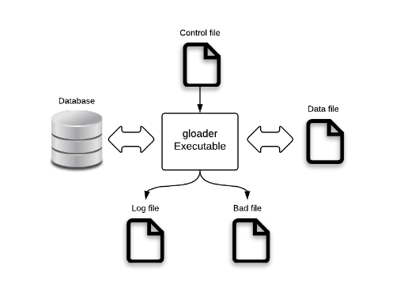

<a id="f08e397a66a2d45f"></a>

# 34. gloader/gloadernet (Upload/download Tool)

> 원본: [GOLDILOCKS 3.2 User Manual (ko)](https://manual.sunjesoft.co.kr/goldilocks/3_2_x/manual/ko/f08e397a66a2d45f)  
> 태그: `GOLDILOCKS_Venus_3_2_14_retagged`

[← 33. gsql/gsqlnet (Interactive SQL Tool)](33-gsql-gsqlnet-interactive-sql-tool.md) · [전체 목차](../README.md) · [35. gdump →](35-gdump.md)

<a id="48e422ad4ac73459"></a>
## gloader 개요

gloader는 GOLDILOCKS 내에 존재하는 데이터를 테이블 단위로 다운로드 또는 업로드 할 수 있는 유틸리티이다.

**실행파일 구분**

<a id="fe52a2ed82f2b04b"></a>
| 실행파일 이름 | 구분 |
| --- | --- |
| gloader | Direct attach (D/A) 환경에서 사용된다. |
| gloadernet | Client/ server (C/S) 환경에서 사용된다. |

<a id="65df94447413ec09"></a>
### Environment

gloader는 database와 연결이 되어야 하고 gloader를 사용할 때 필요한 모든 파일에 주의를 기울여야 한다.

<a id="03038223a6209654"></a>


데이터를 업로드하려면 control file과 datafile이 필요하고 업로드 결과로써 log file이 생성된다.  
데이터를 다운로드하려면 control file이 필요하고 다운로드 결과로써 datafile과 log file, bad file이 생성된다.

<a id="2232231dd41dd311"></a>
#### Control File

Control file은 gloader가 동작하는데 필요한 파일로써 다음과 같은 정보를 가지고 있다. ([Control File 구문](#b8d92d4776f13528)를 참조한다.)

- Table 이름
- Schema 이름
- Row의 column 사이의 구분자
- Column 데이터의 시작과 끝을 알리는 qualifier
- Row 사이의 구분자
- Character set
- 공백 문자에 대한 trim 여부
- Where 절

<a id="a77649aa2dddaa7b"></a>
#### Data File

gloader가 데이터를 업로드 할 때는 data file을 미리 준비해야 하고 데이터를 다운로드 할 때는 datafile이 생성된다.  
Data file은 텍스트 형식과 바이너리 형식을 지원한다.

- 텍스트 형식 데이터 파일은 파일의 내용을 확인하여 직접 수정할 수 있다는 장점이 있다.
- 바이너리 형식 데이터 파일은 텍스트 형식과 비교하여 빠르게 수행할 수 있다.

> gloader는 data file에 대해 default로 direct IO를 사용한다. Direct IO를 사용하여 data file을 업로드 할 때 파일 크기가 direct IO에 적합한 정렬이 아닐 경우, gloader가 임의로 파일 크기를 조절한다.

<a id="cb2c21ef4c32c836"></a>
#### Log File

Log file은 gloader가 동작하면서 발생하는 다음과 같은 에러와 결과를 기록하는 파일이다.

- 에러가 발생한 row 번호와 원인
- gloader 운영에 대한 결과

<a id="23eb38894a2baada"></a>
#### Bad File

Bad file은 gloader가 데이터를 업로드하는 동안 에러가 발생한 row를 기록하는 파일이다. Bad file을 기록할 때 column, row 사이의 구분자와 qualifier는 사용자가 지정한 것을 사용한다.

<a id="59ad756dcf787754"></a>
### 사용 예

다음은 gloader를 이용하여 데이터를 다운로드하고 업로드하는 예이다.

다음과 같이 SQL statement를 이용하여 table을 생성한다.

```
$ cat test.sql
CREATE TABLE TEST
(
TEST_NAME VARCHAR(60),
TEST_NUM  INTEGER,
TEST_TIME TIMESTAMP(0) WITH TIME ZONE
);

INSERT INTO TEST VALUES
( 'NAME', 1, '1999-01-08 04:05:06.789 -8:00' );
INSERT INTO TEST VALUES
( 'NAME', 2, '1999-01-08 04:05:06.789 -8:00' );
INSERT INTO TEST VALUES
( 'NAME', 3, '1999-01-08 04:05:06.789 -8:00' );
COMMIT;
```

다음과 같이 control file을 이용한다.

```
$ cat test.ctl
TABLE TEST
FIELDS TERMINATED BY ','
OPTIONALLY ENCLOSED BY '"'
LINES TERMINATED BY '\n'
```

- Export: 데이터를 다운로드 한다.

```
$ gloader test test --export --control test.ctl --data test.dat --no-copyright

 COMPLETED IN EXPORTING TABLE: PUBLIC.TEST, 3 RECORDS
$ cat test.dat
"NAME","1","1999-01-08 04:05:07. -08:00"
"NAME","2","1999-01-08 04:05:07. -08:00"
"NAME","3","1999-01-08 04:05:07. -08:00"
$ cat test.log
cat test.log
COMPLETED IN EXPORTING TABLE: PUBLIC.TEST, 3 RECORDS [ Start Time: 2010-1-1 01:01:01 End Time: 2010-1-1 01:01:01 Taken Time: 56496 micro-sec ]
```

- Import: 데이터를 업로드 한다.

```
$ cat import.dat
"NAME","1","1999-01-08 04:05:07. -08:00"
"NAME","2","1999-01-08 04:05:07. -08:00"
"NAME","3","1999-01-08 04:05:07. -08:00"
"FAIL","FAIL","FAIL"

$ gloader test test --import --control test.ctl --data import.dat --no-copyright

 COMPLETED IN IMPORTING TABLE: PUBLIC.TEST, TOTAL 4 RECORDS, SUCCEEDED 3 RECORDS

$ gsql test test
gSQL> select * from test;
TEST_NAME TEST_NUM TEST_TIME                        
--------- -------- ---------------------------------
NAME             1 1999-01-08 04:05:07.000000 -08:00
NAME             2 1999-01-08 04:05:07.000000 -08:00
NAME             3 1999-01-08 04:05:07.000000 -08:00
NAME             1 1999-01-08 04:05:07.000000 -08:00
NAME             2 1999-01-08 04:05:07.000000 -08:00
NAME             3 1999-01-08 04:05:07.000000 -08:00

6 rows selected.

$ cat import.log
Err Rec(4) Col(2): 22018(12006): data value is not a numeric literal
COMPLETED IN IMPORTING TABLE: PUBLIC.TEST, TOTAL 4 RECORDS, SUCCEEDED 3 RECORDS [ Start Time: 2010-1-1 01:01:01 End Time: 2010-1-1 01:01:01 Taken Time: 56496 micro-sec ]

$ cat import.bad
"FAIL","FAIL","FAIL"
```

<a id="a8a96209f56a6f15"></a>
## gloader 사용

<a id="dc0477b59488addd"></a>
### Datafile Type

<a id="d3a2ba26b6325410"></a>
#### Text Datafile

사용자가 눈으로 확인하고 수정할 수 있는 문자열로 표현된다. 직접 파일을 생성하거나 수정할 수 있고 database에 있는 기존 테이블의 데이터를 다운로드 받을 수도 있다. 또한 다른 DBMS 제품에서 다운로드 받은 텍스트 형식의 데이터를 이용할 수도 있다.  
텍스트 타입 데이터 파일의 표현에 대한 설명은 control file에 기록된다.

<a id="570b27372bfb60e1"></a>
#### Binary Datafile

이진 파일로 되어 있다. 사용자는 binary datafile을 직접 생성하거나 수정할 수 없고 database에 있는 기존 테이블의 데이터를 다운로드 받을 때 생성된다.

Binary 타입 파일의 데이터는 GOLDILOCKS에 정의된 각 데이터 타입의 구조에 적합하게 기록되기 때문에 텍스트 타입보다 빠르게 업로드 할 수 있다.

> GOLDILOCKS database 버전이 서로 다른 경우에는 binary 파일을 이용한 데이터 업로드/ 다운로드를 권하지 않는다. 또한 문자열 집합이 다른 database 사이에 업로드/ 다운로드 할 경우, column의 크기를 변경해야할 수도 있다.

<a id="618f8610fe2780bb"></a>
### 데이터 다운로드

<a id="5d67a3a0217cf0d4"></a>
#### Text File로 다운로드

<a id="f890fcab5e2229d1"></a>
##### Simple Download

다음은 다운로드 할 테이블의 구조와 데이터를 보여준다.

```
$ cat test.sql
CREATE TABLE TEST ( I1 INTEGER PRIMARY KEY, I2 VARCHAR(10), I3 VARBINARY(10) );
INSERT INTO TEST VALUES( 1, 'LKH', X'10' );
INSERT INTO TEST VALUES( 2, 'KMM', X'A0' );
INSERT INTO TEST VALUES( 3, 'ksj', X'CD' );
COMMIT;

$ gsql test test
gSQL> SELECT * FROM TEST;

I1 I2  I3
-- --- --
 1 LKH 10
 2 KMM A0
 3 ksj CD

3 rows selected.
```

다음은 테이블 데이터를 다운로드하기 위해 작성한 control 파일의 내용이다.

```
$ cat test.ctl
TABLE  PUBLIC.test
FIELDS TERMINATED BY ','
```

다음과 같이 gloader를 통해 T1 테이블의 데이터를 다운로드한다.

```
$ gloader test test --export --control test.ctl --data test.dat

 COMPLETED IN EXPORTING TABLE: PUBLIC.test, TOTAL 3 RECORDS, SUCCEEDED 3 RECORDS
```

다음과 같이 TEST 테이블의 데이터가 데이터 파일에 다운로드 되었다.

```
$ ls 
test.ctl test.dat test.log
$ cat test.dat
1,LKH,10
2,KMM,A0
3,ksj,CD
```

<a id="b4b2da632a496a5a"></a>
##### 공백 문자 처리

다음은 다운로드 할 테이블의 구조와 데이터를 보여준다.

```
$ cat test.sql
CREATE TABLE TEST ( I1 INTEGER PRIMARY KEY, I2 VARCHAR(10), I3 VARBINARY(10) );
INSERT INTO TEST VALUES( 1, ' L K H ', X'10' );
INSERT INTO TEST VALUES( 2, 'KIM
MM', X'A0' );
INSERT INTO TEST VALUES( 3, ' KIM S 
J ', X'CD' );
COMMIT;

$ gsql test test
gSQL> SELECT * FROM TEST;

I1 I2      I3
-- ------- --
 1  L K H  10
 2 KIM     A0
   MM        
 3  KIM S  CD
   J       
3 rows selected.
```

- OPTIONALLY ENCLOSED BY 구문을 사용하지 않은 control 파일

    - 다음은 테이블 데이터를 다운로드하기 위해 작성한 control 파일의 내용이다.

```
$ cat test.ctl
TABLE  PUBLIC.test
FIELDS TERMINATED BY ','
LINES TERMINATED BY '\n'
```

    - 다음은 TEST 테이블의 데이터가 데이터 파일에 다운로드된 모습이다.

```
$ ls 
test.ctl test.dat test.log
$ cat test.dat
1, L K H ,10
2,KIM
MM,A0
3, KIM S 
J ,CD
```

> 데이터에 공백 문자가 있는 경우 control 파일에 OPTIONALLY ENCLOSED BY 구문을 사용해야 다운로드 할 때와 업로드 할 때 모두 동일한 데이터를 유지할 수 있다.

- OPTIONALLY ENCLOSED BY 구문을 사용한 control 파일

    - 다음은 테이블 데이터를 다운로드하기 위해 작성한 control 파일의 내용이다.

```
$ cat test.ctl
TABLE  PUBLIC.test
FIELDS TERMINATED BY ','
OPTIONALLY ENCLOSED BY '"'
LINES TERMINATED BY '\n'
```

    - 다음은 TEST 테이블의 데이터가 데이터 파일에 다운로드된 모습이다.

```
$ ls 
test.ctl test.dat test.log
$ cat test.dat
"1"," L K H ","10"
"2","KIM
MM","A0"
"3"," KIM S 
J ","CD"
```

<a id="0804740fd1e7b712"></a>
##### 시간 데이터 타입

DATE, TIME, TIME WITH TIME ZONE, TIMESTAMP, TIMESTAMP WITH TIME ZONE을 다운로드하면 프로퍼티 기본 포맷으로 출력된다.

다음은 DATE, TIME WITH TIME ZONE, TIMESTAMP WITH TIME ZONE의 데이터 형식을 보여준다.

```
$ gsql test test
gSQL> SELECT PROPERTY_VALUE, INIT_VALUE FROM V$PROPERTY WHERE PROPERTY_NAME LIKE 'NLS_DATE_FORMAT';

PROPERTY_VALUE                    INIT_VALUE                       
--------------------------------- ---------------------------------
YYYY-MM-DD                        YYYY-MM-DD 

1 row selected.

gSQL> SELECT PROPERTY_VALUE, INIT_VALUE FROM V$PROPERTY WHERE PROPERTY_NAME LIKE 'NLS_TIME_WITH_TIME_ZONE_FORMAT';

PROPERTY_VALUE                    INIT_VALUE                       
--------------------------------- ---------------------------------
HH24:MI:SS.FF6 TZH:TZM            HH24:MI:SS.FF6 TZH:TZM 

1 row selected.

gSQL> SELECT PROPERTY_VALUE, INIT_VALUE FROM V$PROPERTY WHERE PROPERTY_NAME LIKE 
'NLS_TIMESTAMP_WITH_TIME_ZONE_FORMAT';

PROPERTY_VALUE                    INIT_VALUE                       
--------------------------------- ---------------------------------
YYYY-MM-DD HH24:MI:SS.FF6 TZH:TZM YYYY-MM-DD HH24:MI:SS.FF6 TZH:TZM

1 row selected.
```

다음은 다운로드 할 테이블의 구조와 데이터를 보여준다.

```
$ cat test.sql
CREATE TABLE TEST ( I1 INTEGER, I2 DATE, I3 TIME WITH TIME ZONE, I4 TIMESTAMP WITH TIME ZONE );

INSERT INTO TEST VALUES ( 1, '1999-12-31', '01:01:01', '1999-12-31 01:01:01.789 -8:00' );
INSERT INTO TEST VALUES ( 2, '2000-01-01', '23:12:12', '2000-01-01 23:12:06.0 +8:00' );
INSERT INTO TEST VALUES ( 3, '2000-12-31', '23:12:12', '2000-12-31 23:12:12.0 -8:00' );
COMMIT;

$ gsql test test
gSQL> SELECT * FROM T1;
I1 I2         I3                     I4                               
-- ---------- ---------------------- ---------------------------------
 1 1999-12-31 01:01:01.000000 +09:00 1999-12-31 01:01:01.789000 -08:00
 2 2000-01-01 23:12:12.000000 +09:00 2000-01-01 23:12:06.000000 +08:00
 3 2000-12-31 23:12:12.000000 +09:00 2000-12-31 23:12:12.000000 -08:00

3 rows selected.
```

다음은 테이블 데이터를 다운로드하기 위해 작성한 control 파일의 내용이다.

```
$ cat test.ctl
TABLE  PUBLIC.test
FIELDS TERMINATED BY ','
OPTIONALLY ENCLOSED BY '"'
LINES TERMINATED BY '\n'
```

다음은 TEST 테이블의 데이터를 데이터 파일에 다운로드한 모습이다.

```
$ gloader test test -e -c test.ctl -d test.dat

 COMPLETED IN EXPORTING TABLE: PUBLIC.TEST, 3 RECORDS 

$ ls 
test.ctl test.dat test.log
$ cat test.dat
"1","1999-12-31 00:00:00","01:01:01.000000 +09:00","1999-12-31 01:01:01.789000 -08:00"
"2","2000-01-01 00:00:00","23:12:12.000000 +09:00","2000-01-01 23:12:06.000000 +08:00"
"3","2000-12-31 00:00:00","23:12:12.000000 +09:00","2000-12-31 23:12:12.000000 -08:00"
```

<a id="9e31259abd020a5d"></a>
#### Binary File로 다운로드

<a id="1578b6b6d77ea54a"></a>
##### Simple Download

다음은 다운로드 할 테이블의 구조와 데이터를 보여준다.

```
$ cat test.sql
CREATE TABLE TEST ( I1 INTEGER PRIMARY KEY, I2 VARCHAR(10), I3 VARBINARY(10) );
INSERT INTO TEST VALUES( 1, 'LKH', X'10' );
INSERT INTO TEST VALUES( 2, 'KMM', X'A0' );
INSERT INTO TEST VALUES( 3, 'ksj', X'CD' );
COMMIT;

$ gsql test test
gSQL> SELECT * FROM TEST;

I1 I2  I3
-- --- --
 1 LKH 10
 2 KMM A0
 3 ksj CD

3 rows selected.
```

다음은 테이블 데이터를 다운로드하기 위해 작성한 control 파일의 내용이다.

```
$ cat test.ctl
TABLE  PUBLIC.test
FIELDS TERMINATED BY ','
```

TEST 테이블의 데이터는 다음과 같이 gloader를 통해 다운로드된다.

```
$ gloader test test --export --control test.ctl --data test.dat --format binary

 COMPLETED IN EXPORTING TABLE: PUBLIC.test, 3 RECORDS
```

다음은 gloader를 수행한 후에 생성된 파일이다.

```
$ ls 
test.ctl test.dat test.log
```

> Binary 파일의 내용은 직접 확인하거나 수정할 수 없다.

<a id="a78550e0e57670b8"></a>
##### Complex Download

다음은 다운로드 할 테이블의 구조와 데이터를 보여준다.

```
$ gsql test test
gSQL>\desc TEST

COLUMN_NAME TYPE                        IS_NULLABLE
----------- --------------------------- -----------
I1          NUMBER(10,0)                TRUE       
I2          DATE                        TRUE       
I3          TIME(6) WITH TIME ZONE      TRUE       
I4          TIMESTAMP(6) WITH TIME ZONE TRUE       

gSQL> SELECT COUNT(*) FROM TEST;

COUNT(*)
--------
 1572864

1 row selected.
```

다음은 테이블 데이터를 다운로드하기 위해 작성한 control 파일의 내용이다.

```
$ cat test.ctl
TABLE  PUBLIC.test
FIELDS TERMINATED BY ','
```

- 하나의 파일로 다운로드

    - 다음과 같이 gloader를 통해 TEST 테이블의 데이터를 다운로드한다.

```
$ gloader test test --export --control test.ctl --data test.dat --format binary

loaded 1000 records into PUBLIC.TEST

loaded 2000 records into PUBLIC.TEST

... 중략 ...

loaded 1571000 records into PUBLIC.TEST

loaded 1572000 records into PUBLIC.TEST

COMPLETED IN EXPORTING TABLE: PUBLIC.TEST, TOTAL 1572864 RECORDS
```

    - 다음은 gloader를 수행한 후에 생성된 파일이다.

```
$ ll test.*
-rw-r--r-- 1 test test       71 2014-08-28 12:13 t1.ctl
-rw-r--r-- 1 test test 59930624 2014-08-28 12:49 t1.dat
-rw-r--r-- 1 test test      159 2014-08-28 12:49 t1.log
```

- 여러 파일로 다운로드

    - 다음과 같이 gloader를 통해 TEST 테이블의 데이터를 다운로드한다.

```
$ gloader test test --export --control test.ctl --data test.dat --format binary --filesize 31461376


loaded 1000 records into PUBLIC.TEST

loaded 2000 records into PUBLIC.TEST

... 중략 ...

loaded 1571000 records into PUBLIC.TEST

loaded 1572000 records into PUBLIC.TEST

 COMPLETED IN EXPORTING TABLE: PUBLIC.TEST, TOTAL 1572864 RECORDS
```

    - 다음은 gloader를 수행한 후에 생성된 파일이다.

```
$ ll test.*
-rw-r--r-- 1 test test       71 2014-08-28 12:13 test.ctl
-rw-r--r-- 1 test test 31461376 2014-08-28 13:02 test.dat
-rw-r--r-- 1 test test 28474880 2014-08-28 13:02 test.dat.001
-rw-r--r-- 1 test test      159 2014-08-28 12:49 test.log
```

<a id="b972c48d5172346e"></a>
### 데이터 업로드

<a id="477fce4925ef05c3"></a>
#### Text File 업로드

<a id="4d3dc0598e40a191"></a>
##### Simple Upload

다음은 업로드 대상인 테이블을 보여준다.

```
gSQL> \DESC TEST

COLUMN_NAME TYPE                        IS_NULLABLE
----------- --------------------------- -----------
I1          NUMBER(10,0)                TRUE       
I2          DATE                        TRUE       
I3          TIME(6) WITH TIME ZONE      TRUE       
I4          TIMESTAMP(6) WITH TIME ZONE TRUE       

gSQL> SELECT * FROM TEST;

no rows selected.
```

다음은 업로드 할 데이터 파일을 보여준다.

```
$ cat test.dat
1,1999-12-31 00:00:00,01:01:01.000000 +09:00,1999-12-31 01:01:01.789000 -08:00
2,2000-01-01 00:00:00,23:12:12.000000 +09:00,2000-01-01 23:12:06.000000 +08:00
3,2000-12-31 00:00:00,23:12:12.000000 +09:00,2000-12-31 23:12:12.000000 -08:00
```

다음과 같이 gloader로 데이터 파일을 업로드하고 결과를 확인한다.

```
$ gloader test test --import --control test.ctl --data test.dat

 COMPLETED IN IMPORTING TABLE: PUBLIC.TEST, TOTAL 3 RECORDS, SUCCEEDED 3 RECORDS 

$ gsql test test

gSQL> select * from test;

I1 I2         I3                     I4                               
-- ---------- ---------------------- ---------------------------------
 1 1999-12-31 01:01:01.000000 +09:00 1999-12-31 01:01:01.789000 -08:00
 2 2000-01-01 23:12:12.000000 +09:00 2000-01-01 23:12:06.000000 +08:00
 3 2000-12-31 23:12:12.000000 +09:00 2000-12-31 23:12:12.000000 -08:00

3 rows selected.
```

<a id="572109f18355a97d"></a>
##### 공백 문자 처리

다음은 업로드 대상인 테이블을 보여준다.

```
gSQL> \DESC TEST

COLUMN_NAME TYPE                  IS_NULLABLE
----------- --------------------- -----------
I1          NUMBER(10,0)          TRUE
I2          CHARACTER VARYING(10) TRUE       
I3          BINARY VARYING(10)    TRUE    

gSQL> SELECT * FROM TEST;

no rows selected.
```

- Control 파일에서 OPTIONALLY ENCLOSED BY 구문을 사용하지 않고 다운로드한 데이터 파일

    - 다음은 control 파일에서 OPTIONALLY ENCLOSED BY 구문을 사용하지 않고 다운로드한 데이터 파일이다. ([Text File로 다운로드](#5d67a3a0217cf0d4)를 참조한다.)

```
$ cat test.dat
1, L K H ,10
2,KIM
MM,A0
3, KIM S 
J ,CD

```

    - 다음과 같이 gloader로 데이터 파일을 업로드하고 결과를 확인한다. 두 번째와 세 번째 레코드의 데이터 내에 New Line('`\`n')이 존재하는데도 불구하고 column 데이터의 시작과 끝을 알리는 qualifier가 설정되지 않아 이를 row 구분자로 인식하게 된다.

```
$ gloader test test --import --control test.ctl --data test.dat

 COMPLETED IN IMPORTING TABLE: PUBLIC.TEST, TOTAL 5 RECORDS, SUCCEEDED 3 RECORDS

$ gsql test test

gSQL> select * from test;

I1 I2     I3  
-- ------ ----
 1 L K H  10  
 2 KIM    null
 3 KIM S  null

3 rows selected.
```

- Control 파일에서 OPTIONALLY ENCLOSED BY 구문을 사용하여 다운로드한 데이터 파일

    - 다음은 control 파일에서 OPTIONALLY ENCLOSED BY 구문을 사용하여 다운로드한 데이터 파일이다. ([Text File로 다운로드](#5d67a3a0217cf0d4)를 참조한다.) 위의 결과와는 달리 아래의 결과를 보면 New Line('`\n`')이 데이터의 일부로 취급되었다.

```
$ cat test.dat
"1"," L K H ","10"
"2","KIM
MM","A0"
"3"," KIM S 
J ","CD"
```

    - 다음과 같이 gloader로 데이터 파일을 업로드하고 결과를 확인한다.

```
$ gloader test test --import --control test.ctl --data test.dat

 COMPLETED IN IMPORTING TABLE: PUBLIC.TEST, TOTAL 5 RECORDS, SUCCEEDED 3 RECORDS

$ gsql test test

gSQL> select * from test;


I1 I2      I3
-- ------- --
 1  L K H  10
 2 KIM     A0
   MM        
 3  KIM S  CD
   J         

3 rows selected.
```

<a id="ac7081658621ed17"></a>
#### Binary File 업로드

<a id="d617fcf0598e6b62"></a>
##### Simple Upload

다음은 업로드 할 테이블의 구조를 보여준다.

```
gSQL> \DESC TEST

COLUMN_NAME TYPE                  IS_NULLABLE
----------- --------------------- -----------
I1          NUMBER(10,0)          TRUE
I2          CHARACTER VARYING(10) TRUE       
I3          BINARY VARYING(10)    TRUE    

gSQL> SELECT * FROM TEST;

no rows selected.
```

다음은 테이블 데이터를 다운로드하기 위해 작성한 control 파일의 내용이다.

```
$ cat test.ctl
TABLE  PUBLIC.test
FIELDS TERMINATED BY ','
```

다음은 gloader를 이용하여 업로드 할 파일이다. test.dat는 [Binary File로 다운로드](#9e31259abd020a5d) 할 때 미리 다운로드하였다.

```
$ ls 
test.dat
```

다음과 같이 TEST 테이블에 데이터를 업로드하고 결과를 보여준다.

```
$ gloader test test --import --control test.ctl --data test.dat --format binary

 COMPLETED IN IMPORTING TABLE: PUBLIC.TEST, TOTAL 3 RECORDS, SUCCEEDED 3 RECORDS

$ gsql test test
gSQL> SELECT * FROM TEST;

I1 I2  I3
-- --- --
 1 LKH 10
 2 KMM A0
 3 ksj CD

3 rows selected.
```

<a id="f4150aa30d5b0a99"></a>
##### Complex Upload

다음은 업로드 할 테이블의 구조를 보여준다.

```
gSQL> \DESC TEST

COLUMN_NAME TYPE                  IS_NULLABLE
----------- --------------------- -----------
I1          NUMBER(10,0)          TRUE
I2          CHARACTER VARYING(10) TRUE       
I3          BINARY VARYING(10)    TRUE    

gSQL> SELECT * FROM TEST;

no rows selected.
```

다음은 업로드하기 위한 데이터 파일이다.

```
$ ll test.*
 -rw-r--r-- 1 test test       71 2014-08-28 12:13 test.ctl
 -rw-r--r-- 1 test test 31461376 2014-08-28 13:02 test.dat
 -rw-r--r-- 1 test test 28474880 2014-08-28 13:02 test.dat.001
 -rw-r--r-- 1 test test      159 2014-08-28 12:49 test.log
```

--filesize로 download 한 여러 파일을 upload 하려면 각각의 데이터 파일에 대해 개별적으로 gloader를 수행해야 한다.

```
$ gloader test test --import --control test.ctl --data test.dat --format binary
 COMPLETED IN IMPORTING TABLE: PUBLIC.TEST, TOTAL 860728 RECORDS, SUCCEEDED 2285000 RECORDS, ERRORED 0 RECORDS 

$ gloader test test --import --control test.ctl --data test.dat.001 --format binary 
 COMPLETED IN IMPORTING TABLE: PUBLIC.TEST, TOTAL 860728 RECORDS, SUCCEEDED 860728 RECORDS, ERRORED 0 RECORDS
```

다음은 업로드한 결과이다.

```
gSQL> select count(*) from test;

COUNT(*)
--------
 3145728

1 row selected.
```

<a id="d8f01c8600275a4f"></a>
#### Upload 처리 단위 제어

데이터를 업로드 할 때 성능과 관련된 옵션을 사용하면 더 빠르게 실행할 수 있다.  
[--array](#edc18aba818e24b1), [--commit](#01832550800dbca3), [--atomic](#13d82e18f4fa1412)을 참조한다.

다음은 약 38만 레코드를 가진 데이터 파일이다.

```
$ ll test.dat
-rw-r--r-- 1 test test 75092480 2014-08-28 15:59 test.dat
```

다음은 업로드에 사용되는 control 파일이다.

```
$ cat test.ctl
TABLE  PUBLIC.test
FIELDS TERMINATED BY ','
OPTIONALLY ENCLOSED BY '"'
LINES TERMINATED BY '\n'
```

<a id="ccfcdbaaabc6655c"></a>
##### Array 바인딩과 Commit 주기

다음과 같이 gloader 명령을 실행하면 바인드하는 레코드를 5000 개, COMMIT하는 레코드는 20000 개로 하여 업로드한다.

```
$ gloader test test --import --control test.ctl --data test.dat --array 5000 --commit 20000


loaded 5000 records into PUBLIC.TEST


loaded 10000 records into PUBLIC.TEST


loaded 15000 records into PUBLIC.TEST

... 중략 ...
loaded 3810000 records into PUBLIC.TEST


loaded 3815000 records into PUBLIC.TEST


loaded 3818244 records into PUBLIC.TEST

 COMPLETED IN IMPORTING TABLE: PUBLIC.TEST, TOTAL 3818243 RECORDS, SUCCEEDED 3818243 RECORDS
```

gloader를 실행한 결과는 다음과 같다.

```
gSQL> SELECT I1, I2, I3 FROM TEST FETCH 3;
I1 I2 I3
-- ------- --
1 L K H 10
2 KIM A0
3 KIM S CD
3 rows selected.
gSQL> SELECT COUNT(*) FROM TEST;
COUNT(*)
--------
3818246
1 row selected.
```

<a id="e04cd6ece50b0c60"></a>
##### Array 바인딩과 Atomic 옵션

다음과 같이 gloader 명령을 실행하면 바인드하는 레코드를 5000 개씩 atomic INSERT로 업로드하고, 1000 개의 레코드가 실패한다.

```
$ gloader test test --import --control test.ctl --data test.dat --array 5000 --atomic


loaded 5000 records into PUBLIC.TEST


loaded 10000 records into PUBLIC.TEST


loaded 15000 records into PUBLIC.TEST

... 중략 ...
loaded 38175000 records into PUBLIC.TEST

 COMPLETED IN IMPORTING TABLE: PUBLIC.TEST, TOTAL 3818243 RECORDS, SUCCEEDED 3817243 RECORDS
```

다음은 gloader로 실행한 결과이다.

```
gSQL> SELECT I1, I2, I3 FROM TEST FETCH 3;
I1 I2 I3
-- ------- --
1 L K H 10
2 KIM A0
3 KIM S CD
3 rows selected.
gSQL> SELECT COUNT(*) FROM TEST;
COUNT(*)
--------
3817243
1 row selected.
```

다음은 업로드에 실패한 원인을 로그 파일에 기록한 결과인데 첫 번째 레코드의 첫 column에 숫자가 아닌 데이터가 저장되었기 때문에 업로드에 실패하였다.

```
$ cat test.log
Err Rec(1) Col(1): 22018(12006): data value is not a numeric literal
Err Rec(1) Col(-1): HY000(19041): Failed to atomic execution
Err Rec(1001) Col(1): 22018(12006): data value is not a numeric literal
Err Rec(1001) Col(-1): HY000(19041): Failed to atomic execution
COMPLETED IN IMPORTING TABLE: PUBLIC.TEST, TOTAL 3818243 RECORDS, SUCCEEDED 3817243 RECORDS [ Start Time: 2014-8-28 16:46:42 End Time: 2014-8-28 16:46:52 Taken Time: 10084582 micro-sec ]
```

다음은 업로드에 실패한 레코드를 bad file에 기록한 결과인데 500 개의 array 단위로 업로드하기 때문에 1000 개의 레코드가 저장되었다.

```
"s1"," L K H ","10"
"2","KIM","A0"
"3"," KIM S J ","CD"
... 생략 ...
```

> Array, commit 옵션은 수행 결과에 영향을 주지 않지만 atomic 연산의 경우 INSERT 성공이나 실패가 array 단위로 처리되기 때문에 하나의 레코드라도 업로드에 실패하면 해당 레코드가 속한 array의 모든 레코드가 INSERT 실패로 처리된다.   
> 로그 파일에는 array에서 처음 실패한 레코드의 원인만 기록되고 이후 레코드의 실패에 대해선 기록되지 않는다.

<a id="cf75848168bf4600"></a>
#### Parallel Upload

gloader가 업로드 작업을 수행할 때 작업을 부분별로 나누어 여러 thread로 처리할 수 있어 성능 향상에 도움이 된다. ([--parallel](#d8db519e7bb3f4bb)을 참조한다.)

다음은 약 38만 레코드를 가진 데이터 파일이다.

```
$ ll test.dat
-rw-r--r-- 1 test test 75092480 2014-08-28 15:59 test.dat
```

다음은 업로드에 사용되는 control 파일이다.

```
$ cat test.ctl
TABLE  PUBLIC.test
FIELDS TERMINATED BY ','
OPTIONALLY ENCLOSED BY '"'
LINES TERMINATED BY '\n'
```

다음과 같이 gloader 명령을 실행하면 네 개의 업로드를 수행하는 thread로 바인드하는 레코드를 5000 개씩 INSERT로 업로드하고, 100 개의 레코드가 실패한다.

```
$ gloader test test --import --control test.ctl --data test.dat --array 5000 --parallel 4


loaded 5000 records into PUBLIC.TEST


loaded 10000 records into PUBLIC.TEST


loaded 15000 records into PUBLIC.TEST

... 중략 ...
loaded 3810000 records into PUBLIC.TEST


loaded 3815000 records into PUBLIC.TEST


 COMPLETED IN IMPORTING TABLE: PUBLIC.TEST, TOTAL 3818243 RECORDS, SUCCEEDED 3818143 RECORDS
```

다음은 gloader를 실행한 결과이다.

```
gSQL> SELECT I1, I2, I3 FROM TEST FETCH 3;
I1 I2 I3
-- ------- --
1 L K H 10
2 KIM A0
3 KIM S CD
3 rows selected.
gSQL> SELECT COUNT(*) FROM TEST;
COUNT(*)
--------
3818143
1 row selected.
```

다음은 업로드에 실패한 원인을 로그 파일에 기록한 결과이다.

```
$ cat test.log
Err Rec(1) Col(1): 22018(12006): data value is not a numeric literal
Err Rec(3) Col(1): 22018(12006): data value is not a numeric literal
Err Rec(5) Col(1): 22018(12006): data value is not a numeric literal
... 중략 ...
Err Rec(1001) Col(1): 22018(12006): data value is not a numeric literal
... 중략 ...
COMPLETED IN IMPORTING TABLE: PUBLIC.TEST, TOTAL 3818243 RECORDS, SUCCEEDED 3818143 RECORDS [ Start Time: 2014-8-28 16:46:42 End Time: 2014-8-28 16:46:52 Taken Time: 10084582 micro-sec ]
```

다음은 업로드에 실패한 레코드를 bad file에 기록한 결과인데 100 개의 레코드가 저장되었다.

```
"s1"," L K H ","10"
"s2","KIM","A0"
"s3"," KIM S J ","CD"
... 중략 ...
```

> 다중 thread로 데이터를 업로드 할 때 INSERT하고 에러가 발생한 레코드에 대한 내용을 로그 파일과 bad file에 기록하는데, 이 때 레코드의 순서는 데이터 파일에서의 순서와 다를 수 있다.

<a id="eff1114344533a21"></a>
### Upload 문제 해결

레코드 업로드 실패에는 다양한 원인이 있고 업로드에 실패한 레코드는 bad file에 기록된다. 또한 실패 원인에 대한 정보는 로그 파일에 기록된다.

<a id="d258c9d2ff6d7a34"></a>
#### 중복 제약으로 인한 실패

<a id="a87a3bbe0da20fca"></a>
##### 제약 조건이 있는 업로드 할 테이블에 이미 중복된 데이터가 존재 (primary key 또는 unique index)

다음은 업로드 할 테이블 대상의 구조이다.

```
gSQL>\desc T1

COLUMN_NAME TYPE                  IS_NULLABLE
----------- --------------------- -----------
I1          NUMBER(10,0)          TRUE
I2          CHARACTER VARYING(10) TRUE       
I3          BINARY VARYING(10)    TRUE    

gSQL> SELECT * FROM T1;

I1 I2  I3
-- --- --
 1 LKH 10
 2 KMM A0
 3 ksj CD

3 rows selected.
```

다음은 업로드 할 데이터 파일이다.

```
$ cat t1.dat
"1","LKH"
"4","SOS"
"5","OKO"
```

다음은 gloader로 업로드를 실행한 결과 및 생성된 로그 파일, bad file이다.   
레코드가 기본 key 제약 조건을 위반하였기 때문에 업로드에 실패하였다.

```
$ gloader test test -i -c t1.ctl -d t1.dat


 COMPLETED IN IMPORTING TABLE: PUBLIC.T1, TOTAL 3 RECORDS, SUCCEEDED 2 RECORDS 
$
$ cat t1.log
Err Rec(1) Col(-1): 40002(16057): unique constraint (PUBLIC.T1_PRIMARY_KEY) violated
COMPLETED IN IMPORTING TABLE: PUBLIC.T1, TOTAL 3 RECORDS, SUCCEEDED 2 RECORDS [ Start Time: 2014-8-26 16:19:51 End Time: 2014-8-26 16:19:51 Taken Time: 15455 micro-sec ]
$
$ cat t1.bad
"1","LKH"
```

<a id="99c37bd45ae7eb8f"></a>
#### 날짜/ 시간 타입 포맷으로 인한 실패

DATE, TIME, TIME WITH TIME ZONE, TIMESTAMP, TIMESTAMP WITH TIME ZONE 데이터 타입에 대해 포맷을 설정할 수 있고 이로 인해 gloader를 이용한 업로드에 실패할 수 있다.

다음은 업로드 할 테이블을 보여준다.

```
gSQL> \DESC T1

COLUMN_NAME TYPE IS_NULLABLE
----------- --------------------------- -----------
I1 NUMBER(10,0) TRUE
I2 TIMESTAMP(6) WITH TIME ZONE TRUE

gSQL> SELECT * FROM T1;
no rows selected.
```

다음은 서버에서 TIMESTAM WITH TIME ZONE의 포맷을 보여준다.

```
gSQL> SELECT PROPERTY_VALUE, INIT_VALUE FROM V$PROPERTY WHERE PROPERTY_NAME LIKE 'NLS_TIMESTAMP_WITH_TIME_ZONE_FORMAT';

PROPERTY_VALUE                    INIT_VALUE                       
--------------------------------- ---------------------------------
YYYY-MM-DD HH24:MI:SS.FF6 TZH:TZM YYYY-MM-DD HH24:MI:SS.FF6 TZH:TZM
```

다음은 업로드 할 데이터 파일이다.

```
$ cat t1.dat
"4","20000108 00:00:00"
"5","20000108 04:05:06"
"6","20000108 04:05:06"
```

다음은 gloader로 업로드한 결과이다.

```
$ gloader test test -i -c t1.ctl -d t1.dat
 
 COMPLETED IN IMPORTING TABLE: PUBLIC.T1, TOTAL 3 RECORDS, SUCCEEDED 0 RECORDS
```

다음은 업로드에 실패한 원인과 레코드가 기록된 로그 파일과 bad file이다.

```
$ cat t1.log
Err Rec(1) Col(2): HY000(12136): literal does not match format string
Err Rec(2) Col(2): HY000(12136): literal does not match format string
Err Rec(3) Col(2): HY000(12136): literal does not match format string
COMPLETED IN IMPORTING TABLE: PUBLIC.T1, TOTAL 3 RECORDS, SUCCEEDED 0 RECORDS [ Start Time: 2014-8-27 13:56:29 End Time: 2014-8-27 13:56:29 Taken Time: 20670 micro-sec ]

$ cat t1.bad 
"4","20000108 00:00:00"
"5","20000108 04:05:06"
"6","20000108 04:05:06"
```

<a id="edf0f1841b04a8ec"></a>
##### 문제 해결

데이터 파일과 서버에서 사용하는 데이터 타입의 포맷이 달라서 생긴 문제이므로 데이터 파일의 데이터 타입 포맷을 설정해줘야 한다. 이 때 .odbc.ini를 사용한다.

다음은 데이터 타입의 포맷을 설정한 .odbc.ini 파일이다.

```
$ cat .odbc.ini
[GOLDILOCKS]
HOST = 127.0.0.1
PORT = 21123
DATE_FORMAT = SYYYYMMDD
TIME_FORMAT = HH24MISS
TIME_WITH_TIME_ZONE_FORMAT = HH24MISS TZHTZM
TIMESTAMP_FORMAT = SYYYYMMDD HHMISS
TIMESTAMP_WITH_TIME_ZONE_FORMAT = SYYYYMMDD HH:MI:SS
```

다음은 .odbc.ini를 설정하고 다시 gloader를 수행한 결과이다.

```
$ gloader test test -i -c t1.ctl -d t1.dat

 COMPLETED IN IMPORTING TABLE: PUBLIC.T1, TOTAL 3 RECORDS, SUCCEEDED 3 RECORDS
```


> 
> - .odbc.ini에 설정하는 데이터 타입의 포맷은 전체 column에 적용되고 각각의 column에 대해 개별적으로 설정할 수는 없다.
> - .odbc.ini에 데이터 타입의 포맷을 설정하면 gloader로 다운로드 할 때도 적용된다.
> 

<a id="24abe83a7c955f05"></a>
#### 용량 부족으로 인한 실패

다음은 gloader를 수행하고 실패한 결과를 보여준다.

```
$ gloader test test -i -c t1.ctl -d t2.dat

loaded 4000 records into PUBLIC.T1
COMPLETED IN IMPORTING TABLE: PUBLIC.T1, TOTAL 4200 RECORDS, SUCCEEDED 0 RECORDS
```

다음은 테이블스페이스의 데이터 파일에 용량이 부족하여 실패했다는 것을 보여준다.

```
$ cat t1.log
Err Rec(1) Col(-1): HY000(14015): there is no extendible datafile in tablespace 'MEM_DATA_TBS'
Err Rec(2) Col(-1): HY000(14015): there is no extendible datafile in tablespace 'MEM_DATA_TBS'
... 중략 ...
COMPLETED IN IMPORTING TABLE: PUBLIC.T1, TOTAL 4200 RECORDS, SUCCEEDED 0 RECORDS [ Start Time: 2014-8-27 15:7:28 End Time: 2014-8-27 15:7:29 Taken Time: 317885 micro-sec ]
```

<a id="23b4573f20eb2995"></a>
##### 문제 해결

테이블스페이스의 데이터 파일을 확장하거나 추가한다.   
자세한 내용은 [ALTER TABLESPACE](../part-03-sql-manual/16-sql-references.md#c308f53537323289)를 참조한다.

<a id="239601c8dd81b218"></a>
#### 데이터 파일 분석 실패

Control 파일에서 기술한 field terminator와 qualifier, line terminator가 텍스트 데이터 파일 내에서 올바르게 사용되지 않아 일치하지 않을 수 있다.

다음은 업로드 할 테이블 대상의 구조이다.

```
gSQL>\desc T1
COLUMN_NAME TYPE                  IS_NULLABLE
----------- --------------------- -----------
I1          NUMBER(10,0)          TRUE
I2          CHARACTER VARYING(10) TRUE       
I3          BINARY VARYING(10)    TRUE
```

다음은 업로드 할 control 파일의 내용이다.

```
$ cat t1.ctl
TABLE  T1
FIELDS TERMINATED BY ','
OPTIONALLY ENCLOSED BY '"'
LINES TERMINATED BY '\n'
```

다음은 업로드 할 데이터 파일이다.

```
$ cat t1.dat
'1',"LKH","aa"
"2","SOS"","aa"
"5","OKO","00"
```

다음은 gloader로 업로드한 결과이다.

```
$ gloader test test --import --control t1.ctl --data t1.dat

 COMPLETED IN IMPORTING TABLE: PUBLIC.T1, TOTAL 3 RECORDS, SUCCEEDED 1 RECORDS
```

다음은 업로드에 실패한 원인과 레코드를 보여준다.

```
$ cat t1.log
Err Rec(1) Col(1): 22018(12006): data value is not a numeric literal
COMPLETED IN IMPORTING TABLE: PUBLIC.TEST, TOTAL 3 RECORDS, SUCCEEDED 1 RECORDS [ Start Time: 2014-8-28 18:6:13 End Time: 2014-8-28 18:6:13 Taken Time: 18679 micro-sec ]
$
$ cat t1.bad
"2","SOS"","aa"
'1',"LKH","aa"
```

<a id="712bada750f74c55"></a>
##### 문제 해결

데이터 파일 분석 실패의 주된 원인은 field terminator, qualifier, 또는 line terminator를 적절하게 사용하지 못한 것이다. 따라서 control 파일과 데이터 파일의 field terminator, qualifier와 line terminator를 확인하고 bad file에 기록된 레코드를 이용하여 데이터 파일을 수정해야 한다.

> 데이터 파일 분석 과정에서 파싱에 실패한 레코드는 로그 파일에 기록되지 않고 bad file에 기록된다.

<a id="27e44b1f00d7cb2b"></a>
#### Character Set이 다른 Database에 업로드

Characeter set이 다른 database 사이에서 데이터를 binary 타입으로 다운로드/ 업로드 할 경우, column의 크기를 변환해야 할 수도 있다.

다음은 업로드 할 테이블 대상의 구조이다.

```
gSQL>\desc T1
COLUMN_NAME TYPE                  IS_NULLABLE
----------- --------------------- -----------
I1          NUMBER(10,0)          TRUE
I2          CHARACTER VARYING(36) TRUE
```

다음은 테이블의 데이터인데 VARCHAR 타입이고 크기는 36 이며 모두 채워져 있다.

```
SELECT * FROM T1;

I1    I2
---- ------------------------------------ 
   1 일이삼사오육칠팔구십일이삼사오육칠팔
```

위의 데이터를 UHC database에서 다운로드한 후에 동일한 스키마를 갖는 UTF8 database로 업로드하면 다음과 같은 에러가 발생한다.

```
$ gloader test test -i -f binary -T T1 -d t1.dup

ERR-HY000(42023): byte length of data greater than column length.

ERROR: FAILED TO IMPORT TABLE PUBLIC.T1
```

<a id="b25eb0c8d219aa4b"></a>
##### 문제 해결

다음과 같이 column I2의 길이를 변경하면 데이터가 정상적으로 업로드된다.  
I2를 VARCHAR(18 CHAR)로 선언하거나 I2를 VARCAR(54) 크기로 선언한다.

```
gSQL>\desc T1
COLUMN_NAME TYPE                       IS_NULLABLE
----------- -------------------------- -----------
I1          NUMBER(10,0)               TRUE
I2          CHARACTER VARYING(18 CHAR) TRUE
```

```
gSQL>\desc T1
COLUMN_NAME TYPE                  IS_NULLABLE
----------- --------------------- -----------
I1          NUMBER(10,0)          TRUE
I2          CHARACTER VARYING(54) TRUE
```

<a id="b8d92d4776f13528"></a>
## Control File 구문

```
TABLE [schema_name.]table_name[domain_name.]
FIELDS TERMINATED BY 'Field Terminator'
[OPTIONALLY ENCLOSED BY 'Open Qualifier' [AND 'Close Qualifier']]
[LINES TERMINATED BY 'Line Terminator']
[Characterset characterset_name]
[RTRIM [ON|OFF]]
[LTRIM [ON|OFF]]
[WHERE="conditional statement"]
```

> 한 개의 control file은 한 개의 table에 대해 설명한다. 따라서 control file에는 위의 각 항목들이 한 번씩만 기술되어야 하며 중복하여 기술될 경우 control file 파싱 에러가 발생한다.

<a id="6ad47f7f97cf7405"></a>
### CHARACTERSET

<a id="0501b71dae2bb607"></a>
#### 구문

```
CHARACTERSET characterset_name
```

<a id="2d0607b2d0d9adcc"></a>
#### 설명

다운로드 또는 업로드 할 데이터 파일의 character set을 의미한다.  
Character set이 표현되지 않았을 경우, GOLDILOCKS의 property 중에 CHARACTER_SET의 기본 character set인 UTF8이 사용된다.

<a id="2ff1624fbb5fae2c"></a>
#### 사용 예

다음은 다운로드 또는 업로드 할 데이터 파일의 character set이 ASCII 코드인 예이다.

```
% cat sample.ctl
CHARACTERSET ASCII
```

<a id="190a1269023f6380"></a>
### TABLE

<a id="fb88408acc9a1146"></a>
#### 구문

```
TABLE table_name
TABLE schema_name.table_name
TABLE table_name@domain_name
TABLE schema_name.table_name@domain_name
```

<a id="d0606f153fac79c3"></a>
#### 설명

데이터를 업로드 또는 다운로드 할 대상 테이블 이름과 테이블이 속한 스키마 이름, 도메인 이름을 기술한다.  
도메인 이름은 데이터 다운로드에만 사용할 수 있는데 해당 멤버의 데이터만 다운로드 한다.  
테이블 이름에는 문자열 또는 double quote (") 문자열이 사용된다.  
테이블 이름이 gloader의 명령행 인자로도 주어질 경우, 명령행 인자로 주어진 값이 control file의 값보다 우선적으로 사용된다.

<a id="29117e56a765c5a0"></a>
#### 사용 예

다음은 테이블 이름만 기술하는 예이다.

```
% cat sample.ctl
TABLE lineitem
```

다음은 PUBLIC 스키마와 테이블 이름을 기술하는 예인데 위 예와 같은 의미를 갖는다.

```
% cat sample.ctl
TABLE PUBLIC.lineitem
```

다음은 G1N1 멤버의 PUBLIC 스키마와 테이블 이름을 기술하는 예인데 위 예와 같은 의미를 갖는다.

```
% cat sample.ctl
TABLE PUBLIC.lineitem@G1N1
```

다음은 delimited identifier로 생성한 테이블 이름을 기술하는 예이다.

```
gSQL> CREATE TABLE "Tab*&^" ( id INTEGER );
```

```
% cat sample.ctl
TABLE "Tab*&^"
```

<a id="0cf78048f5ac0d19"></a>
### FIELDS TERMINATED BY

<a id="96da6c7aead7e4cc"></a>
#### 구문

```
FIELDS TERMINATED BY 'Field Terminator'
```

<a id="fdee6e310fc6faf2"></a>
#### 설명

Field terminator는 데이터 파일의 record 데이터에서 각 column들 사이의 구분자로 사용된다. Control 파일에서 field terminator 설정은 생략할 수 없다.  
Field terminator는 하나 이상의 문자열로 설정할 수 있으며, qualifier 및 line terminator와 중복되거나 서로 간의 부분 집합 문자열을 사용해서는 안된다.  
Field terminator로 설정할 수 있는 문자열에는 제한이 없다. 다만 NEW LINE이나 TAB, CARRIAGE RETURN 문자를 설정하려면 각각 n, t, r 문자 앞에 역슬래시 (`\`) 또는 %를 추가해야 한다.  
Field terminator가 gloader의 명령행 인자로도 주어질 경우, 명령행 인자로 주어진 값이 control file의 값보다 우선적으로 사용된다.

<a id="b3d08490e287820a"></a>
#### 사용 예

다음은 field terminator를 COMMA와 NEW LINE으로 설정하는 예이다.

```
% cat sample.ctl

FIELDS TERMINATED BY ',\n'
```

```
% cat sample.ctl

FIELDS TERMINATED BY ',%n'
```

<a id="5c03bf5bdd7700c1"></a>
### OPTIONALLY ENCLOSED BY

<a id="777468b12f9e1e8b"></a>
#### 구문

```
OPTIONALLY ENCLOSED BY 'Open Qualifier' [AND 'Close Qualifier']
```

<a id="60de0d21e74134e6"></a>
#### 설명

Qualifier는 column의 시작과 끝을 표현하는 구분자이다.  
Qualifier는 하나의 문자로만 설정할 수 있으며 첫 번째 qualifier는 open qualifier, 마지막 qualifier는 close qualifier라고 불린다. Open qualifier와 close qualifier를 같은 문자로 설정할 수도 있지만 각기 다른 문자로 설정하여 column의 시작과 끝을 표현할 수도 있다.  
Qualifier로 설정한 문자는 field terminator와 line terminator에서 사용할 수 없다.  
Close qualifier가 문자 그대로 column 데이터에 포함될 경우, 두 개의 close qualifier를 사용하여 하나의 유효한 데이터임을 표현한다.  
Close qualifier를 생략하고 open qualifier만 설정할 경우, close qualifier에는 open qualifier와 동일한 문자를 사용한다.

OPTIONALLY ENCLOSED BY 구문이 없는 경우, column의 데이터는 field terminator에 의해 구분된다.  
Qualifier가 gloader의 명령행 인자로도 주어질 경우, 명령행 인자로 주어진 값이 control file의 값보다 우선적으로 사용된다.

> OPTIONALLY ENCLOSED BY 구문이 없는 경우, 데이터 다운로드와 업로드 결과가 서로 다를 수 있다. ([Upload 문제 해결](#eff1114344533a21)을 참조한다.)

<a id="f48d2037d6955657"></a>
#### 사용 예

다음은 open qualifier와 close qualifier를 각각 double quote (")와 single quote (')로 표현한 예이다.

```
% cat sample.ctl
OPTIONALLY ENCLOSED BY '"' AND "'"
```

<a id="6c482fededb993b8"></a>
### LINES TERMINATED BY

<a id="e64586e34ee5540f"></a>
#### 구문

```
LINES TERMINATED BY 'Line Terminator'
```

<a id="68ba3e02174c818b"></a>
#### 설명

Line terminator는 데이터 파일에서 각 record들의 구분자로 사용된다.  
Line terminator는 하나 이상의 문자열로 설정할 수 있으며, qualifier 및 field terminator와 중복되거나 서로 간의 부분집합 문자열을 사용해서는 안된다.

Line terminator 설정을 생략하면 NEW LINE('`\`n' 또는 '%n')이 기본값으로 사용된다.  
Line terminator가 gloader의 명령행 인자로도 주어질 경우, 명령행 인자로 주어진 값이 control file의 값보다 우선적으로 사용된다.

> • Unix와는 달리 Windows OS에서 export 받은 데이터 파일에는 하나의 NEW LINE 대신에 CARRIAGE RETURN과 NEW LINE이 함께 기록된다. 이런 데이터파일을 이용하여 import 할 때는 '`\`r`\`n'과 같이 control 파일의 LINES TERMINATED BY를 명확히 설정해 주어야 정상적으로 데이터를 import할 수 있다.   
>   
> • Field terminator와 line terminator는 각각 다른 문자열로 설정할 것을 권장한다. 첫 문자를 포함하여 일치하는 문자열이 많을수록 내부 비교 비용으로 인해 import 성능이 저하될 수 있다.  
> 즉, field terminator와 line terminator를 각각 다른 문자열로 하되 해당 문자열의 길이가 짧을수록 성능이 향상될 수 있다.

<a id="d5f6f6dab99f46c7"></a>
#### 사용 예

다음은 '^^`\`t`\`r`\`n'를 line terminator로 사용하는 예이다.

```
% cat sample.ctl

LINES TERMINATED BY '^^\t\r\n'
```

<a id="f054c1accc6856a0"></a>
### LTRIM

<a id="63ab50ef24623de3"></a>
#### 구문

```
LTRIM ON|OFF
```

<a id="612abd23854d1ad3"></a>
#### 설명

Left trim을 결정한다.  
Default 값은 OFF이며, OFF로 설정할 경우 왼쪽 WHITESPACE를 data로 간주한다.  
ON으로 설정할 경우 왼쪽 WHITESPACE는 무시한다.

> OPTIONALLY ENCLOSED BY 구문이 없을 경우에만 적용된다.  
> OPTIONALLY ENCLOSED BY 구문이 사용되고 데이터 파일에서 column이 구분자로 둘러싸여 있을 경우, RTRIM과 LTRIM은 OFF이다.

<a id="f1351c94bedfba44"></a>
#### 사용 예

다음은 LTRIM을 ON하는 예이다.

```
% cat sample.ctl
LTRIM ON
```

<a id="009811b0154991a0"></a>
### RTRIM

<a id="d2675a3d86f6bc9f"></a>
#### 구문

```
RTRIM ON|OFF
```

<a id="03175aa863a6d3b7"></a>
#### 설명

Rigth trim을 결정한다.  
Default 값은 OFF이며, OFF로 설정할 경우 오른쪽 WHITESPACE를 data로 간주한다.  
ON으로 설정할 경우 오른쪽 WHITESPACE는 무시한다.

> OPTIONALLY ENCLOSED BY 구문이 없을 경우에만 적용된다.  
> OPTIONALLY ENCLOSED BY 구문이 사용되고 데이터 파일에서 column이 구분자로 둘러싸여 있을 경우, RTRIM과 LTRIM은 OFF이다.

<a id="8af17ed906d2868f"></a>
#### 사용 예

다음은 RTRIM을 ON 하는 예이다.

```
% cat sample.ctl
RTRIM ON
```

<a id="c457e62027ebd857"></a>
### WHERE

<a id="89bfb9419ab568f3"></a>
#### 구문

```
WHERE="conditional_statement"
```

<a id="ec76e396ec0ebf20"></a>
#### 설명

데이터를 다운로드 할 경우 조건절을 사용한다.

<a id="7b619506993d5a63"></a>
#### 사용 예

다음은 WHERE를 사용하는 예이다.

```
% cat sample.ctl
WHERE="I2 > 3"
```

<a id="6811a9777e2ca6d7"></a>
## gloader Argument References

<a id="2123d215a7bc6af2"></a>
### 사용법

```
$ gloader --help
Usage 
    gloader user password mode data [control] [format] [options]

    user                user name
    password            password

mode: gloader's mode. 
  --export              export data
  --import              import data

data:
  --data                data file

options:
  --control             control file
  --format              file format(text|binary, Default text)
  --log                 log file
  --bad                 bad file
  --dsn                 dsn string
  --array               number of rows in bind array(Default 1000)
  --filesize            max file size
  --commit              number of commit unit(Default 5000)
  --comment             commenting on commit
  --atomic              use atomic function
  --parallel            use parallel in import
  --propagation         enabling or disabling a redo log propagation(ON|OFF)
  --errors              number of error count to allow(Default 100)
  --AsTIMESTAMP         bind DATE as TIMESTAMP
  --buffered            buffered disk io(Default direct io)
  --tablename           [schema_name.]table_name[@domain_name]
  --fieldterm           field terminator
  --lineterm            line terminator
  --qualifier           qualifier(column data encloser)
  --where               export only rows selected by given WHERE condition
  --group-id            importing distributed data by group id using global connections in a clustered environment
  --directio-size       direct io size(Default 512)
  --no-copyright        suppresses the display of the banner
  --silent              suppresses the display of the result message
  --help                print help message
```

<a id="ee5d2f2f668f4201"></a>
### 필수 인자

Database에 연결하기 위해 user name, password의 순서로 인자가 입력된다.  
gloader의 작업에 대한 mode, control file과 datafile이 인자로 입력된다.

<a id="560f76c0aff801c6"></a>
| 인자 | 설명 |
| --- | --- |
| user_name | User name이다. User name의 최대 길이는 128 이다. |
| password | Password이다. Password의 최대 길이는 128 이다. |

<a id="b90e8775ed6e1a5f"></a>
#### --export

<a id="3b7eaba8e174c4c2"></a>
##### 설명

gloader가 database에서 데이터를 다운로드하도록 기술한다.

<a id="ab5d4f5068651718"></a>
##### 사용 예

```
$ gloader test test --export -c sample.ctl -d sample.dat
```

<a id="d1fa3798be8592ff"></a>
#### --import

<a id="c9e0c71f705b1630"></a>
##### 설명

gloader가 database에서 데이터를 업로드 하도록 기술한다.

<a id="f54c1840365cb02f"></a>
##### 사용 예

```
$ gloader test test --import -c sample.ctl -d sample.dat
```

<a id="06adc192ff416c6d"></a>
#### --control

<a id="f8ded4b6a62503f0"></a>
##### 설명

Control file 경로를 기술한다.

--tablename이 argument 로 주어질 경우 control file을 생략할 수 있다. gloader를 수행하려면 테이블 이름이 필수 요소이므로 반드시 control file이나 argument를 통해 테이블 이름이 주어져야 한다. 만일 테이블 이름이 argument로 주어지지 않을 경우, control file을 통해 반드시 TABLE 항목을 설정해야 한다.

Control file이 생략되면 field terminator, qualifier, line terminator를 argument로 부여할 수 있다. 만약 이러한 구분자들이 argument로도 주어지지 않을 경우, CSV 형식의 구분자들을 기본으로 사용한다.

<a id="c139ceeb2ee47c4c"></a>
##### 사용 예

다음은 sample.ctl 이라는 이름을 가진 control 파일을 사용하는 예이다.

```
$ gloader test test -i --control sample.ctl -d sample.dat
```

<a id="10668fdd0fee2d92"></a>
#### --data

<a id="88d1dc0eb4178e44"></a>
##### 설명

다운로드/ 업로드 할 data file 경로를 기술한다.

<a id="99242d3991e82f7b"></a>
##### 사용 예

다음은 sample.dat 라는 이름을 가진 데이터 파일을 업로드하는 예이다.

```
$ gloader test test -i -c sample.ctl --data sample.dat
```

<a id="16ef22603e19e1f9"></a>
### 옵션 인자

<a id="2275bd3cdc759dfa"></a>
#### --tablename

<a id="7203726ce4e00fe2"></a>
##### 설명

[Schemaname.]Tablename[@domain_name] 형식으로 테이블 이름을 기술한다.

Argument 또는 control file의 TABLE 설정을 통해 테이블 이름을 반드시 부여해야 한다. 즉, control file이 생략되었을 경우, 테이블 이름 argument가 필수이다.  
만약 control file의 TABLE 항목이 설정되어 있는 상태에서 tablename argument도 주어졌다면 argument 값을 우선적으로 사용한다.

<a id="7daa7ea36e3ab3ef"></a>
##### 사용 예

다음은 control file argument가 생략되어 tablename argument를 부여함으로써 CSV 형식으로 업로드하는 예이다.

```
$ gloader test test -i --tablename PUBLIC.T1 --data sample.dat
```

다음은 control file에 TABLE 항목이 설정되어 tablename argument를 생략한 예이다.

```
$ cat sample.ctl | grep TABLE
  TABLE T1
$ gloader test test -i -c sample.ctl --data sample.dat
```

<a id="9b540cea95f025c4"></a>
#### --format

<a id="64fc1beb2f3e60e6"></a>
##### 설명

Datafile의 형식에 대해서 기술한다.  
Datafile에는 text 형식과 binary 형식이 있고, 설정되지 않았을 경우 text 형식이 기본으로 사용된다.

<a id="698b90049a7d1b93"></a>
##### 사용 예

다음과 같이 데이터가 sample.dat 파일에 binary 형식으로 다운로드 된다.

```
$ gloader test test --export --control sample.ctl --data sample.dat --format binary
```

다음은 위에서 gloader를 실행한 후에 생성된 sample.dat와 sample.log 파일을 보여준다.

```
$ ls
sample.ctl sample.dat sample.log
```

<a id="164501b0397f5fd2"></a>
#### --log

<a id="62a58b4915ffd77a"></a>
##### 설명

Logfile 경로를 기술한다.  
gloader를 수행하면서 발생하는 에러와 작업 결과를 기록한다.  
설정되지 않았을 경우 확장자를 log로 바꾸어 datafile 이름과 동일한 이름으로 생성된다.

<a id="5524161b90e1f7d1"></a>
##### 사용 예

다음은 --log 옵션을 사용하여 로그 파일 이름을 명시하는 예이다.

```
$ gloader test test --export --control sample.ctl --data sample.dat --log SAMPLE.log
```

다음은 위에서 gloader를 실행한 후 생성된 sample.dat와 SAMPLE.log 파일을 보여준다.

```
$ ls
sample.ctl sample.dat SAMPLE.log
```

다음은 --log 옵션을 사용하여 로그 파일 이름을 명시하지 않은 예이다.

```
$ gloader test test --export --control sample.ctl --data sample.dat
```

다음은 위에서 gloader를 실행한 후 생성된 sample.dat와 sample.log 파일을 보여준다.

```
$ ls
sample.ctl sample.dat sample.log
```

<a id="215a1295d3a54231"></a>
#### --bad

<a id="537e8a926d7a94ec"></a>
##### 설명

Bad file 경로를 기술한다.  
gloader가 import 작업을 할 때만 유효하며 오류가 발생하여 업로드 되지 못한 row를 저장한다.  
설정하지 않았을 경우, 확장자를 bad로 바꾸어 datafile 이름과 동일한 이름으로 생성된다.

<a id="04396db7f90e46df"></a>
##### 사용 예

다음은 --bad 옵션을 사용하여 bad file 이름을 명시하는 예이다.

```
$ gloader test test --import --control sample.ctl --data sample.dat --bad SAMPLE.bad
```

다음은 위에서 gloader를 실행한 후에 생성된 sample.dat, sample.log와 SAMPLE.bad 파일을 보여준다.

```
$ ls
SAMPLE.bad sample.ctl sample.dat sample.log
```

다음은 --bad 옵션을 사용하여 bad file 이름을 명시하지 않은 예이다.

```
$ gloader test test --export --control sample.ctl --data sample.dat
```

다음은 위에서 gloader를 실행한 후 생성된 sample.dat, sample.log와 sample.bad 파일을 보여준다.

```
$ ls
sample.bad sample.ctl sample.dat sample.log
```

<a id="3f7594305defe8dd"></a>
#### --dsn

<a id="92eba629d51b11b1"></a>
##### 설명

dsn string이며 최대 길이는 128이다.  
다운로드/ 업로드 할 데이터 파일에 표현된 시간 관련 데이터 타입의 형식에 대해 기술해야 할 때 사용된다.  
Client/ Server (C/S) 환경에서 gloadernet을 이용하여 서버를 지정할 때 사용된다.  
자세한 내용은 [odbc.ini 파일](../part-05-developer-manual/25-odbc.md#78b0fc955ee2c6e5)을 참조한다.

<a id="e31082baecdf1ccb"></a>
##### 사용 예

다음은 --dsn 옵션을 사용하기 위해 기술된 .odbc.ini의 예이다.

```
$ cat .odbc.ini
[GOLDILOCKS]
HOST = 127.0.0.1
PORT = 21123
DATE_FORMAT = SYYYYMMDD
TIME_FORMAT = HH24MISS
TIME_WITH_TIME_ZONE_FORMAT = HH24MISS TZHTZM
TIMESTAMP_FORMAT = SYYYYMMDD HHMISS
TIMESTAMP_WITH_TIME_ZONE_FORMAT = SYYYYMMDD HH:MI:SS
```

다음은 이름이 goldilocks인 서버에 --dsn 옵션을 사용하여 데이터를 업로드하는 예이다.

```
$ gloadernet test test --dsn goldilocks --import --control sample.ctl --data sample.dat
```

다음은 사용자가 --dsn 옵션을 사용하여 데이터 파일의 시간 관련 데이터 타입의 형식을 정의하여 다운로드하는 예이다.

```
$ gloader test test --dsn goldilocks --export --control sample.ctl --data sample.dat
```

자세한 내용은 [날짜/ 시간 타입 포맷으로 인한 실패](#99c37bd45ae7eb8f)를 참조한다.

<a id="edc18aba818e24b1"></a>
#### --array

<a id="534512c489baa18c"></a>
##### 설명

데이터를 import 할 때 bind하는 row의 개수를 기술한다.  
Array의 개수에 비례하여 메모리의 사용량이 필요한데 설정되지 않았을 경우 1,000 (rows)가 사용된다.  
이 옵션은 데이터를 업로드 할 때만 적용된다.

<a id="b0299a427f9fd7de"></a>
##### 사용 예

다음은 데이터 파일을 2,000 개의 레코드 단위로 업로드하는 예이다.

```
$ gloader test test --import --control sample.ctl --data sample.dat --array 2000
```

<a id="8e9333b238ea2318"></a>
#### --filesize

<a id="20cb2f41f3f66470"></a>
##### 설명

gloader가 데이터를 다운로드 할 때 파일의 최대 크기를 설정할 수 있고, 데이터가 기술한 최대 크기를 초과하면 파일 확장자 뒤에 순열 번호를 더하여 파일을 생성한다.  
설정하지 않았을 경우, 파일의 최대 크기는 무한대이고, 최소값은 31,461,376 (30 Mbytes)이다.  
Binary 타입 데이터 파일에만 유효한 옵션이다.

<a id="7653d670739346a1"></a>
##### 사용 예

명령어를 실행한 결과 파일의 최대 크기를 초과하여 생성된 결과물은 다음과 같다.

```
$ gloader test test --export --control sample.ctl --data sample.dat --filesize 31461376
```

```
$ls -al
-rw-r--r-- 1 test test 31461376 sample.dat
-rw-r--r-- 1 test test 31461376 sample.dat.001
-rw-r--r-- 1 test test  6715392 sample.dat.002
```

<a id="01832550800dbca3"></a>
#### --commit

<a id="38bdb531ff90031f"></a>
##### 설명

gloader가 데이터를 업로드 할 때 트랜잭션은 no commit 상태이다. --commit option을 사용하여 레코드의 commit 주기를 설정할 수 있다.  
설정하지 않았을 경우 5000 (rows)가 사용된다.

<a id="78361b3a277e2f77"></a>
##### 사용 예

다음은 --commit 옵션을 사용하는 예이다.

```
$ gloader test test --import --control sample.ctl --data sample.dat --commit 10000
```

<a id="65e3148d6485f82c"></a>
#### --comment

<a id="2b32e8987a1029a9"></a>
##### 설명

gloader가 트랜잭션을 commit 할 때 트랜잭션에 주석을 지정한다.

<a id="4ceb07e2b9887276"></a>
##### 사용 예

다음은 --comment 옵션을 사용하는 예이다.

```
$ gloader test test --import --control sample.ctl --data sample.dat --comment import_sample
```

<a id="13d82e18f4fa1412"></a>
#### --atomic

<a id="8d243270cd9a1f83"></a>
##### 설명

Array INSERT를 수행하는 옵션으로써 데이터를 업로드 할 때만 유용하다.  
Atomic array INSERT는 array 크기만큼의 insert 문을 하나의 트랜잭션으로 처리하기 때문에 기존의 array insert 보다 빠르게 처리된다.

<a id="61fc607a05ec1ab0"></a>
##### 사용 예

다음은 --atomic 옵션을 사용하는 예이다.

```
$ gloader test test --import --control sample.ctl --data sample.dat --array 1000 --atomic
```

<a id="d8db519e7bb3f4bb"></a>
#### --parallel

<a id="abd01bde11d33e1a"></a>
##### 설명

병렬 처리할 thread의 개수를 기술한다.  
gloader가 업로드 작업을 수행할 때만 유용하며 --parallel 옵션을 조정하여 각 부분 작업을 진행하는 thread의 개수를 늘리면 빠른 처리가 가능하다.  
Thread의 개수를 늘려서 빠르게 작업할 수 있지만 thread 개수는 작업환경에 따라 정해야 한다.  
기본값은 1이고, 최대값은 32이다.

<a id="fdfb45b1125ccf13"></a>
##### 사용 예

다음은 데이터를 업로드 할 때 여덟 개의 thread를 사용하는 예이다. 여덟 개의 업로드 thread 이외에 데이터 파일 분석하는 thread와 읽기 전용 thread를 포함하여 총 열 개의 thread가 동작한다.

```
$ gloader test test --import --control sample.ctl --data sample.dat --parallel 8
```

<a id="92c63d6fe3382d4f"></a>
#### --propagation

<a id="8923faee8562c6bf"></a>
##### 설명

업로드 트랜잭션의 로그를 다른 복제 서버에 전파할지 여부를 결정한다.  
ON, OFF를 설정할 수 있다.

<a id="7b8896af78721465"></a>
##### 사용 예

다음은 업로드 트랜잭션 로그를 다른 복제 서버에 전파하지 않을 경우의 예이다.

```
$ gloader test test --import --control sample.ctl --data sample.dat --propagation off
```

<a id="17067f47096cd1b2"></a>
#### --errors

<a id="26b1c364e4e54013"></a>
##### 설명

gloader가 데이터를 업로드 할 때 허용되는 에러 개수를 설정한다.  
설정하지 않을 경우, 100 (rows)가 사용되고 0으로 설정할 경우, --errors 옵션을 무시한다.  
--array 옵션의 크기보다 작은 경우 허용되는 에러 개수는 array 개수이다.

<a id="9a1e728e72a6bdcd"></a>
##### 사용 예

다음은 --errors 옵션을 사용하는 예이다.

```
$ gloader test test --import --control sample.ctl --data sample.dat --errors 10000
```

<a id="9ddcb640ef91a4cb"></a>
#### --AsTIMESTAMP

<a id="b1d02063a11a6a2f"></a>
##### 설명

하위 호환을 위해 TIMESTAMP 형식으로 저장된 DATE 타입 데이터를 TIMESTAMP 형식으로 동작하도록 한다.  
--AsTIMESTAMP 옵션이 사용되면 DATE 데이터에도 TIMESTAMP_FORMAT이 적용된다.

<a id="25b2fde586ac4f0f"></a>
##### 사용 예

다음은 --AsTIMESTAMP 옵션을 사용하는 예이다.

```
$ gloader test test --import --control sample.ctl --data sample.dat --AsTIMESTAMP
```

<a id="71f0d9b7d93d079d"></a>
#### --buffered

<a id="c0bc190cb958fc72"></a>
##### 설명

Datafile에 한해 direct IO를 대신 buffered IO를 사용하도록 한다.  
Log file과 bad file은 buffered IO를 사용한다.

<a id="851571e45bc30820"></a>
##### 사용 예

다음은 --buffered 옵션을 사용하는 예이다.

```
$ gloader test test --import --control sample.ctl --data sample.dat --buffered
```

<a id="e1815971da237b5b"></a>
#### --fieldterm

<a id="df530b60055d751e"></a>
##### 설명

Field terminator를 부여한다.  
Control file에도 설정되어 있을 경우 fieldterm argument 값이 우선적으로 사용된다.  
NEW LINE, CARRIAGE RETURN, TAB의 경우에는 각각 n, r, t 앞에 %를 붙여서 사용한다.  
Shell meta character로 사용되는 ', ", \, & 등의 문자는 되도록 사용하지 않아야 한다.

<a id="7c42c5da0cfd88ed"></a>
##### 사용 예

다음은 --fieldterm 옵션을 사용하는 예이다.

```
$ gloader test test --i -c sample.ctl -d sample.dat --fieldterm ",,,"
$ gloader test test --i -c sample.ctl -d sample.dat --fieldterm ,,,
$ gloader test test --i -c sample.ctl -d sample.dat --fieldterm ',,,'
```

<a id="165ebc584e216250"></a>
#### --lineterm

<a id="0e4a5f112aa7bc73"></a>
##### 설명

Line terminator를 부여한다.  
Control file에도 설정되어 있을 경우 lineterm argument 값이 우선적으로 사용된다.  
자세한 입력 방법은 fieldterm argument와 같다.

<a id="b0bbd9dc3db22684"></a>
##### 사용 예

다음은 --lineterm 옵션을 사용하는 예이다.

```
$ gloader test test --i -T PUBLIC.test -d sample.dat --lineterm ",,,"
$ gloader test test --i -T PUBLIC.test -d sample.dat --lineterm ,,,
$ gloader test test --i -T PUBLIC.test -d sample.dat --lineterm ',,,'
```

<a id="81a54370f2ef79e2"></a>
#### --qualifier

<a id="508075d48ade2027"></a>
##### 설명

Column 데이터의 시작과 끝에 추가할 qualifier를 부여한다. Qualifier는 한 개 문자만 설정할 수 있다.  
Control file에도 설정되어 있을 경우 qualifier argument 값이 우선적으로 사용된다.  
자세한 입력 방법은 fieldterm argument와 같다.

<a id="4aec380682a8f675"></a>
##### 사용 예

다음은 --qualifier 옵션을 사용하는 예이다.

```
$ gloader test test --i -T PUBLIC.test -d sample.dat --qualifier "|"
$ gloader test test --i -T PUBLIC.test -d sample.dat --qualifier '"'
```

<a id="fb6d1df237ecff91"></a>
#### --where

<a id="74bcf16cf3ddde67"></a>
##### 설명

export 동작에서 조건절을 설정하여 데이터를 다운로드 한다.  
Control file에도 where절이 설정되어 있을 경우 where argument 값이 우선적으로 사용된다.

<a id="7327e2bd9de50de1"></a>
##### 사용 예

다음은 --where 옵션을 사용하는 예이다.

```
$ gloader test test --i -T PUBLIC.test -d sample.dat --where "I2 > 4"
```

<a id="e2e635e5daf1d03c"></a>
#### --group-id

<a id="d3360e368ff27fe7"></a>
##### 설명

클러스터 환경에서 sharded 테이블의 데이터만 그룹별로 업로드 한다.  
이 옵션을 non-sharded 테이블에 데이터를 업로드 할 때 사용할 경우, 해당 옵션은 유효하지 않다.  
이 옵션은 CS 환경에서만 작동되므로 gloadernet에서만 유효하며 텍스트 파일을 업로드 할 때만 사용할 수 있다.

--group-id 옵션은 ODBC의 [GLOBAL CONNECTION](../part-05-developer-manual/25-odbc.md#6d615db06c59e6d5)을 사용하므로 [데이터 원본 구성](../part-05-developer-manual/25-odbc.md#99c2f1f58b73deeb)에 관련 내용을 설정해야 한다.

<a id="f5e696e58e5117fb"></a>
##### 사용 예

다음은 global connection을 사용하기 위한 odbc.ini 설정 파일이다.

```
$cat .odbc.ini
[GOLDILOCKS]
HOST=127.0.0.1
PORT = 22581
LOCALITY_AWARE_TRANSACTION=1
LOCATOR_DSN = LOCATOR
[LOCATOR]
LOCATOR_FILE=.locator.ini
```

다음은 gloadernet에서 --group-id 옵션을 사용하는 예이다.

```
$ gloadernet test test --i -T PUBLIC.test -d sample.dat --group-id
COMPLETED IN IMPORTING TABLE: PUBLIC.TEST, TOTAL 20 RECORDS, SUCCEEDED 20 RECORDS
```

다음은 gloader에서 --group-id 옵션을 사용하여 에러가 발생한 예이다.

```
$ gloader test test --i -T PUBLIC.test -d sample.dat --group-id
ERR-HY010(19009): Function sequence error : The function should be called only when the SQL_ATTR_LOCALITY_AWARE_TRANSACTION connection attribute is set.

```

<a id="504b5b9377ee61e0"></a>
#### --directio-size

<a id="9b45ab9bf759a070"></a>
##### 설명

gloader는 기본적으로 direct IO를 사용한다. Direct IO 크기의 기본값은 512 이지만 이 크기는 --directio-size를 사용하여 변경할 수 있다. 크기값은 512의 2 거듭 제곱 값이어야 한다.

<a id="2b4c78a0862d5184"></a>
##### 사용 예

다음은 gloader에서 direct IO 크기를 변경하는 예이다.

```
$ gloader test test --i -T PUBLIC.test -d sample.dat --directio-size 1024
```

<a id="b43d0f182cb38414"></a>
#### --no-copyright

<a id="32387817119b8659"></a>
##### 설명

Copyright와 version을 출력하지 않는다.

<a id="165e1ac367f89ab2"></a>
##### 사용 예

다음은 --no-copyright 옵션과 함께 gloader를 수행한 결과이다.

```
$ gloader test test --import --control sample.ctl --data sample.dat --no-copyright 
COMPLETED IN EXPORTING TABLE: PUBLIC.t1, 3 RECORDS 
$
```

<a id="33aa300b7eac4d99"></a>
#### --silent

<a id="012755c1665fbef5"></a>
##### 설명

gloader 수행 결과를 출력하지 않는다.

<a id="1878619789d581f3"></a>
##### 사용 예

다음은 --silent 옵션과 함께 gloader를 수행한 결과이다.

```
$ gloader test test --import --control sample.ctl --data sample.dat --silent

$
```

<a id="000af5e52dfd06b1"></a>
#### --help

<a id="f5e7d21e12e95ae6"></a>
##### 설명

도움말을 출력한다.  
자세한 내용은 [사용법](#2123d215a7bc6af2)을 참조한다.

---

[← 33. gsql/gsqlnet (Interactive SQL Tool)](33-gsql-gsqlnet-interactive-sql-tool.md) · [전체 목차](../README.md) · [35. gdump →](35-gdump.md)

<sub>Copyright © 2010 SUNJESOFT Inc. All rights reserved.</sub>
